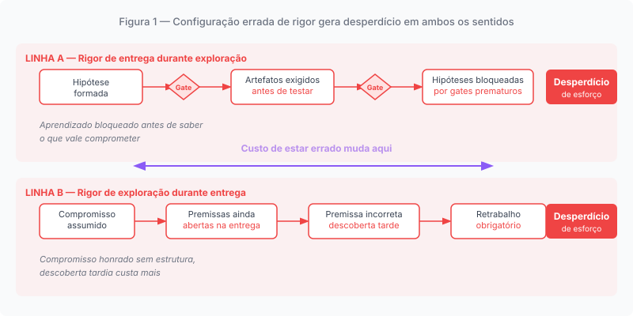
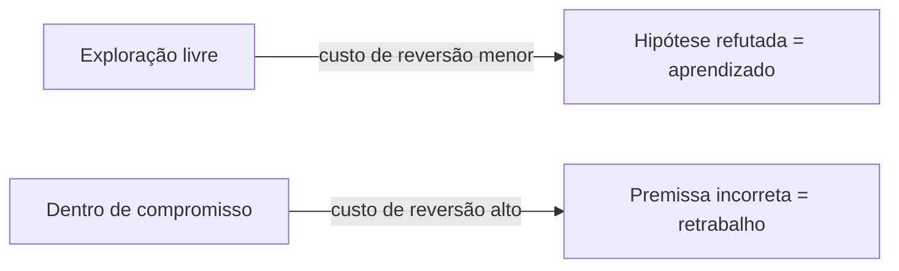

# Capítulo 1: A confusão não é de processo; é de compromisso

---

## O time que fez tudo certo e entregou as coisas erradas

Imagine um time de produto que tem o seguinte: uma prática de discovery bem estabelecida, com entrevistas regulares de usuários, análise de métricas, mapeamento de oportunidades e priorização criteriosa. Um processo de delivery igualmente estruturado, com critérios de aceite, revisões de código, pipelines de CI/CD e reuniões de retrospectiva. O time não pula etapas. O processo existe e é seguido.

E ainda assim, ao final de seis meses, as entregas não correspondem ao que o mercado precisava. Funcionalidades foram construídas com excelência técnica para problemas que os usuários não tinham como prioridade. Decisões que pareciam sólidas na fase de discovery mostraram-se frágeis quando testadas em produção. Algumas hipóteses que o discovery nunca chegou a confirmar foram simplesmente assumidas como verdadeiras durante a execução.

A diagnose habitual nesse cenário é de processo: discovery insuficiente, falta de alinhamento entre as equipes de produto e engenharia, priorização mal feita, ou comunicação deficiente. A solução prescrita é geralmente mais process: mais rituais, mais artefatos, mais cerimônias de alinhamento.

Essa diagnose está errada. Ou, mais precisamente, está incompleta de uma forma que importa.

O problema não está apenas no que o time fez. Está, sobretudo, no *tipo de compromisso sob o qual o time estava operando* em cada momento.

---

## As quatro feridas que o processo não curou

Ao longo das últimas décadas, boa parte da literatura e da prática sobre construção de produtos digitais girou em torno de algumas tensões recorrentes. Os conceitos de Upstream e Downstream aparecem, em diferentes contextos de produto e desenvolvimento, como tentativas de organizar parte dessas tensões, mas raramente as nomearam todas ao mesmo tempo. O resultado é que diversas gerações de frameworks resolveram parte do problema e deixaram o restante implícito.

**A primeira tensão: o custo de construir errado.** Funcionalidades implementadas com excelência técnica para problemas que os usuários não tinham. Hipóteses assumidas como verdadeiras sem evidência suficiente. Decisões de discovery que se revelam frágeis quando testadas em produção. Esse problema é real e bem documentado. Mas é apenas um dos problemas.

**A segunda tensão: o lead time como inimigo da inovação.** Em mercados onde janelas de oportunidade se abrem e fecham em meses, o tempo entre uma decisão estratégica e sua materialização em software operando em produção determina se uma organização consegue ou não atingir resultados de negócio. Um time que leva doze meses para validar uma hipótese não compete com um time que valida a mesma hipótese em três semanas, mesmo que o produto final do time lento seja tecnicamente superior. O problema não é apenas *o que* se constrói: é quanto tempo se leva para aprender que estava errado, ou certo.

Lead time alto não é apenas ineficiência operacional. É a erosão da capacidade estratégica de uma organização. Quando os ciclos de aprendizado são longos demais, a estratégia que orientou o investimento já envelheceu antes de poder ser validada. A organização não está apenas construindo devagar; está construindo com informações velhas.

**A terceira tensão: o abismo entre estratégia e software.** O desdobramento entre a estratégia que executivos formulam nas reuniões de planejamento e a materialização dessa estratégia em software funcional exige ciclos curtos, iterativos e incrementais. Mas esses ciclos raramente encontravam cultura dentro de grandes corporações. O modelo mental de grandes projetos, marcos trimestrais e entregas em cascata ainda dominava os ambientes onde as decisões de investimento eram tomadas. A estratégia era pensada em anos; o software era construído em sprints; e entre os dois, havia uma lacuna de tradução que nenhum processo formalizava adequadamente.

O efeito era previsível: a estratégia chegava ao desenvolvimento desfigurada por camadas de interpretação, priorização política e perda de contexto. O software resultante era fiel ao que foi especificado, não ao que foi intencionado.

**A quarta tensão: a abstração que os executivos nunca tiveram.** A maioria dos executivos de grandes organizações nunca vivenciou um ambiente de alta maturidade de engenharia. Não tinham referência empírica de que era possível levar um experimento do zero à produção em dias, não meses. Muitos cultivavam a convicção de que esse tipo de velocidade só existia em startups, e que a escala corporativa inevitavelmente significava lentidão. Esse preconceito era, em parte, uma profecia auto-realizável: acreditando que a velocidade era impossível, as organizações não criavam as condições para que ela fosse possível.

A inteligência artificial generativa começou a demolir esse mito de maneira significativa. Executivos que nunca escreveram uma linha de código passaram a gerar aplicações inteiras usando serviços de internet, alguns por curiosidade, outros por necessidade. Essa experiência, mesmo que superficial, produziu um deslocamento de percepção que décadas de evangelização ágil não haviam conseguido: a separação entre "quem pensa o negócio" e "quem constrói o software" começou a parecer menos uma lei da natureza e mais uma escolha organizacional. E escolhas organizacionais podem ser refeitas.

**Essas quatro tensões não são independentes.** Um time que constrói as coisas erradas também tem lead time alto, porque o retrabalho está embutido no processo. Uma organização que não consegue desdobrar estratégia em software rapidamente também não consegue responder ao mercado em tempo útil. Executivos que nunca vivenciaram ambientes de alta velocidade de entrega não criam as condições para que o abismo entre estratégia e software seja superado. Os problemas se alimentam mutuamente.

O que esses conceitos procuraram endereçar é real. O que faltou foi uma formulação que reconhecesse todas as quatro tensões e identificasse a raiz que as conecta.

---

## O custo de estar errado muda tudo

*Figura 1. Rigor de compromisso aplicado durante exploração (linha A) e rigor de exploração aplicado durante compromisso (linha B) produzem o mesmo resultado: desperdício*

Há uma distinção que rara vez é articulada explicitamente em organizações de produto: a distinção entre o custo de estar errado durante a exploração e o custo de estar errado durante o compromisso.

Quando um time está explorando (investigando se uma hipótese é válida, testando uma abordagem, mapeando um espaço de problema), o custo de reversão de uma hipótese incorreta tende a ser menor. A exploração pode ser cara: entrevistas, protótipos e experimentos consomem tempo e recursos. O que é controlável, antes de um compromisso Downstream formal, é o custo de mudar de curso quando uma hipótese se revela incorreta. Uma hipótese refutada é informação valiosa. Um protótipo que não funciona elimina uma opção ruim antes que ela se torne um compromisso mais caro de reverter. A exploração é o mecanismo pelo qual um time aprende o que não saber pode custar.

Quando um time está operando sob compromisso (implementando algo que foi formalmente assumido, para uma data, com critérios de aceite definidos), o custo de estar errado aumenta radicalmente. Uma premissa incorreta descoberta durante a implementação exige retrabalho. Um contrato de API mal definido pode travar integrações. Um critério de aceite vago resulta em discussão sobre se o item está "pronto". O Downstream é o mecanismo pelo qual um time honra compromissos, e quebrar compromissos tem custos reais.

O problema do time da abertura deste capítulo não é que o discovery foi inadequado no vácuo. É que o tipo de rigor aplicado ao trabalho não estava calibrado para o tipo de compromisso que o trabalho exigia em cada momento.

Em alguns momentos, o time aplicou rigor de compromisso durante a exploração: hipóteses foram tratadas como requisitos antes de serem verificadas, o que transformou insights preliminares em especificações prematuras. Em outros momentos, o time manteve postura exploratória durante o compromisso: decisões que deveriam estar fixadas continuaram abertas, critérios de aceite permaneceram vagos, e a incerteza que deveria ter sido eliminada antes do compromisso foi carregada para dentro da implementação.

O resultado em ambos os casos é o mesmo: desperdício de esforço. No primeiro caso, por explorar com rigor excessivo antes de saber o que vale a pena comprometer. No segundo, por comprometer sem ter eliminado a incerteza que tornaria o compromisso honrável.

---

## O que muda quando há compromisso

Comprometer algo (uma funcionalidade, um comportamento, um prazo) não é uma formalidade burocrática. É uma transformação no tipo de trabalho que a equipe passa a realizar.

Antes do compromisso, o trabalho é de redução de incerteza. A pergunta que guia as decisões é: "o que precisamos saber para decidir com confiança?". O fracasso de uma hipótese é um resultado legítimo, possivelmente o resultado mais valioso. A qualidade do trabalho é medida pela qualidade da evidência produzida e pela clareza com que as perguntas foram respondidas ou declaradas não-respondíveis.

Depois do compromisso, o trabalho é de honra do que foi prometido. A pergunta que guia as decisões muda: "como entregamos o que comprometemos, com a qualidade que comprometemos, no tempo comprometido?". O fracasso agora tem um custo diferente: não é um dado de aprendizagem, é uma quebra de acordo. A qualidade do trabalho é medida pela correspondência entre o que foi prometido e o que foi entregue.

Essas duas formas de trabalho coexistem em qualquer organização que constrói produtos. O problema é que elas raramente são distinguidas explicitamente. Times transitam de uma para outra sem que ninguém formalize essa transição. O que estava sendo explorado começa a ser tratado como comprometido. O que foi comprometido continua sendo tratado como explorável.

Essa confusão não é de processo. A organização frequentemente tem os processos certos. É uma confusão de *configuração de rigor*: o rigor aplicado ao trabalho não corresponde ao tipo de compromisso que o trabalho exige.

---

## Por que a sequência não resolve

A resposta mais comum para esse problema é estrutural: separar formalmente a fase de exploração da fase de entrega, garantindo que a primeira precede e alimenta a segunda. Discovery antes de delivery. Exploração antes de comprometimento.

Essa resposta tem mérito genuíno. Sem ela, muitas organizações cometeriam o erro de comprometer sem ter explorado nada. Ela produz uma separação temporal que ajuda os times a não confundir os dois modos de trabalho.

Mas ela não resolve o problema porque não o formulou corretamente.

O problema não é que os times não exploram antes de entregar. É que os times frequentemente não sabem, em qualquer momento dado, *que tipo de compromisso estão mantendo* e, portanto, *que tipo de rigor deveriam estar aplicando*. Uma fase de discovery que se estende indefinidamente porque nenhum critério de parada foi definido. Uma fase de delivery que começa com premissas ainda abertas porque o comprometimento aconteceu antes da evidência ser suficiente. Um item que transita de "estamos explorando" para "estamos entregando" sem que ninguém tenha tomado uma decisão explícita sobre essa transição.

O problema é de configuração, não de sequência. O que falta não é um processo que garanta que exploração precede entrega. O que falta é um mecanismo que torne explícito, em qualquer momento, qual tipo de rigor o trabalho exige, e que force uma decisão quando esse tipo muda.

---

## Rigor como configuração, não como estado fixo

Usar o termo "rigor" no contexto desta análise requer cuidado. Rigor não é sinônimo de burocracia, nem de processo pesado, nem de formalidade pela formalidade.

Rigor, aqui, significa o grau de exigência aplicado para reduzir a incerteza relevante, sustentar uma decisão ou verificar a realização de um compromisso. Sua manifestação muda conforme o tipo de compromisso que o trabalho carrega. No Upstream, o regime de rigor é predominantemente orientado à qualidade da evidência, ao aprendizado e à redução da incerteza relevante. No Downstream, o regime de rigor é predominantemente orientado à verificação da realização, à preservação do compromisso, ao controle de mudança e à evidência do resultado. Esses não são dois tipos universais e fechados: são regimes que emergem do tipo de compromisso vigente.

O ponto é que rigor não é um estado fixo que se aplica uniformemente a todo o trabalho. É uma configuração que precisa ser calibrada para o tipo de compromisso que o trabalho carrega.

Um time pode aplicar rigor altíssimo durante a exploração: entrevistas com transcrições completas, benchmarks com metodologia documentada, protótipos testados com critérios de aceitação declarados antes do teste, sem que isso constitua um compromisso de entrega. O rigor está a serviço da qualidade da evidência, não da promessa de um resultado.

Um time pode aplicar rigor diferente durante a entrega: critérios de aceite mensuráveis, rastreabilidade de decisões, evidência de cada etapa, sem que isso seja burocracia. O rigor está a serviço da honra do compromisso, não da aparência de processo.

A confusão ocorre quando o regime de rigor não corresponde ao tipo de compromisso. Quando se aplica um regime orientado à entrega em trabalho que ainda é exploratório, o aprendizado é bloqueado por gates prematuros. Quando se aplica um regime exploratório em trabalho que já carrega um compromisso, a execução perde a estrutura necessária para honrá-lo.

---

## A pergunta que o capítulo seguinte responde

Se o problema central é de configuração de rigor (não de sequência, não de quantidade de discovery, não de alinhamento entre equipes), então o que um framework de produto precisa para resolver esse problema?

Precisa de uma forma de distinguir, explicitamente, quando um time está operando com rigor de exploração e quando está operando com rigor de compromisso. Precisa de um mecanismo que formalize a transição entre esses diferentes regimes de rigor. E precisa fazer isso sem simplesmente renomear "discovery" como "exploração" e "delivery" como "compromisso", porque o problema não está nos nomes das fases, está no que os nomes não capturam.

Uma interpretação recorrente da literatura e da prática de produto, ao separar discovery e delivery como fases distintas, tem mérito genuíno: reduz o risco de comprometer sem explorar. Mas essa interpretação endereça a sequência e deixa implícito o tipo de compromisso que cada fase carrega. O capítulo seguinte examina por que essa interpretação, por mais influente que seja, não resolve o problema fundamental que este capítulo descreveu.

---

## A jornada que começa antes da primeira

O framework ProdOps define cinco jornadas, mas quatro delas — Discovery, Delivery, Operation e Diligence — têm um ponto de entrada claro: uma capability que precisa ser explorada, construída, operada ou verificada. A quinta jornada, **Assessment**, não tem ponto de entrada fixo: ela está presente desde o momento em que um Business Signal aparece no horizonte do produto.

Assessment é a camada de governança informacional do framework. Ela avalia se o ambiente informacional está preparado para as decisões que o ciclo exige: a transformação de um Signal em Business Intent, a suficiência de evidências para o CommitmentGate, a correspondência entre o compromisso assumido e o compromisso honrado, e o que o ciclo encerrado revela sobre o ciclo que virá. Não é uma fase de avaliação periódica; é uma responsabilidade contínua que o ProdOps nomeia e estrutura para que não fique dependente do julgamento informal de quem está mais atento no momento.

A conexão com o problema descrito neste capítulo é direta. O custo de estar errado aumenta com o nível de compromisso assumido porque a confusão entre rigor de exploração e rigor de compromisso raramente é visível no momento em que acontece: fica visível depois, quando o custo de corrigir já subiu. Assessment é o mecanismo que torna essa confusão detectável antes que o custo seja máximo — não porque Assessment decide, mas porque Assessment prepara e qualifica o contexto informacional para que a decisão correta seja mais provável.

O Capítulo 4 descreve o Assessment em profundidade: o que ele avalia, o que ele produz e o que ele explicitamente não faz. O que vale registrar aqui, ao fim do capítulo que descreve o problema central, é que a solução não começa no framework de modos: começa na responsabilidade de manter o ambiente informacional controlado ao longo de todo o ciclo.

---

*Capítulo 1 de 11 | Parte I: O Problema*
