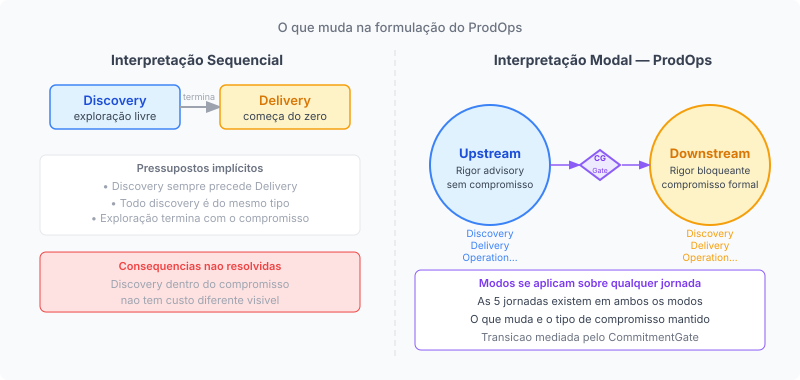
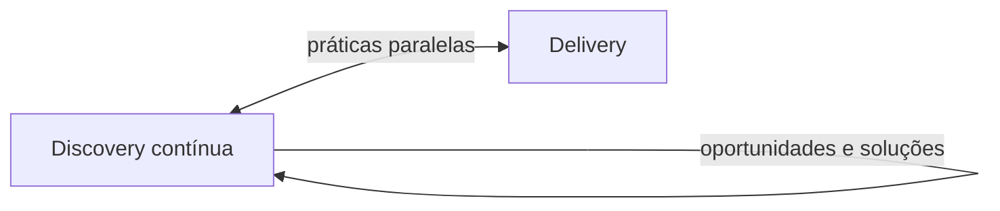
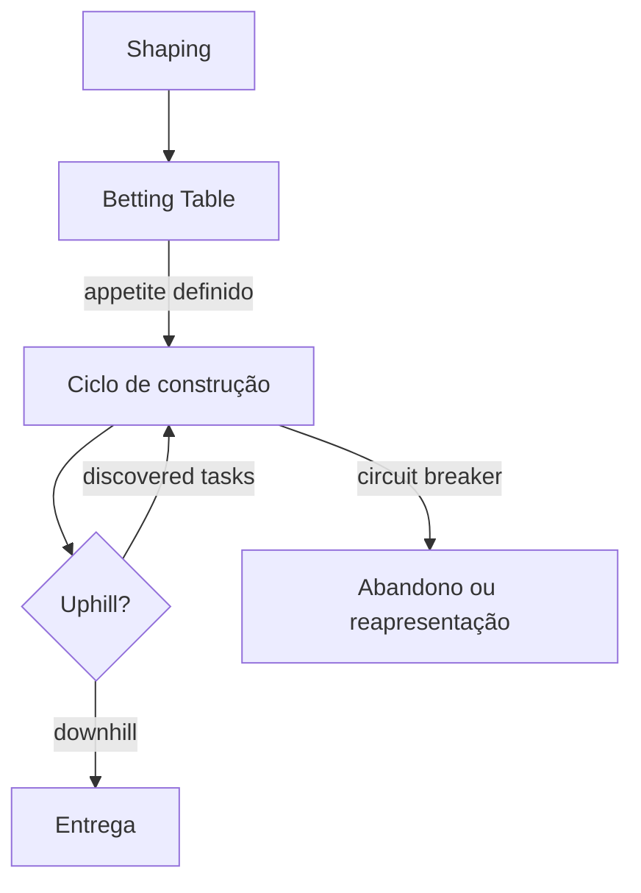
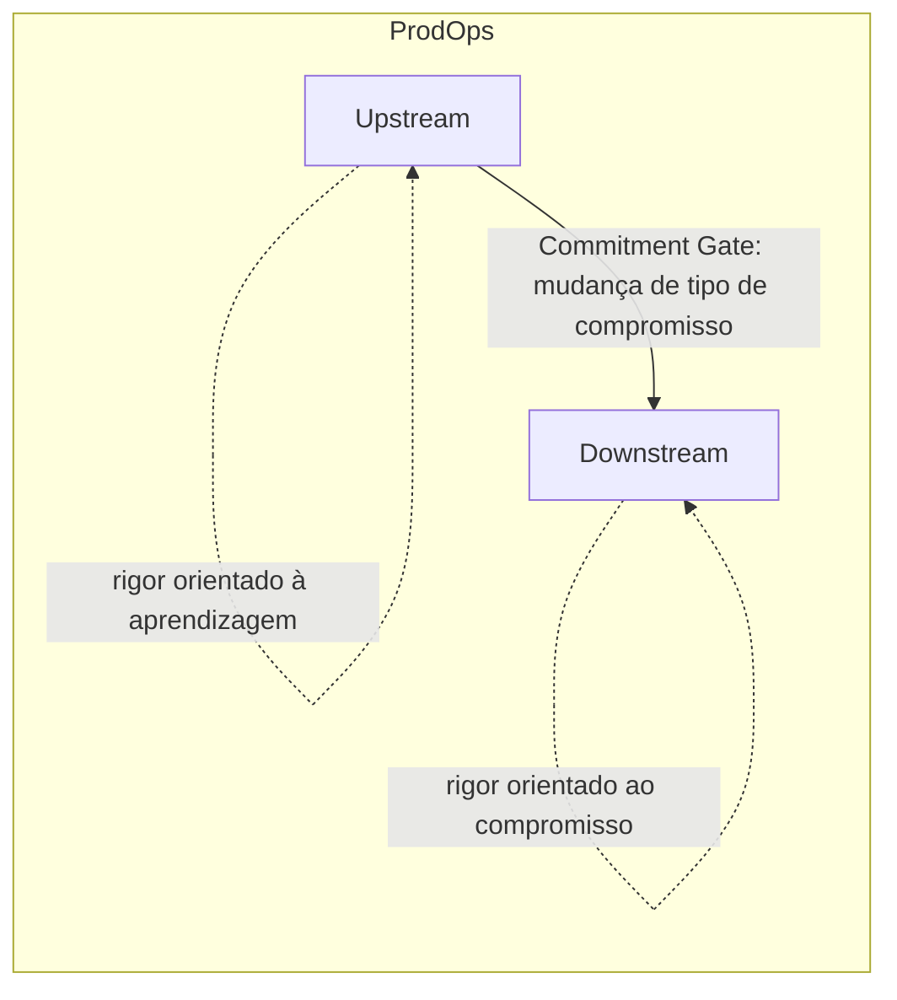

# Capítulo 2: Por que a leitura de mercado não resolve

---

## O consenso que falta precisão

*Figura 2. Interpretação sequencial (esquerda) vs. interpretação modal do ProdOps (direita): a distinção não é de vocabulário, é de tipo de compromisso*

Existe um consenso razoavelmente estável na literatura de produto sobre como estruturar o trabalho de desenvolvimento: fazer discovery antes de delivery. Explorar o problema antes de comprometer uma solução. Entender os usuários antes de especificar funcionalidades.

Esse consenso é correto como orientação geral. O problema é que ele é impreciso no que importa. E essa imprecisão não é cosmética: ela produz consequências estruturais que o capítulo anterior começou a descrever.

Obras como *Inspired* de Marty Cagan, *Continuous Discovery Habits* de Teresa Torres e *Shape Up* de Ryan Singer abordam, cada uma a seu modo, o problema de organizações que constroem as coisas erradas porque comprometem recursos antes de entender o suficiente. Cada uma propõe práticas mais rigorosas de exploração, validação e controle de risco antes ou durante o comprometimento. Cagan propõe que times de produto testem ideias com usuários antes de comprometer recursos significativos de engenharia com a construção de uma solução, reduzindo risco nas dimensões de valor, usabilidade, viabilidade e factibilidade. Torres propõe que discovery seja uma prática contínua, próxima dos usuários, baseada em oportunidades e soluções que coexiste com o delivery em vez de preceder. Singer propõe um ciclo de shaping que transforma ideias brutas em apostas com risco reduzido, seguido de uma betting table que formaliza o comprometimento de um ciclo de construção.

Essas obras são sofisticadas e suas contribuições são genuínas. A revisão de literatura que fundamenta o framework ProdOps examinou um conjunto amplo de obras sobre discovery, delivery e gestão de produto, a ser documentado em maior detalhe em apêndice metodológico, e identificou que uma interpretação operacional recorrente dessa literatura transforma a distinção entre discovery e delivery em uma diferença de posição temporal: primeiro se explora, depois se entrega. Isso não equivale a dizer que os autores mais sofisticados reduzem seu argumento a essa sequência, mas é como parte relevante da prática de mercado frequentemente operacionaliza os frameworks que essas obras inspiraram.

Essa estrutura tem valor genuíno. Sem ela, organizações comprometeriam recursos para construir soluções para problemas que não existem ou que não têm o peso que se presumia. A orientação de realizar discovery antes de comprometer recursos significativos de construção é uma correção histórica importante em relação a processos de desenvolvimento que tratavam especificações iniciais como verdades a implementar.

Mas o consenso, em sua interpretação operacional mais comum, tem um ponto cego que o framework ProdOps identifica como sua contribuição mais específica: o *tipo de compromisso vigente* não emerge, nessas obras, como variável operacional transversal que determine o regime de rigor do trabalho. Essa diferença de formulação, aparentemente técnica, tem consequências práticas.

---

## O que a interpretação sequencial deixa implícito

A interpretação sequencial de discovery e delivery tem dois pressupostos que raramente são explicitados.

O primeiro pressuposto: todo o trabalho de discovery é do mesmo tipo. Uma equipe que está investigando se há demanda de mercado para uma nova categoria de produto e uma equipe que está refinando os critérios de aceite de uma funcionalidade já comprometida estão ambas "fazendo discovery". Mas o tipo de compromisso que cada uma carrega é radicalmente diferente. No primeiro caso, a exploração existe antes de qualquer promessa. No segundo, a exploração existe *dentro* de uma promessa que já foi feita. Tratá-las como instâncias do mesmo processo ignora essa diferença.

O segundo pressuposto: uma vez que o discovery termina, o que resta é delivery. Isso implica que toda a exploração relevante precisa acontecer antes do comprometimento, e que o trabalho pós-comprometimento é pura implementação de algo já bem entendido. Na prática, isso raramente se sustenta. Decisões de arquitetura durante a implementação revelam premissas que o discovery não testou. Integrações técnicas descobrem restrições que a fase de exploração não antecipou. O comprometimento formal não elimina a necessidade de exploração; apenas muda o custo de estar errado durante ela.

A consequência do primeiro pressuposto é o que o Capítulo 1 chamou de "rigor de entrega aplicado durante exploração": quando uma equipe trata todo o discovery como preparação para um compromisso iminente, ela aplica gates prematuros que bloqueiam aprendizados que poderiam mudar o curso antes do compromisso ser feito.

A consequência do segundo pressuposto é o que pode ser chamado de "discovery no Downstream": exploração que ocorre dentro de um compromisso formal sem o reconhecimento de que o custo de estar errado agora é radicalmente diferente. As premissas abertas que uma equipe carrega para a fase de delivery não desaparecem; elas apenas passam a ser mais caras quando se revelam incorretas.

---

## Contribuições e lacunas conceituais

Identificar onde frameworks influentes não formulam determinada abstração exige precisão. O objetivo não é depreciar obras consolidadas nem reduzir argumentos complexos a caricaturas, mas localizar o que cada obra resolve e o que permanece não articulado como variável operacional.

**Cagan e a redução de risco antes da construção**

Em *Inspired*, Cagan trata o discovery como o mecanismo pelo qual times de produto reduzem risco antes de comprometer recursos de engenharia em larga escala. A redução de risco opera em quatro dimensões: valor (os clientes vão querer isso?), usabilidade (conseguem usar?), viabilidade (funciona dentro dos negócios da empresa?) e factibilidade (a engenharia consegue construir?). Diferentes iniciativas possuem diferentes perfis de risco, e o esforço de discovery deve ser calibrado de acordo. Protótipos, experimentos e entrevistas com usuários servem ao objetivo de produzir evidência suficiente, nas dimensões relevantes, para que a construção do produto de produção ocorra com maior confiança. Os artefatos do discovery são instrumentos de aprendizagem, não versões preliminares do produto final. O produto de produção é construído a partir do que se aprendeu, com uma compreensão mais profunda do problema e dos riscos associados.

Esse modelo resolve de forma poderosa o problema das premissas não testadas e oferece uma taxonomia rigorosa de onde os riscos podem residir. A contribuição é clara e permanece válida.

O que não é articulado como princípio transversal: o tipo de compromisso vigente como variável operacional que determina o regime de rigor do trabalho. Cagan formula com precisão o que precisa ser aprendido e reduzido antes da construção. O que o ProdOps acrescenta não é uma nova teoria de redução de risco, mas uma abstração operacional adicional: o risco determina o que precisa ser aprendido; o compromisso vigente determina o regime sob o qual esse aprendizado pode ocorrer. Essa distinção não contradiz Cagan; é uma camada operacional que o framework não formula como princípio independente da metodologia.

**Torres e a continuidade da exploração**

Em *Continuous Discovery Habits*, Torres rompe de forma importante com a ideia de discovery como uma etapa anterior e estanque ao delivery. Torres propõe discovery como uma prática contínua, executada em ciclos regulares próximos dos usuários, que coexiste com o delivery. Oportunidades, soluções, hipóteses e experimentos compõem um fluxo de aprendizagem que não se encerra com o início da construção. Torres claramente percebe e incorpora a ideia de que discovery pode e deve ocorrer depois que o comprometimento começou.

Essa contribuição resolve de forma relevante o segundo pressuposto da interpretação sequencial e deve ser reconhecida como tal.

O que não é formulado explicitamente: Torres não apresenta o framework primariamente como um operating model no qual o tipo de compromisso vigente altera explicitamente o regime operacional, o rigor, os gates e a evidência exigida. A prática de discovery contínua não opera com o tipo de compromisso como variável explícita que determina o modo de execução e o custo aceitável de erro. A contribuição do ProdOps não é afirmar que Torres não percebe a sobreposição entre discovery e delivery: ela claramente percebe. A contribuição é propor que o tipo de compromisso seja uma propriedade operacional explícita do trabalho, com consequências mensuráveis sobre o rigor exigido. Torres responde com precisão à pergunta central de seu framework: como manter aprendizagem contínua próxima dos usuários? O ProdOps acrescenta uma pergunta diferente: como o compromisso vigente altera o regime operacional no qual essa aprendizagem acontece?

**Singer e o commitment como aposta limitada**

Em *Shape Up*, Singer é, dos três autores, o que mais explicitamente operacionaliza o compromisso como variável que estrutura o trabalho. O ciclo de shaping reduz a incerteza antes que a aposta seja formalizada. O betting table é o momento em que a organização decide comprometer um projeto a um ciclo. O appetite define o que a organização está disposta a gastar antes de saber o resultado. O circuit breaker permite abandonar o ciclo se a execução revelar que o projeto não converge. Singer distingue ainda modos de trabalho com características operacionais distintas: R&D mode, Production mode e Cleanup mode, cada um com expectativas diferentes em relação ao escopo, à incerteza e ao resultado esperado.

Singer também reconhece explicitamente que novos desconhecidos surgem durante a execução. Os hill charts distinguem a fase ascendente, caracterizada por incerteza sobre como resolver, da fase descendente, caracterizada por execução com clareza suficiente. Discovered tasks são tarefas que só se revelam durante a construção. Apostas experimentais permitem estruturar trabalho de alta incerteza como um bet distinto, com escopo intencionalmente mais aberto. O abandono ou a reapresentação de uma aposta são possibilidades explícitas no framework.

Shape Up é, portanto, sofisticado na estrutura do compromisso, no reconhecimento da incerteza durante a execução e na distinção de modos de trabalho. Mais do que isso: Shape Up demonstra empiricamente que compromisso, appetite, incerteza e modo de execução alteram o comportamento operacional do trabalho. Essa é precisamente a relação que o ProdOps procura articular como princípio transversal. Nesse sentido, Shape Up não é um alvo de crítica, mas uma evidência da tese: a intuição que o framework contém, especialmente na distinção uphill/downhill, no uso de appetite e circuit breaker e na existência de modos distintos de trabalho, está alinhada com o argumento central deste livro.

A diferença não está na sofisticação, mas no escopo de generalização. Os mecanismos do Shape Up estão formulados dentro de uma metodologia específica de planejamento e delivery, com ciclos fixos de seis semanas, betting tables em intervalos regulares e um modelo particular de organização do trabalho. Os modos de trabalho que Singer descreve são distinções internas a esse método. O ProdOps não propõe introduzir a ideia de modos distintos de trabalho: propõe tratar o tipo de compromisso vigente como a variável que governa o modo de execução, de forma transversal e independente da metodologia utilizada. A abstração que o ProdOps formula não é uma invenção sobre o que Shape Up ignora; é uma generalização do que Shape Up já operacionaliza de maneira concreta dentro de seu próprio método.

**O que as três obras compartilham**

Cagan reduz o risco antes da construção por meio de validação estruturada. Torres transforma discovery em uma prática contínua de aprendizagem que coexiste com o delivery. Singer transforma o commitment em uma aposta limitada, com mecanismos explícitos para estruturar, controlar e eventualmente interromper o trabalho.

O ProdOps propõe explicitar, como uma única cadeia operacional transversal, relações que aparecem de forma parcial e metodologicamente situada em cada uma dessas obras: COMPROMISSO → MODO DE EXECUÇÃO → RIGOR → EVIDÊNCIA → CONTROLE. Essa ideia está presente em diferentes graus em cada framework, mas não se apresenta, em nenhum deles, como uma abstração independente de metodologia e aplicável a qualquer operating model. A reivindicação do ProdOps não é que cada componente dessa cadeia seja original; é que a articulação sistêmica entre eles constitui uma abstração operacional que os frameworks existentes não formulam explicitamente.

---

## O problema do discovery dentro do compromisso

O ponto cego tem um nome operacional no contexto do ProdOps: Discovery no Downstream.

Discovery no Downstream é a exploração realizada depois que uma decisão passou a carregar um compromisso operacional, econômico ou temporal, fazendo com que a mesma incerteza que seria aceitável no Upstream passe a possuir custo de reversão, renegociação ou retrabalho. O problema não é descobrir depois do comprometimento. O problema é carregar incerteza para dentro de um compromisso sem reconhecer que o custo de estar errado mudou.

Quando uma equipe assume um compromisso formal, com critérios de aceite, com prazo, com expectativa de stakeholder, e ainda carrega exploração não resolvida para dentro desse compromisso, o que está acontecendo não é discovery seguido de delivery. É delivery com discovery embutido, sem reconhecimento de que as duas coisas estão coexistindo sob regimes de custo diferentes.

Isso importa por uma razão precisa: o custo de mudar de curso é radicalmente diferente nos dois casos.

Quando uma hipótese é refutada durante a exploração livre, o resultado é informação. O esforço de exploração não foi desperdiçado; foi o preço do aprendizado. A equipe pode redirecionar sem quebrar uma promessa.

Quando uma premissa é revelada incorreta durante a implementação, depois que o compromisso foi assumido, o resultado é retrabalho. O esforço investido na direção incorreta tem um custo de oportunidade real. A equipe não pode simplesmente redirecionar; precisa renegociar o compromisso, ajustar expectativas, possivelmente atrasar a entrega. E se a cultura organizacional penaliza mudanças de curso depois do comprometimento, a equipe tem incentivo para não revelar o problema até que ele seja grave demais para ignorar.

O discovery no Downstream não é apenas ineficiente: é estruturalmente arriscado. E o risco não diminui ao ignorá-lo.

---

## A distinção que falta: modo, não sequência

O que a interpretação operacional mais comum da literatura de produto deixa implícito, o ProdOps torna explícito: a diferença entre exploração e entrega não é uma diferença de momento no tempo, mas de tipo de compromisso mantido.

Upstream e Downstream não descrevem onde o trabalho está no tempo. Descrevem qual compromisso está governando o trabalho.

Discovery não é necessariamente Upstream, e delivery não é necessariamente Downstream. Uma investigação pode ocorrer no Downstream quando existe um compromisso formal de entrega. Uma construção experimental pode ocorrer no Upstream quando ainda não existe compromisso de produção. O que determina o modo de execução é o compromisso vigente, não a natureza da atividade.

Exploração sem compromisso formal pode acontecer em qualquer momento: antes, durante ou em paralelo ao que outras equipes chamam de "delivery". O que a caracteriza não é sua posição na linha do tempo, mas o fato de que o custo de estar errado ainda é controlável: a hipótese pode ser refutada sem quebrar uma promessa.

Entrega com compromisso formal pode também envolver exploração, mas essa exploração acontece sob condições radicalmente diferentes. O custo de estar errado é mais alto. Os gates que protegem o compromisso precisam ser mais rigorosos. A incerteza que pode ser tolerada durante a exploração livre não pode ser carregada indefinidamente dentro de um compromisso.

No Upstream, o rigor é predominantemente orientado à aprendizagem, experimentação e redução de incerteza. Upstream não significa ausência de rigor: significa que o rigor está a serviço da qualidade da evidência, não da honra de um compromisso. No Downstream, o rigor está relacionado à preservação do compromisso, verificação da execução, controle de mudança e realização do resultado esperado. Downstream não significa ausência de discovery: significa que qualquer discovery que ocorra ali carrega um custo diferente e exige um regime de controle diferente.

A distinção que falta na interpretação sequencial não é "quando explorar", mas "com que tipo de compromisso o trabalho está sendo executado". Essa distinção, quando articulada com precisão, é o que o ProdOps chama de modo de execução.

A síntese operacional que organiza essa distinção pode ser expressa como três regimes de ação: APRENDER → COMPROMETER → REALIZAR. A seta não representa uma sequência temporal; representa a transformação progressiva do tipo de compromisso que governa o trabalho. Cada regime determina o que conta como qualidade, o que conta como erro e o que constitui evidência válida.

O próximo capítulo define o que é um modo de execução e por que essa definição resolve o problema que a interpretação sequencial não consegue formular.

---

*Capítulo 2 de 10 | Parte I: O Problema*

---

## Notas de revisão

### Rodada 1: revisão conceitual profunda

**Cagan (*Inspired*):** removida a afirmação "delivery começa do zero". A crítica foi reformulada para reconhecer que Cagan oferece mecanismos poderosos de redução de risco antes da construção, operando nas quatro dimensões de valor, usabilidade, viabilidade e factibilidade.

**Torres (*Continuous Discovery Habits*):** removida a sugestão de que Torres não percebe sobreposição entre discovery e delivery. A crítica foi reformulada: Torres resolve o problema da continuidade, mas o framework não é apresentado primariamente como um operating model onde o tipo de compromisso vigente altera explicitamente o regime de rigor.

**Singer (*Shape Up*):** removida a afirmação factualmente incorreta de que Shape Up "não tem protocolo" para descobertas tardias. O diagrama "sem protocolo → Descoberta tardia" foi substituído por representação fiel ao framework.

**18 obras:** quantidade específica removida da narrativa principal; referência mantida como "conjunto amplo de obras", com documentação remetida ao apêndice metodológico.

**Diagramas:** revisados para não atribuir ausências ou limitações que os autores não possuem.

### Rodada 3: três ajustes pontuais

**Cagan (comprometimento):** "antes de qualquer comprometimento de engenharia em larga escala" → "antes de comprometer recursos significativos de engenharia com a construção de uma solução". Esclarece que a questão é evitar comprometer recursos de construção prematuramente, sem sugerir que nenhum compromisso exista durante o discovery.

**Consenso discovery/delivery:** "O consenso do discovery antes do delivery" → "A orientação de realizar discovery antes de comprometer recursos significativos de construção". Evita tratar uma sequência temporal como posição uniforme dos três autores, coerente com o fato de que Torres trabalha com discovery contínua e Singer reconhece incerteza durante a execução.

**APRENDER → COMPROMETER → REALIZAR:** adicionada frase explicitando que a seta não representa sequência temporal, mas transformação progressiva do tipo de compromisso que governa o trabalho. Alinha a síntese com a tese central do capítulo.
