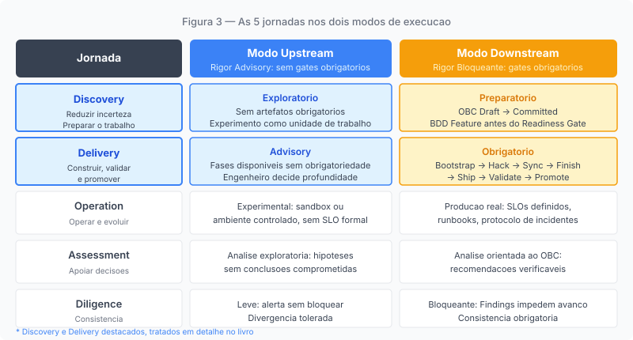
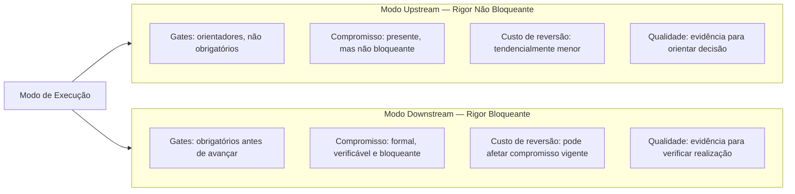
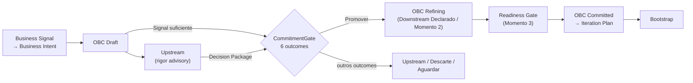

# Capítulo 3: O que é um modo de execução

---

## Uma distinção que não é de vocabulário

*Figura 3. Matriz de jornadas e modos: as mesmas 5 jornadas existem em ambos os modos, sob diferentes regimes de compromisso*

Os capítulos anteriores descreveram um problema: times de produto aplicam o tipo de rigor errado ao trabalho que estão fazendo, não porque careçam de processos, mas porque nenhum mecanismo torna explícito o tipo de compromisso que o trabalho carrega em qualquer momento dado.

A solução que o ProdOps propõe é estrutural: em vez de distinguir Upstream de Downstream pelo momento no tempo em que acontecem, distingui-los pelo *tipo de compromisso* que estão mantendo. Essa distinção é o que o framework chama de *modo de execução*.

Introduzir dois termos (Upstream e Downstream) e dizer que um representa exploração e o outro representa compromisso de execução seria apenas renomear um problema sem resolvê-lo. O ponto do modelo modal não é o vocabulário. É o que o vocabulário carrega: uma distinção de compromisso que pode ser verificada em qualquer momento, aplicada a qualquer tipo de trabalho, e gerenciada com mecanismos explícitos.

Este capítulo define o que é um modo de execução no sentido técnico que o ProdOps usa o termo. Sem essa definição precisa, os capítulos sobre Upstream e Downstream parecerão apenas descrições de processos, e o leitor perderá o que é genuinamente diferente nessa abordagem.

---

## O que um modo modifica

A definição canônica do ProdOps é direta: "O modo define o rigor, não as jornadas. As mesmas 5 jornadas existem nos dois modos; o que muda é o compromisso."

Para entender o que isso significa operacionalmente, é necessário primeiro entender o que são as jornadas, e por que a distinção entre jornadas e modos é mais do que terminológica.

O ProdOps organiza o trabalho de produto em cinco jornadas:

- **Discovery**: reduzir incerteza e preparar o trabalho
- **Delivery**: construir, validar e promover a solução
- **Operation**: operar e evoluir o produto em produção
- **Assessment**: produzir análises para apoiar decisões
- **Diligence**: garantir a consistência do sistema de trabalho

Cada jornada tem uma responsabilidade única e um ciclo de vida próprio. Discovery não é Delivery. Operation não é Assessment. As fronteiras entre elas são reais e têm consequências operacionais.

Um modo, por sua vez, não é uma jornada. É uma *configuração de compromisso* que se aplica sobre qualquer jornada. Um time fazendo Discovery pode estar em modo Upstream ou em modo Downstream. Um time fazendo Delivery pode igualmente estar em qualquer dos dois modos. A jornada é a mesma; o que muda é o compromisso que o trabalho carrega e, consequentemente, o regime de rigor sob o qual ele é executado.

A tríade que organiza essa distinção é simples: *jornada define o trabalho; modo define o compromisso; gate define a condição de avanço*. Os três conceitos são diferentes, e confundi-los é a origem da maior parte das interpretações equivocadas do modelo.

---

## O que o modo determina concretamente

Dizer que o modo determina o rigor não é suficiente sem especificar o que "rigor" significa operacionalmente no contexto do ProdOps.

Em modo **Upstream**, o rigor é *não bloqueante*: práticas, artefatos e evidências estão disponíveis e recomendados, mas não constituem condições obrigatórias para avançar. Podem existir checkpoints e critérios orientadores, mas não gates cuja satisfação seja obrigatória para prosseguir. O praticante decide quais práticas aplicar, com qual profundidade e quando. Isso não significa ausência de disciplina nem ausência de compromisso: significa que o regime de compromisso não é bloqueante. O time pode comprometer-se com uma investigação, com uma análise, com a produção de determinada evidência; o que não existe é um compromisso bloqueante: aquele em que o não-cumprimento de uma condição impede o avanço. Um trabalho mal conduzido no Upstream é um problema; a diferença é que o custo de corrigir o curso permanece controlável porque o regime vigente não torna a mudança de direção a violação de um compromisso bloqueante.

Em modo **Downstream**, o rigor é *bloqueante*: gates são verificáveis e precisam ser satisfeitos antes de avançar, artefatos precisam estar em estados definidos, a sequência de etapas é imposta. Um item em modo Downstream não prossegue com lacunas a resolver depois; o trabalho para até que as condições obrigatórias sejam atendidas. Na jornada Delivery, essa estrutura se materializa no framework ProdOps como a sequência Bootstrap → Hack → Sync → Finish → Ship → Validate → Promote, com gates entre cada etapa. Essa sequência é uma materialização do rigor bloqueante dentro da jornada Delivery, não a definição de Downstream como tal. A razão para essa estrutura não é burocracia: é que um compromisso formal foi assumido, e honrá-lo exige evidência verificável em cada ponto de avanço.

| Dimensão | Upstream | Downstream |
|---|---|---|
| Gates | Orientadores; não bloqueantes | Bloqueantes e obrigatórios |
| Regime de rigor | Rigor não bloqueante; praticante decide a profundidade | Rigor bloqueante; sequência e gates obrigatórios |
| Custo de reversão | Tendencialmente menor; mudar de direção não viola um compromisso bloqueante | Potencialmente alto; mudança pode afetar um compromisso formal e exige decisão explícita sobre ele |
| Artefatos | Tornam o compromisso vigente observável; estados refletem o regime | Condições verificáveis de avanço; estados confirmam a realização |
| Critério de qualidade | Qualidade da evidência para informar a decisão de comprometer | Verificabilidade da correspondência entre o prometido e o entregue |

O compromisso é o que determina em qual coluna um item se encontra. O estado dos artefatos é evidência do compromisso, não sua definição: um artefato mais avançado não transforma automaticamente o trabalho em Downstream, assim como um artefato em estado inicial não garante que o trabalho está em Upstream.

---

## As mesmas jornadas em dois modos

Aqui está o ponto que mais frequentemente produz confusão: quando o ProdOps diz que "as mesmas 5 jornadas existem nos dois modos", não está dizendo que Discovery no Upstream e Discovery no Downstream são idênticas. Está dizendo que ambas são instâncias da jornada Discovery, com a mesma responsabilidade central (reduzir incerteza e preparar o trabalho), mas executadas sob regimes de compromisso diferentes.

Discovery no **Upstream** opera sob rigor não bloqueante: sem artefatos obrigatórios, sem gate de saída formal, com liberdade para perseguir hipóteses em direções não antecipadas. Em muitos casos, o experimento é a unidade de trabalho e o output primário é uma resposta à hipótese, mesmo que a resposta seja "não confirmada" ou "refutada". Nenhuma dessas respostas viola um compromisso bloqueante.

Discovery no **Downstream** opera sob rigor bloqueante: a capability já passou por condições verificáveis que justificaram o comprometimento de recursos para ela. A discovery agora serve a um objetivo diferente: refinar artefatos e evidências até o nível que o compromisso vigente exige. O output não é mais um conjunto aberto de aprendizados; é um conjunto de condições satisfeitas que permite avançar com a confiança que um compromisso formal demanda.

O mesmo contraste se aplica às demais jornadas. Delivery no modo Upstream opera sem sequência obrigatória: as etapas estão disponíveis como referência, mas o praticante decide quais aplicar e com qual profundidade, sem gates formais entre elas. Delivery no modo Downstream é executada com sequência e gates obrigatórios: cada etapa precisa ser satisfeita antes de avançar, porque existe um compromisso que precisa ser honrado com evidência em cada ponto. Operation no modo Upstream pode, por exemplo, ser executada em ambientes controlados, sem SLOs formais, enquanto os comportamentos ainda não foram formalmente comprometidos. Operation no modo Downstream é produção real: SLOs definidos, runbooks existentes, protocolos formais de resposta a incidentes.

A implementação completa dessas distinções nos mecanismos do framework está em evolução contínua, mas o princípio é invariante: a jornada define o que está sendo feito; o modo define sob qual regime de compromisso está sendo feito.

Um mesmo time pode operar simultaneamente em diferentes modos para diferentes objetos de trabalho. Uma capability comprometida pode estar em Downstream, com gates ativos e sequência obrigatória. Uma hipótese arquitetural relacionada pode estar em Upstream, sob regime não bloqueante, avançando conforme a evidência se acumula. Nenhum desses modos interfere no outro: eles coexistem porque representam diferentes regimes de compromisso, não diferentes momentos do tempo.

---

## Por que "modo" e não "fase"

A distinção entre modo e fase não é pedantismo terminológico. Ela resolve um problema que a interpretação de fase-sequencial não consegue resolver.

Se Upstream e Downstream fossem fases (momentos específicos na linha do tempo do produto), então um item precisaria passar pelo modo Upstream antes de entrar no Downstream. Toda capability precisaria ser primeiramente tratada sob o regime não bloqueante antes de receber o regime bloqueante. Isso reproduz exatamente o problema do Capítulo 2: trata toda exploração como do mesmo tipo, e toda entrega como começando depois que a exploração termina.

Como modos (configurações de compromisso que se aplicam sobre qualquer jornada), Upstream e Downstream podem coexistir em um mesmo time para itens diferentes. Um item pode estar em modo Downstream, com compromisso formal e gates ativos, enquanto um experimento paralelo opera em modo Upstream, sob regime não bloqueante e sem gates obrigatórios. A decisão de modo não é temporal; é de compromisso. E um item pode mudar de modo, mas apenas por uma decisão explícita, não por uma passagem de tempo.

Isso também significa que não existe transição automática entre os modos. Um item em modo Upstream não transita para o Downstream simplesmente porque o time decidiu começar a implementar. A transição representa uma mudança explícita de compromisso, sustentada por condições verificáveis que confirmam que o comprometimento está justificado. O Capítulo 7 descreve como essa transição é estruturada no framework ProdOps.

---

## O que o modelo modal não faz

Definir o que o modelo modal é requer também definir o que ele não é.

Modo de execução não é uma classificação de maturidade do time. Um time que opera em modo Upstream não está em estado de menor disciplina que um time em modo Downstream. A disciplina do Upstream tem uma forma diferente, orientada à qualidade da evidência e à manutenção explícita da incerteza, mas não é menor. Um trabalho mal conduzido no Upstream, sem hipótese falsificável, sem critério de parada, sem evidência verificável, é tão problemático quanto um item mal executado no Downstream.

Modo de execução não é uma classificação do tipo de trabalho. Não existe trabalho que é "por natureza" Upstream ou "por natureza" Downstream. Um componente técnico pode ser tratado sob regime não bloqueante e depois implementado sob regime bloqueante. Uma feature de produto pode igualmente percorrer ambos os modos, ou entrar diretamente em Downstream se a evidência já existe e o compromisso está justificado.

Modo de execução não é maturidade do artefato. O estado de um artefato pode ser evidência do compromisso vigente, mas não é o que define o modo. O compromisso determina quais condições e evidências são necessárias; os artefatos tornam esse compromisso observável. Um artefato em determinado estado não transforma automaticamente o trabalho em Upstream ou Downstream: a causalidade começa no compromisso, não no artefato.

Modo de execução não é uma localização temporal no ciclo de vida do produto. Um item não está em Upstream porque acabou de começar, nem em Downstream porque está próximo de ser entregue. A posição no tempo é irrelevante; o que importa é o tipo de compromisso vigente.

Modo de execução não é sinônimo de jornada. Upstream não é "a jornada de Discovery". Downstream não é "a jornada de Delivery". Cada uma das cinco jornadas pode ser executada em qualquer modo, com consequências operacionais diferentes.

Modo de execução não é um indicador do nível de certeza sobre o que está sendo feito. É possível ter conhecimento incompleto em Downstream, porque um compromisso não exige onisciência: exige verificabilidade. É possível ter conhecimento abundante em Upstream, porque a decisão de não formalizar um compromisso bloqueante pode ser estratégica, não uma consequência de ignorância. O nível de conhecimento pode informar a decisão de assumir um compromisso, mas não define o modo. O que define o modo é o compromisso vigente e as condições que ele torna bloqueantes.

O que determina o modo não é o tipo de trabalho, nem o momento no ciclo de vida, nem o estado dos artefatos, nem o volume de conhecimento acumulado. É o tipo de compromisso que o time está mantendo sobre o resultado.

---

## A frase que o framework usa como teste de compreensão

O framework ProdOps usa uma frase específica para verificar se o modelo modal foi compreendido: "O modo define o rigor, não as jornadas. As mesmas 5 jornadas existem nos dois modos; o que muda é o compromisso."

Qualquer compressão que mapeie Upstream para uma jornada específica ("Upstream é onde se faz discovery", "Upstream é a fase de exploração") está errada. Essas frases reproduzem a interpretação de mercado que o Capítulo 2 examinou. Elas são intuitivamente atraentes porque capturam algo verdadeiro (exploração tende a ocorrer com maior frequência no Upstream), mas ocultam o que é distintivo no modelo: que a mesma jornada pode ser executada em qualquer modo, e que o que muda entre eles não é o conteúdo do trabalho, mas o regime de compromisso que o governa.

Com essa distinção estabelecida, os Capítulos 5 e 6 descrevem cada modo em profundidade — não como fases com diferentes conteúdos, mas como configurações de compromisso com diferentes disciplinas.

---

## O ciclo em síntese: OBC, CommitmentGate e a transição de regime

O modelo modal descreve dois regimes de compromisso. O que ainda não foi dito é qual artefato carrega esse compromisso ao longo do ciclo de vida de uma capability — e qual mecanismo faz a transição de um regime para o outro.

O artefato é o **OBC** (Observable Business Contract). O mecanismo é o **CommitmentGate**.

O OBC nasce na transição de um Business Signal para um Business Intent: a partir desse momento, ele sempre existe. O modo determina sob qual regime o OBC opera — não quando ele nasce. No Upstream, o OBC está em estado **Draft**: incompleto é aceitável, pode ser alterado livremente, não bloqueia experimentos. O Upstream usa o OBC como memória do aprendizado acumulado — o que já se sabe sobre a capability, quais hipóteses foram respondidas, quais questões permanecem abertas.

O CommitmentGate é o gate que avalia se a evidência acumulada justifica transitar o OBC de **Draft** para **Refining** (Momento 2). O Decision Package — artefato com hipóteses respondidas, riscos identificados e recomendação formal — é o input do gate. Um trio executa o CommitmentGate: o **PM**, o **Tech Lead** e o **Autor** (quem conduziu o experimento e preparou o package; o PM e o Tech Lead funcionam como leitores independentes). O framework define seis outcomes canônicos: o outcome Promover transita o OBC de Draft para Refining, declara o Downstream e abre a jornada Discovery em modo bloqueante — o OBC alcança o estado Committed somente no Readiness Gate (Momento 3). Os demais outcomes mantêm o item em Upstream, descartam a capability ou suspendem o trabalho até que uma condição externa seja resolvida.

No Downstream, o OBC Committed é o contrato sob o qual o compromisso foi assumido. Os gates bloqueantes que governam a jornada Delivery verificam o que está no OBC: os Observable Events esperados, os critérios de aceite mensuráveis, os Initial SLIs com targets numéricos. Sem OBC Committed, nenhuma fase de Delivery começa. Com ele, o rigor passa de advisory para bloqueante — não como uma preferência, mas como consequência operacional do compromisso assumido.

**O rigor é configurável, mas sua configuração não é uma preferência.** O Framework ProdOps prescreve o template canônico do CommitmentGate — os artefatos obrigatórios, os participantes do trio, os seis outcomes. O Runtime é o que o time instala e adapta ao seu contexto operacional: quais verificações adicionais se aplicam ao tipo de trabalho que o time faz, com qual profundidade, sob quais condições o Reliability Plan é exigido. Essa adaptação é legítima e recomendada. O que não é adaptável é o princípio: sem CommitmentGate com Decision Package avaliado, a transição do OBC de Draft para Refining (e, consequentemente, para Committed no Readiness Gate) não acontece. O que muda entre times é como o gate é calibrado — não se ele existe.

Com o OBC como artefato e o CommitmentGate como mecanismo, os três capítulos seguintes têm referência concreta: o Capítulo 4 descreve o Assessment — a jornada de governança informacional que acompanha todo o ciclo, do Business Signal à retroalimentação pós-Operation; o Capítulo 5 descreve o Upstream, o regime sob o qual o OBC acumula evidência antes do gate; e o Capítulo 6 descreve o Downstream, o regime sob o qual o OBC Committed é honrado com gates bloqueantes até a promoção da capability.

---

*Capítulo 3 de 11 | Parte II: Os Modos*

---

[← Capítulo 2 — Por que a leitura de mercado não resolve](capitulo-02.md)
[→ Capítulo 4 — Assessment: a jornada que acompanha todas](capitulo-04.md)
