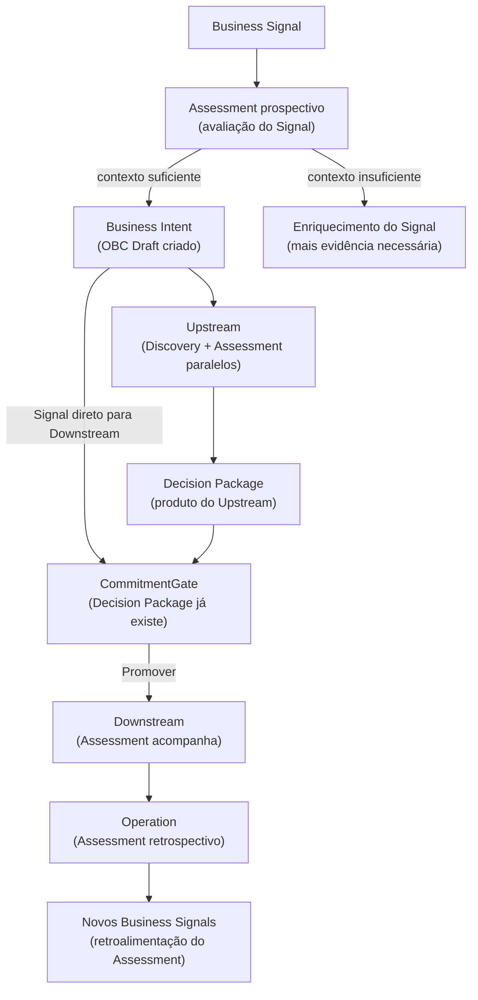
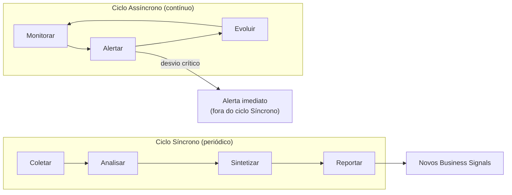

# Capítulo 4: Assessment — a jornada que acompanha todas

---

## Antes das três jornadas clássicas

Quando o framework ProdOps lista cinco jornadas, a tendência natural é lê-las como equivalentes: Discovery, Delivery, Operation, Assessment e Diligence como cinco responsabilidades do mesmo nível, cada uma com seu momento de entrada. Essa leitura é incorreta, e o erro importa.

Assessment não é uma jornada que começa depois de Discovery e antes de Delivery. Não é uma fase de avaliação periódica que acontece em paralelo às três jornadas clássicas de produto. É a camada de governança informacional do framework — a jornada com alcance transversal sobre todo o ciclo: atua desde o Business Signal, acompanha cada jornada durante toda sua duração, e retroalimenta o ciclo com novos Business Intents após a Operation.

A distinção é mais do que posicional. Uma jornada que começa depois de Discovery está subordinada às três clássicas: ela depende de que o trabalho já tenha começado para ter o que avaliar. O Assessment, como definido pelo ProdOps, tem alcance que se estende ao momento em que um Business Signal aparece no horizonte do produto — antes que qualquer decisão de iniciar Discovery tenha sido tomada.

O que isso significa operacionalmente: toda decisão relevante do ciclo de vida de uma capability — se transformar o Signal em Intent, se avançar para CommitmentGate, se o compromisso assumido está sendo honrado, o que o ciclo produziu de aprendizado para o próximo — tem uma contribuição da jornada Assessment. Não porque Assessment decide, mas porque Assessment produz o contexto informacional sem o qual as decisões seriam tomadas com base em percepção, não em evidência.

---

## A governança informacional começa com o Business Signal

O Business Signal é o ponto de entrada do ciclo de vida de uma capability: a observação, qualitativa ou quantitativa, que indica que pode existir uma oportunidade ou um problema que justifica atenção. Antes de qualquer experimento Upstream, antes de qualquer decisão de transformar o Signal em Business Intent, o Assessment já tem trabalho a fazer.

A pergunta que o Assessment responde nesse momento não é "o que vamos construir?" nem "como vamos construir?". É: **o ambiente informacional está suficientemente preparado para que a decisão de avançar — ou de não avançar — seja tomada com clareza sobre o que se sabe e o que não se sabe?**

Isso implica três perguntas menores. O Signal tem contexto suficiente para ser distinguido de ruído: é uma observação fundamentada ou uma intuição sem dados? O Signal se conecta a outros Signals existentes no corpus — há padrão, há precedente, há convergência com o que o histórico de experimentos e ciclos anteriores já produziu? E quais riscos informativos estão associados ao avanço: o que ainda não se sabe que seria necessário saber para comprometer recursos de forma responsável?

Assessment não decide se o Signal se transforma em Business Intent. Essa decisão pertence ao Product Owner e ao time. O que Assessment faz é garantir que a decisão seja tomada com a entropia informacional controlada: sem lacunas invisíveis, sem dependências implícitas, sem riscos que só aparecerão depois que o compromisso estiver assumido.

---

## A dimensão prospectiva: preparando o ambiente para a decisão

A dimensão prospectiva do Assessment é a que opera antes do compromisso Downstream: desde o Signal, durante o Upstream (quando existe), e até o CommitmentGate.

O artefato central que o Assessment prospectivo **avalia** é o **Decision Package**: o conjunto de evidências, hipóteses respondidas, riscos identificados e recomendação formal que o trio — PM, Tech Lead e Autor — usará no CommitmentGate para decidir o destino da capability.

O que o Assessment prospectivo faz não é produzir o Decision Package por si mesmo — isso é responsabilidade da jornada Discovery em modo Upstream. O que Assessment faz é avaliar a qualidade do package: o Decision Package é legível por um membro do trio que não participou do experimento, sem contexto verbal adicional? As hipóteses foram respondidas com critérios de falsificação declarados, ou apenas afirmadas? Os riscos foram avaliados com base em evidência ou apenas listados? A incerteza residual está explicitamente declarada como aceitável, ou foi simplesmente omitida?

Quando o Business Signal entra diretamente em Downstream — sem Upstream prévio, porque o contexto já é suficiente para o CommitmentGate —, o Assessment prospectivo avalia se a suficiência declarada é real: o que justifica dispensar a exploração? Quais são os riscos dessa decisão? Existe um **Reliability Plan** adequado ao perfil de risco do compromisso assumido?

O Reliability Plan é o segundo produto relevante da dimensão prospectiva. Ele define, antes da entrada no Delivery, as condições de confiabilidade que o capability precisa satisfazer ao longo do ciclo: SLIs iniciais, Reliability Rules, critérios de alerta e escalação. Em capabilities de alto risco, o Reliability Plan pode ser exigido como condição de entrada no Readiness Gate — sem ele, o gate não é aberto. Em capabilities de risco controlado, o plan pode ser produzido durante o Downstream com menor formalidade. A calibração é responsabilidade do Runtime de cada time; o ProdOps Framework define que a avaliação de quais condições se aplicam pertence ao Assessment prospectivo.

---

## A dimensão retrospectiva: lendo o que o passado produziu

Se a dimensão prospectiva do Assessment prepara o ambiente para a decisão, a dimensão retrospectiva extrai aprendizado do ciclo encerrado — e alimenta o próximo.

O Assessment retrospectivo é ativado após a conclusão de um ciclo Downstream completo: capability entregue, em estado Operational, com Release Trail finalizado. Seu foco é o que o ciclo produziu de evidência sobre o funcionamento do framework, não sobre o funcionamento da capability em si. A capability funciona: os OBCs documentam isso. O que o Assessment retrospectivo pergunta é: como o ciclo funcionou? O que o histórico revela sobre a saúde do sistema de trabalho?

As fontes primárias do Assessment retrospectivo são os **Timelines** — os registros cronológicos de cada ciclo — e os artefatos de medição que o ciclo gerou: DORA Extended metrics, Gate Failure Rate (frequência com que os gates do Downstream foram bloqueados antes de serem satisfeitos), Decision Latency (tempo entre evidência disponível e convocação do CommitmentGate), Discovery WIP (experimentos simultâneos em andamento).

A partir dessas fontes, o Assessment retrospectivo produz dois outputs. O primeiro é o **relatório de ciclo**: uma síntese do que o ciclo revelou sobre a saúde do processo — anti-padrões detectados, signals diagnósticos ativados, recomendações para o próximo ciclo. O segundo, mais importante, é o conjunto de **novos Business Signals**: observações derivadas da Operation que indicam oportunidades ou problemas a investigar no próximo ciclo. É por esse mecanismo que a retroalimentação do ProdOps opera — não como um ritual de retrospectiva desconectado do fluxo de trabalho, mas como a produção estruturada de inputs para o início do próximo ciclo.

| Fonte de dados | O que o Assessment retrospectivo lê |
|---|---|
| Release Trails | Como cada fase do Delivery foi executada; onde o fluxo travou |
| Gate Failure Rate | Frequência de bloqueios por gates não satisfeitos; sinal de rigor inadequado |
| Decision Latency | Tempo entre evidência e CommitmentGate; sinal de Perpetual Discovery |
| Postmortems | Incidentes em Operation; o que o Reliability Plan não previu |
| OBC Operational | Comportamento real vs. comportamento prometido; desvios de SLO |

---

## O ciclo do Assessment

O Assessment opera em dois ciclos complementares: o ciclo Síncrono, estruturado e periódico, e o ciclo Assíncrono, contínuo e orientado a eventos.

O ciclo **Síncrono** tem quatro fases: **Coletar** (agregar artefatos do ciclo: Timelines, OBCs, Release Trails, métricas, postmortems), **Analisar** (identificar padrões, signals diagnósticos, desvios entre o prometido e o entregue), **Sintetizar** (produzir conclusões e recomendações com grau de confiança declarado) e **Reportar** (comunicar ao trio e ao time as conclusões, com próximos passos acionáveis). O ciclo Síncrono é o momento em que o Assessment se torna visível para o time — é o relatório de ciclo, a retrospectiva com base em evidência, o input estruturado para o planejamento do próximo ciclo.

O ciclo **Assíncrono** não tem início e fim definidos: é o monitoramento contínuo do estado do sistema de trabalho. Enquanto o ciclo Síncrono lê o passado para orientar o futuro, o ciclo Assíncrono observa o presente para detectar desvios antes que se tornem problemas. Ele opera em três fases: **Monitorar** (observar métricas de fluxo, sinais de Perpetual Discovery, divergências entre artefatos e estado real), **Alertar** (sinalizar desvios que requerem atenção imediata, antes que o ciclo Síncrono os detecte com atraso) e **Evoluir** (incorporar novos critérios de monitoramento a partir do que ciclos anteriores revelaram como pontos cegos).

A relação entre os dois ciclos é de complementaridade: o Assíncrono detecta desvios no tempo real; o Síncrono os contextualiza no histórico do ciclo. Um desvio detectado pelo Assíncrono pode ser endereçado imediatamente, sem esperar pelo relatório de ciclo. Um padrão que o Síncrono identifica pode tornar-se um novo critério de monitoramento do Assíncrono.

---

## O que o Assessment não faz

A clareza sobre o que o Assessment não faz é tão importante quanto a clareza sobre o que ele faz.

**Assessment não escreve em Timelines.** Os Timelines são registros append-only produzidos pelas jornadas clássicas — Discovery, Delivery e Operation. O Assessment lê os Timelines; nunca os modifica. Essa restrição não é técnica: é epistemológica. A integridade dos registros de cada jornada é a condição que torna o Assessment retrospectivo confiável. Se o Assessment pudesse modificar os registros que lê, seus outputs perderiam a base objetiva que os distingue de percepção e julgamento subjetivo.

**Assessment não decide sobre o destino de uma capability.** Ele não aprova nem rejeita a transformação de um Signal em Intent, não vota no CommitmentGate, não autoriza o início do Downstream. Essas decisões pertencem ao trio — PM, Tech Lead e Autor. O que Assessment faz é preparar e qualificar o contexto informacional para que as decisões sejam tomadas com clareza — mas a decisão em si não é do Assessment.

**Assessment não define o que será construído.** Isso é responsabilidade de Discovery e Delivery. O Assessment avalia a qualidade do contexto informacional que informa essas decisões, não o mérito das decisões em si.

**Assessment não é uma auditoria de conformidade.** Ele não verifica se os artefatos foram preenchidos segundo um template: isso é responsabilidade do Diligence. O que Assessment avalia é a qualidade epistêmica do trabalho — se as hipóteses foram formuladas com critérios de falsificação, se as evidências têm substância, se os riscos foram identificados com especificidade. A forma dos artefatos interessa ao Diligence; o conteúdo epistêmico dos artefatos interessa ao Assessment.

---

## Assessment no corpus: o ciclo de retroalimentação da Magazine Siará

O corpus da Magazine Siará contém um caso que ilustra o mecanismo de retroalimentação do Assessment de forma concreta.

O Business Signal BS-001 — o Signal que originou a feature Split Payment — não surgiu do nada. Ele é rastreável a observações de Operation: clientes abandonando carrinhos, contratos com fornecedores parceiros sendo perdidos por ausência de flexibilidade de pagamento. Essas observações são exatamente o tipo de output que o Assessment retrospectivo produz quando lê o estado Operational de capabilities existentes e identifica gaps entre o comportamento prometido e as necessidades reais do mercado.

O PI-001 documenta por que BS-001 entrou diretamente em Downstream sem Upstream prévio: "demanda confirmada por dois canais independentes, escopo delimitado, deadline inegociável". Essa justificativa é Assessment prospectivo em operação — a avaliação de que o contexto informacional era suficiente para dispensar a exploração pré-CommitmentGate. A ausência de Upstream não significa ausência de avaliação: significa que a avaliação concluiu que a incerteza residual era aceitável para o compromisso.

O EXP-007, aberto em paralelo ao Downstream do Split Payment, é um experimento Upstream — não a jornada Assessment em si, mas o resultado do Assessment funcionando: a avaliação retrospectiva das lacunas do ciclo em andamento gerou o Signal que motivou abrir o experimento. Enquanto DS-61 honrava o compromisso do Split Payment Pix+Boleto, o EXP-007 explorava as combinações prioritárias de métodos, o modelo de domínio adequado para a composição e a política de falha parcial. Quando DS-61 encerrou, o aprendizado do EXP-007 — incluindo o OBC Draft de `payment-composition` — estava pronto para alimentar o próximo ciclo. Esse é o mecanismo de retroalimentação funcionando: o Assessment leu o ciclo em curso e produziu o Signal; o experimento Upstream respondeu à hipótese.

O que torna esse caso valioso não é sua excepcionalidade. É que ele representa o funcionamento normal do Assessment: acompanhar o ciclo corrente, extrair aprendizado do que está em Operation, e preparar o ambiente informacional para o próximo.

---

## Assessment como camada, não como fase

A leitura mais comum de uma jornada nova em um framework é posicioná-la em uma sequência: antes de X, depois de Y. O Assessment resiste a essa leitura — não porque seja especial, mas porque sua responsabilidade é estruturalmente diferente das três jornadas clássicas.

Discovery, Delivery e Operation são jornadas de execução: cada uma tem um input esperado, um output definido e um critério de conclusão. O Assessment é uma jornada de governança informacional: seu input é o estado corrente do sistema de trabalho, seu output é o contexto qualificado para as decisões do ciclo, e seu "critério de conclusão" é a entropia informacional controlada ao longo de todo o ciclo.

Isso não torna o Assessment mais importante do que as três clássicas: torna-o diferente em natureza. Um time pode operar sem Assessment formal — usando julgamento, memória e intuição no lugar de avaliação sistemática. O custo não é imediato: manifesta-se gradualmente, como decisões tomadas com contexto incompleto, riscos identificados tarde, padrões de failure que se repetem porque não foram formalizados no relatório de ciclo anterior.

O ProdOps não prescreve uma implementação única do Assessment. O que o Framework define é o que Assessment é responsável por **avaliar e qualificar** — o Decision Package gerado pela Discovery, o Reliability Plan adequado ao risco do compromisso, a saúde do ciclo com base em evidência, os novos Business Signals como retroalimentação — e o Runtime de cada time decide com que frequência, com que nível de formalidade e com que instrumentação o Assessment opera.

Os capítulos seguintes descrevem os modos de execução (Upstream e Downstream) e as jornadas clássicas. Em cada um deles, o Assessment opera como pano de fundo: garantindo que a decisão que encerra uma fase tenha o contexto informacional que ela exige, e que o aprendizado que cada fase produz não se perca entre um ciclo e o próximo.

---

*Capítulo 4 de 11 | Parte II: Os Modos*

---

---

[→ Capítulo 5 — Upstream: o modo da incerteza explícita](capitulo-05.md)
[← Capítulo 3 — O que é um modo de execução](capitulo-03.md)
