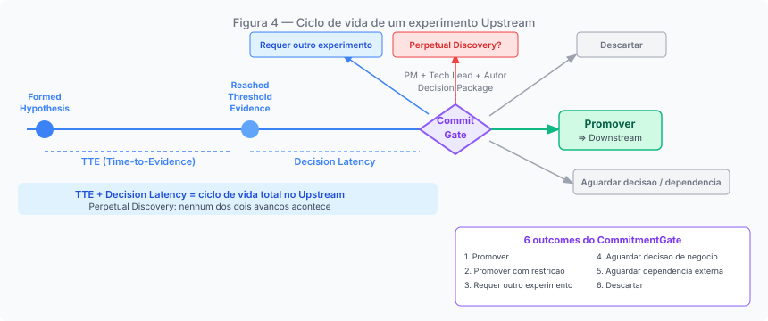

# Capítulo 4: Upstream: o modo da incerteza explícita

---

## A disciplina do que não é promessa


*Figura 4. Ciclo de vida de um experimento Upstream: de HypothesisFormed ao CommitmentGate com seus 6 outcomes*

O Upstream não é o modo onde o rigor é descartado. É o modo onde o rigor assume uma forma distinta: orientado à qualidade da evidência, não à verificação de um compromisso de entrega.

O que define o Upstream não é a ausência de compromisso, mas o tipo de compromisso que está em vigor. Há três camadas nessa distinção que precisam ser mantidas separadas.

O trabalho em andamento carrega um compromisso real. A investigação tem hipótese, responsáveis, e algum critério de parada, mesmo que implícito. Conduzir um experimento sem rigor, sem hipótese formulada, sem progressão verificável, não é Upstream bem executado; é Upstream mal conduzido.

Não existe, no entanto, compromisso formal com uma capability específica: sem OBC Committed, sem Release Trail, sem promessa de que aquele comportamento estará em produção para aqueles usuários, com aqueles critérios de aceite.

E não existe compromisso bloqueante: mudar de direção, encerrar o experimento, ou rejeitar a hipótese não viola um contrato que precise ser renegociado. O custo de reversão permanece controlável porque o regime vigente não transforma a mudança de curso em quebra de promessa.

O software produzido no Upstream pode ter qualidade de produção: código testado, documentado e implantável. O que distingue esse trabalho do Downstream não é a qualidade técnica do artefato, mas o regime de compromisso sob o qual ele foi produzido.

A disciplina do Upstream é a disciplina de manter essas três camadas distintas. Um time pode trabalhar com todo o rigor técnico de um engenheiro sênior em modo Upstream e ainda assim o trabalho permanece não bloqueante, porque o compromisso de capability não foi assumido.

---

## Quando abrir um experimento

Quando o Upstream opera na jornada Discovery, o instrumento de trabalho mais estruturado é o experimento. Um experimento não é qualquer investigação informal: é um artefato estruturado com propósito definido, hipótese falsificável, e critério de parada.

O framework ProdOps orienta quatro condições para justificar a abertura de um experimento formal. Todas precisam ser verdadeiras: existe uma hipótese falsificável; a hipótese ainda não foi respondida por evidência existente; a resposta tem valor de decisão: ela afeta o que será construído ou como; e o custo de assumir a hipótese como verdadeira sem testá-la supera o custo do experimento.

Essas condições eliminam dois casos frequentes de uso inadequado do experimento. O primeiro: investigar o que já é conhecido. A hipótese já foi respondida por experimentos anteriores ou pelo conhecimento acumulado do time, e formalizar um novo experimento é trabalho desnecessário. O segundo: formalizar uma preferência não testável. A hipótese não é falsificável porque é uma crença ou uma orientação de design sem critério de verificação.

> **Nota:** A distinção entre pesquisa informal e experimento formal é operacional, não canônica. O framework não exige que toda investigação seja um experimento formal, apenas que experimentos formais satisfaçam essas condições.

O levantamento de necessidades de procurement do Procurare é um exemplo concreto. A hipótese central: "a maior dor do Procurement não é falta de tecnologia, mas falta de contexto estruturado: a intenção de negócio nunca é capturada de forma que sistemas possam agir sobre ela." A hipótese é falsificável: se usuários de procurement relatarem que a dor primária é outra (custo, tempo de aprovação, falta de fornecedores qualificados), a hipótese é refutada. A resposta tem valor de decisão: ela define o que o MVP do Procurare precisa priorizar. E o custo de assumir a hipótese sem testá-la seria construir um sistema de captura de intenção para um problema que não é o principal.

---

## A anatomia do experimento

Todo experimento Upstream tem dois artefatos obrigatórios: o `experiment.md` e o `upstream-trail.md`.

O `experiment.md` documenta a estrutura permanente do experimento: Business Goal, Questions to Answer, Hypothesis, Repository Scope Gate, Findings e Decision Package.

```mermaid
graph TD
    EXP["experiment.md"] --> BG["Business Goal"]
    EXP --> HYP["Hypothesis + Evidence Threshold"]
    EXP --> QA["Questions to Answer"]
    EXP --> SC["Scope"]
    EXP --> DP["Decision Package"]
    EXP --> EC["Exit Criteria"]
    DP --> ES["Executive Summary"]
    DP --> REC["Decisão Recomendada"]
    DP --> RISK["Riscos"]
    DP --> OPP["Oportunidades"]
    DP --> DS["Escopo Downstream"]
``` Não é um template de burocracia: é o mecanismo que mantém o experimento orientado à sua hipótese central. A seção Decision Package é a que determina se o experimento está maduro para o CommitmentGate.

O `upstream-trail.md` é o registro cronológico das sessões: o que foi feito, o que foi descoberto, quais artefatos foram produzidos, quais decisões foram tomadas e por quê. Ele serve a dois propósitos. Durante o experimento, é o mecanismo que previne a perda de contexto entre sessões. No CommitmentGate, é a evidência de que o experimento teve progressão real, não apenas acumulou entradas sem avançar na hipótese.

Além dos obrigatórios, experimentos podem ter artefatos opcionais: OBC Draft (obrigatório antes do CommitmentGate, não antes), BDD Feature em rascunho, arquivos de evidência em `evidence/`, protótipos em `prototypes/`. A chave é que esses artefatos são criados conforme a necessidade do experimento, não como requisito de entrada.

---

## Evidence Threshold: o critério que o Upstream pode ou não declarar

O Evidence Threshold é o critério explícito que define quando a evidência produzida é suficiente para tomar uma decisão de comprometimento.

No Upstream, o Evidence Threshold é *opcional* (recomendado, mas não obrigatório). Se declarado, revisões ao threshold devem ser registradas no upstream-trail. Se não declarado, o critério de parada é o julgamento do autor: as perguntas de investigação foram respondidas, o Decision Package pode ser redigido com substância, a incerteza residual é declarável e aceitável.

O que não é aceitável é a ausência total de critério de parada, e é exatamente essa ausência que produz o principal anti-padrão do Upstream.

---

## Perpetual Discovery: o anti-padrão central

Perpetual Discovery é o estado de um experimento que continua acumulando evidência e sessões sem que a hipótese central avance para uma decisão de comprometimento. O experimento nunca chega ao CommitmentGate, não porque a evidência seja insuficiente, mas porque não há pressão ou critério explícito que force a decisão.

Três condições estruturais produzem Perpetual Discovery. A ausência de Evidence Threshold declarado: sem critério de parada, o experimento sempre pode "precisar de mais evidência": o threshold implícito é infinito. A hipótese central nunca formalizada: sem o que falsificar, nunca há uma resposta: o experimento continua porque a pergunta permanece aberta. E o CommitmentGate visto como evento de aprovação em vez de decisão de comprometimento: se o gate é percebido como o momento em que a capacidade de mudar de curso termina, há incentivo racional para evitá-lo.

O framework ProdOps identifica quatro sinais diagnósticos que tornam o Perpetual Discovery reconhecível sem depender de julgamento subjetivo. Os limiares numéricos abaixo são heurísticas orientadoras, não critérios canonizados. O que é invariante é a estrutura do diagnóstico; o que cada time calibra é o threshold:

**S1: Ausência de progressão no upstream-trail por 3+ sessões.** Se o trail tem entradas mas a seção Hypothesis do experiment.md não mudou há mais de 2 semanas e o Decision Package ainda não tem substance, o experimento está estagnado.

**S2: Questions to Answer com status "não respondível com evidência disponível".** Se alguma pergunta foi marcada como não respondível sem que a hipótese central tenha sido respondida por outra via, e esse estado persiste há mais de 5 dias sem evidência substituta, o experimento está bloqueado.

**S3: Evidence Threshold declarado e não atingível sem nova hipótese.** Se o threshold foi declarado e a evidência acumulada não o satisfaz após 3 ou mais sessões de coleta, sem identificação de novas fontes, a rota atual não levará ao threshold.

**S4: Stakeholder com decisão bloqueada há 10+ dias úteis por esse experimento.** O custo de espera supera o valor de continuar explorando: a decisão de avançar ou encerrar precisa ser tomada.

Quando múltiplos sinais estão ativos simultaneamente, o experimento está em risco crítico de Perpetual Discovery e o CommitmentGate deve ser convocado, não para aprovar, mas para decidir o que fazer.

```mermaid
graph TD
    S1["S1: upstream-trail sem progressão por 3+ sessões"]
    S2["S2: Questions to Answer não respondíveis por 5+ dias"]
    S3["S3: Evidence Threshold declarado mas não atingível"]
    S4["S4: Stakeholder bloqueado por 10+ dias úteis"]
    S1 & S2 & S3 & S4 --> PD["Perpetual Discovery diagnosticado"]
    PD --> |"outcome correto"| CG["CommitmentGate imediato"]
    CG --> D["Descartar com aprendizado\nou Requer outro experimento"]
```

---

## Os três atos de implantação

Um ponto que merece atenção explícita: o Upstream não proíbe código em produção. O modo descreve o tipo de compromisso, não onde o código pode ser implantado.

Existem três atos distintos de implantação no Upstream, com autorizações e consequências diferentes:

**Sandbox Deploy**: código implantado em stack efêmera e isolada, sem tráfego de cliente real. O engenheiro decide. A stack é destruída ao final do experimento. Sem Release Trail, sem OBC Committed.

**Produção Controlada**: código Upstream implantado em produção real, sem CommitmentGate. Autorização explícita do time e da liderança. Rollback imediato disponível. Sem Release Trail exigido. Isso não é violação do modo Upstream: é um ato autorizado. O que a diferencia da promoção é que o *compromisso de capability* (OBC Committed, gates do Downstream) não foi assumido. O código chega a produção; a capability permanece em exploração.

**Promoção de Capability**: CommitmentGate com outcome Promover. BDD Feature e OBC movidos para os paths comprometidos. O item entra no Iteration Plan. O Downstream começa.

A distinção entre Produção Controlada e Promoção de Capability é precisamente a distinção que o modelo modal resolve: no primeiro caso, o código está em produção mas a capability não está comprometida; no segundo, o compromisso foi formalmente assumido com todos os seus gates.

---

## O Upstream em operação: o Procurare como exemplar

O levantamento de necessidades de procurement do Procurare ilustra o Upstream como modo operacional. O experimento abriu com uma hipótese falsificável sobre a dor central do Procurement, definiu 10 perguntas de investigação estruturadas, e produziu um mapa completo de necessidades do Procurare cobrindo processo, dados, integrações, agentes e observabilidade.

O Decision Package resultante inclui recomendação de "Mover para Downstream": o equivalente ao outcome Promover do CommitmentGate. O experimento está marcado como Completed, o que indica que a hipótese foi respondida e o Decision Package foi redigido com substância.

O que o levantamento de procurement do Procurare demonstra é o Upstream como engenharia séria de exploração: não uma fase de baixa disciplina, mas um esforço estruturado de redução de incerteza que produziu conhecimento verificável e uma recomendação justificada para o próximo passo.

O que esse levantamento ainda não demonstrou, no repositório atual, é o CommitmentGate executado formalmente: com o trio convocado, o Decision Package avaliado, e o outcome registrado no upstream-trail. Isso é a fronteira entre o que o Upstream produz e o que o Downstream começa.

---

## O que o Upstream não é responsável por fazer

A definição do Upstream inclui uma lista explícita do que está fora de seu escopo. Implementar a capability comprometida com gates bloqueantes: isso é a jornada Delivery no modo Downstream. A distinção é de compromisso, não de atividade física: o Upstream pode produzir código funcional, prova de conceito, implementação em sandbox ou em produção controlada, sem que isso constitua a entrega de uma capability formalmente prometida. Definir como a observabilidade será implementada tecnicamente: isso é responsabilidade do Downstream (o "como" da instrumentação, não o "o que" deve ser observável). Produzir OBC Committed: isso é Discovery no Downstream. Produzir BDD completa em `artifacts/bdd/`: isso acontece antes do Readiness Gate. Garantir ausência de incerteza: incerteza residual aceitável é um critério válido de CommitmentGate.

Essa última afirmação é contraintuitiva o suficiente para merecer ênfase: o Upstream não precisa eliminar toda a incerteza. Precisa reduzir a incerteza ao ponto em que o risco residual é aceitável para assumir o compromisso do Downstream. O que é "aceitável" é julgamento coletivo do trio no CommitmentGate, não um critério de zero incerteza que nenhum experimento finito pode satisfazer.

---

*Capítulo 4 de 10 | Parte II: Os Modos*
