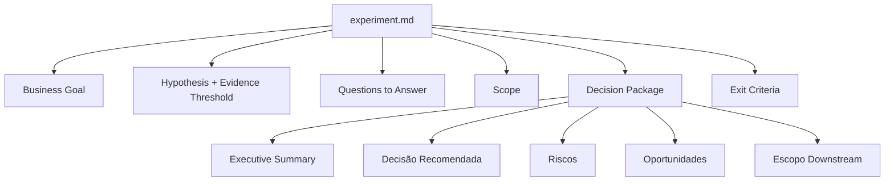
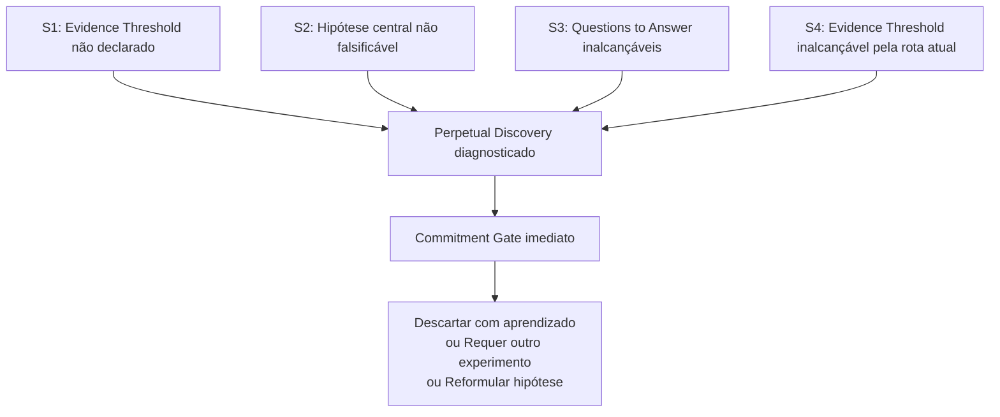
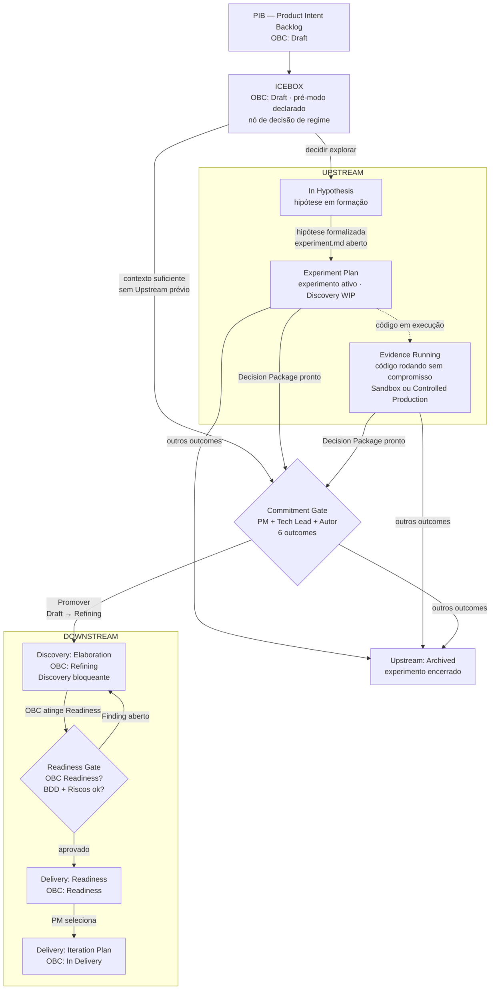

# Capítulo 5: Upstream: o modo da incerteza explícita

---

## A disciplina do que não é promessa

*Figura 5. Ciclo de vida de um experimento Upstream: de Hypothesis Formed ao Commitment Gate com seus 6 outcomes*

O Upstream não é o modo onde o rigor é descartado. É o modo onde o rigor assume uma forma distinta: orientado à qualidade da evidência, não à verificação de um compromisso Downstream.

O que define o Upstream não é a ausência de compromisso, mas o tipo de compromisso que está em vigor. Há três camadas nessa distinção que precisam ser mantidas separadas.

O trabalho em andamento carrega um compromisso real. A investigação tem hipótese, responsáveis, e algum critério de parada, mesmo que implícito. Conduzir um experimento sem rigor, sem hipótese formulada, sem progressão verificável, não é Upstream bem executado; é Upstream mal conduzido.

Não existe, no entanto, compromisso formal com uma Product Capability específica: sem OBC Readiness, sem Release Trail, sem promessa de que aquele comportamento estará em produção para aqueles usuários, com aqueles critérios de aceite.

E não existe compromisso bloqueante: mudar de direção, encerrar o experimento, ou rejeitar a hipótese não viola um contrato que precise ser renegociado. O custo de reversão permanece controlável porque o regime vigente não transforma a mudança de curso em quebra de promessa.

O software produzido no Upstream pode ter qualidade de produção: código testado, documentado e implantável. O que distingue esse trabalho do Downstream não é a qualidade técnica do artefato, mas o regime de compromisso sob o qual ele foi produzido.

A disciplina do Upstream é a disciplina de manter essas três camadas distintas. Um time pode trabalhar com todo o rigor técnico de um engenheiro sênior em modo Upstream e ainda assim o trabalho permanece não bloqueante, porque o compromisso de Product Capability não foi assumido.

---

## Quando abrir um experimento

Quando o Upstream opera na jornada Discovery, o instrumento de trabalho mais estruturado é o experimento. Um experimento não é qualquer investigação informal: é um artefato estruturado com propósito definido, hipótese falsificável, e critério de parada.

O framework ProdOps orienta quatro condições para justificar a abertura de um experimento formal. Todas precisam ser verdadeiras: existe uma hipótese falsificável; a hipótese ainda não foi respondida por evidência existente; a resposta tem valor de decisão: ela afeta o que será construído ou como; e o custo de assumir a hipótese como verdadeira sem testá-la supera o custo do experimento.

Essas condições eliminam dois casos frequentes de uso inadequado do experimento. O primeiro: investigar o que já é conhecido. A hipótese já foi respondida por experimentos anteriores ou pelo conhecimento acumulado do time, e formalizar um novo experimento é trabalho desnecessário. O segundo: formalizar uma preferência não testável. A hipótese não é falsificável porque é uma crença ou uma orientação de design sem critério de verificação.

> **Nota:** A distinção entre pesquisa informal e experimento formal é operacional, não canônica. O framework não exige que toda investigação seja um experimento formal, apenas que experimentos formais satisfaçam essas condições.

O EXP-001 da Payments API da Magazine Siará é um exemplo concreto. A hipótese central: "o ciclo completo de cartão de crédito pode ser suportado sem cruzar a fronteira PCI desde que apenas o fluxo hosted seja exposto na primeira iteração." A hipótese é falsificável: se a análise de escopo PCI mostrar que hosted e tokenizado têm exposição equivalente, ou se o time de Checkout não conseguir integrar o fluxo hosted sem breaking changes no contrato existente, a hipótese é refutada. A resposta tem valor de decisão: ela define qual dos três modelos de integração (hosted, tokenizado, transparente) entra primeiro no Downstream. E o custo de assumir a hipótese sem testá-la seria construir com o modelo errado e precisar de um segundo ciclo Downstream para corrigir.

---

## A anatomia do experimento

Todo experimento Upstream tem dois artefatos obrigatórios: o `experiment.md` e o `upstream-trail.md`.

O `experiment.md` documenta a estrutura permanente do experimento: Business Goal, Questions to Answer, Hypothesis, Repository Scope Gate, Findings e Decision Package.

Não é um template de burocracia: é o mecanismo que mantém o experimento orientado à sua hipótese central. A seção Decision Package é a que determina se o experimento está maduro para o Commitment Gate.

O `upstream-trail.md` é o registro cronológico das sessões: o que foi feito, o que foi descoberto, quais artefatos foram produzidos, quais decisões foram tomadas e por quê. Ele serve a dois propósitos. Durante o experimento, é o mecanismo que previne a perda de contexto entre sessões. No Commitment Gate, é a evidência de que o experimento teve progressão real, não apenas acumulou entradas sem avançar na hipótese.

Além dos obrigatórios, experimentos trabalham sobre artefatos que já existem ou que podem ser enriquecidos durante a investigação: o OBC Draft (que nasce com o Business Intent, pré-existe ao experimento e precisa estar presente como arquivo antes do Commitment Gate), a BDD Feature em rascunho, arquivos de evidência em `evidence/`, protótipos em `prototypes/`. O experimento não cria o OBC; opera sobre ele. Os demais artefatos opcionais são produzidos conforme a necessidade da investigação, não como requisito de entrada.

---

## Evidence Threshold: o critério que o Upstream pode ou não declarar

O Evidence Threshold é o critério explícito que define quando a evidência produzida é suficiente para tomar uma decisão de comprometimento.

No Upstream, o Evidence Threshold é *opcional* (recomendado, mas não obrigatório). Se declarado, revisões ao threshold devem ser registradas no upstream-trail. Se não declarado, o critério de parada é o julgamento do autor: as perguntas de investigação foram respondidas, o Decision Package pode ser redigido com substância, a incerteza residual é declarável e aceitável.

O que não é aceitável é a ausência total de critério de parada, e é exatamente essa ausência que produz o principal anti-padrão do Upstream.

Quatro conceitos que operam em sequência no Upstream, mas que não são sinônimos: o **Evidence Threshold** é o critério explícito declarado antes ou durante o experimento; a **evidência suficiente** é o julgamento epistemológico sobre se o conhecimento produzido permite uma decisão (existe mesmo quando nenhum threshold foi formalmente declarado); o **critério de parada** é a condição que indica que o experimento deve encerrar: pode ser o threshold atingido, o julgamento do autor, ou um dos sinais S1–S4; o **Commitment Gate** é o mecanismo coletivo que decide o destino da Product Capability com base na evidência produzida. Usar "Evidence Threshold" como sinônimo de "evidência suficiente" ou de "Commitment Gate" é o erro que alimenta o Perpetual Discovery.

---

## Perpetual Discovery: o anti-padrão central

Perpetual Discovery é o estado de um experimento cujos indicadores de parada estão ausentes, ambíguos ou demonstravelmente inalcançáveis. Um experimento sem Evidence Threshold declarado não sabe quando tem evidência suficiente: qualquer quantidade parece insuficiente. Um experimento com hipótese não falsificável não tem resultado que o encerre: a exploração continua porque a pergunta permanece estruturalmente aberta. Um experimento com perguntas inalcançáveis está bloqueado sem saída. Em qualquer desses casos, o experimento não continua por necessidade real de mais evidência: continua porque o critério que encerraria a exploração não existe ou não pode ser satisfeito.

Três condições estruturais produzem essa ambiguidade nos indicadores de parada. A ausência de Evidence Threshold declarado: sem critério explícito, o threshold implícito é infinito e nunca é atingido. A hipótese central nunca formalizada como falsificável: sem o que refutar, qualquer evidência parece parcial e o experimento continua. O Commitment Gate visto como evento de aprovação em vez de decisão de comprometimento: se o Gate é percebido como o momento em que a capacidade de mudar de curso termina, há incentivo racional para não declarar critérios de parada que forcem a sua convocação.

O framework ProdOps identifica quatro sinais diagnósticos que tornam o Perpetual Discovery reconhecível. Cada sinal é suficiente, individualmente, para convocar o Commitment Gate: não é necessário que todos estejam ativos simultaneamente.

**S1: Evidence Threshold não declarado.** O experimento não definiu um critério de parada explícito no `experiment.md`. Quando o threshold está ausente, o critério implícito é "quando tivermos evidência suficiente" — que nunca se satisfaz sozinho. É o convite estrutural mais direto ao Perpetual Discovery.

**S2: Hipótese central não falsificável.** A hipótese foi formulada de forma que nenhum resultado possível a refuta, ou nunca foi formalizada como pergunta com resposta verificável. Sem o que falsificar, não existe resultado que encerre o experimento: a exploração continua porque a pergunta permanece estruturalmente aberta.

**S3: Questions to Answer demonstravelmente inalcançáveis.** Uma ou mais perguntas foram marcadas como "não respondíveis com a evidência disponível" e o experimento não identificou nova rota de evidência nem reformulou a hipótese central. O experimento está bloqueado: não consegue satisfazer seus próprios indicadores de parada.

**S4: Evidence Threshold declarado mas inalcançável pela rota atual.** O critério de parada existe mas a evidência acumulada não o satisfaz e novas fontes não foram identificadas. Continuar coletando evidência do mesmo tipo não alterará o resultado: a rota atual é um beco sem saída estrutural.

Qualquer sinal ativo justifica convocar o Commitment Gate imediatamente — não para aprovar, mas para decidir: reformular a hipótese, encerrar com aprendizado registrado, ou declarar que o experimento requer nova formulação antes de prosseguir.

---

## Os três atos de implantação

Um ponto que merece atenção explícita: o Upstream não proíbe código em produção. O modo descreve o tipo de compromisso, não onde o código pode ser implantado.

Existem dois atos distintos de implantação no Upstream, com autorizações e consequências diferentes:

**Sandbox Deploy**: código implantado em stack efêmera e isolada, sem tráfego de cliente real. O engenheiro decide. A stack é destruída ao final do experimento. Sem Release Trail, sem OBC Readiness.

**Produção Controlada**: código Upstream implantado em produção real, sem Commitment Gate. Autorização explícita do time e da liderança. Rollback imediato disponível. Sem Release Trail exigido (o que não significa sem evidência): o que foi observado em Produção Controlada deve ser registrado no upstream-trail do experimento. Isso não é violação do modo Upstream: é um ato autorizado. O que a diferencia da promoção é que o *compromisso de Product Capability* (OBC Readiness, Gates do Downstream) não foi assumido. O código chega a produção; a Product Capability permanece em exploração.

O terceiro ato é a saída do Upstream, não uma implantação dentro dele:

**Promoção de Product Capability**: Commitment Gate com outcome Promover. O OBC transita de Draft para Refining; a BDD Feature existe como rascunho nos paths do Downstream. O item entra em Discovery: Elaboration, onde a Discovery Downstream elabora o escopo, completa a BDD e satisfaz as condições do Readiness Gate. Após o Readiness Gate, o OBC alcança o estado Readiness; o Iteration Plan é criado e a Delivery começa com o Bootstrap.

A distinção entre Produção Controlada e Promoção de Product Capability é precisamente a distinção que o modelo modal resolve: no primeiro caso, o código está em produção mas a Product Capability não está comprometida; no segundo, o compromisso foi formalmente assumido com todos os seus Gates.

---

## O Upstream em operação: a Magazine Siará como exemplar

Os três primeiros experimentos da Payments API da Magazine Siará (EXP-001, EXP-002 e EXP-003) ilustram o Upstream como modo operacional em sua forma mais completa, com Commitment Gate executado ao final da sequência.

O EXP-001 abriu com uma questão de alto risco: como suportar o ciclo completo de cartão de crédito sem cruzar a fronteira PCI nem acoplar o Checkout ao contrato do Asaas? Antes de escrever uma linha de código de produção, o experimento especificou os BDD scenarios obrigatórios, os Observable Events esperados para cada fluxo (autorização, confirmação, análise de risco, recusa, cancelamento, estorno) e as dimensões que nunca poderiam aparecer nos logs (número do cartão, CVV, token do provedor). O EXP-002 mapeou as capacidades e limitações do sandbox Asaas para reprodução do ciclo de cartão, e confirmou o Validation Workbench como ambiente de simulação para os cenários que o sandbox não consegue reproduzir deterministicamente; a validação completa dos cenários do provedor permanece em aberto, dependente de evidência externa do Asaas. O EXP-003 comparou sistematicamente os três modelos de integração possíveis (hosted, tokenizado, transparente) e produziu a recomendação com justificativa: apenas a entrada hosted avança para o Downstream, porque é a única opção que não exige decisões externas ao time de Payments.

O Decision Package do EXP-003 recomenda Promover com restrição (outcome ②): o slice hosted avança; as demais opções permanecem em Upstream aguardando decisões de terceiros (escopo PCI, modelo de token, UX do Checkout). O Commitment Gate foi executado com esse Decision Package: o trio registrou o outcome, e o Downstream iniciou exclusivamente para a entrada hosted.

Três experimentos sequenciais. Nenhuma linha de código de produção durante os três. Uma recomendação verificável por terceiros. Um Commitment Gate que decidiu sobre o destino da Product Capability com evidência suficiente, e com restrição explícita sobre o que a evidência não suportava. Esse é o modo Upstream operado com rigor de engenharia: não uma fase de baixa disciplina antes da "engenharia real". Um regime de compromisso não bloqueante que produziu conhecimento verificável, e um Decision Package que tornou o Commitment Gate possível.

---

## Coordenação do Upstream: o Experiment Plan

Quando um time opera múltiplos experimentos Upstream em paralelo, surge a necessidade de um artefato de coordenação. Esse é o **Experiment Plan**: uma VIEW sobre os itens do Icebox que possuem um experimento ativo: hipótese formulada, `experiment.md` aberto, investigação em andamento.

O Experiment Plan não é um sprint. Não tem data de término nem sequência obrigatória. É um instrumento de visibilidade: responde à pergunta *"quais hipóteses estamos investigando agora?"* e torna visível o **Discovery WIP**: o número de experimentos Upstream ativos simultaneamente.

O Experiment Plan é o equivalente Upstream do Iteration Plan. O Iteration Plan governa o Downstream em execução (Product Capabilities comprometidas, em Delivery). O Experiment Plan governa o Upstream em exploração (hipóteses ativas, sem compromisso). Os dois são simétricos: um não substitui o outro; coexistem quando o time opera nos dois modos.

*Figura 5a. Estrutura do PIB: o Icebox como nó de triagem pré-modo, as VIEWs Upstream, o Commitment Gate como fronteira modal, e as VIEWs Downstream até a Delivery.*

Um item fica no Icebox enquanto não há decisão de regime: pode ir diretamente ao Commitment Gate (contexto de negócio suficiente, sem necessidade de exploração), ou ativar o caminho Upstream abrindo uma hipótese. O Experiment Plan lista apenas os experimentos que estão ativos neste momento; um item no Icebox que ainda não abriu experimento não aparece no Experiment Plan.

Os três experimentos da Magazine Siará (EXP-001, EXP-002, EXP-003) seriam representados no Experiment Plan durante suas respectivas janelas de investigação, e removidos quando o Commitment Gate registrou o outcome *Promover com restrição* e o item entrou em Discovery: Elaboration com Downstream Declared.

---

## O que o Upstream não é responsável por fazer

A definição do Upstream inclui uma lista explícita do que está fora de seu escopo. Implementar a Product Capability comprometida com Gates bloqueantes: isso é a jornada Delivery no modo Downstream. A distinção é de compromisso, não de atividade física: o Upstream pode produzir código funcional, prova de conceito, implementação em sandbox ou em produção controlada, sem que isso constitua a entrega de uma Product Capability formalmente prometida. Comprometer e implementar tecnicamente a observabilidade da Product Capability (SLOs, Observable Events, instrumentação em produção): isso é responsabilidade do Downstream. No Upstream, ODD orienta documentar o que precisa ser observável para testar a hipótese, sem que isso constitua compromisso de implementação. Produzir OBC Readiness: isso é Discovery no Downstream. Produzir BDD completa em `prodops/artifacts/bdd/`: isso acontece antes do Readiness Gate. Garantir ausência de incerteza: incerteza residual aceitável é um critério válido de Commitment Gate.

Essa última afirmação é contraintuitiva o suficiente para merecer ênfase: o Upstream não precisa eliminar toda a incerteza. Precisa reduzir a incerteza ao ponto em que o risco residual é aceitável para assumir o compromisso do Downstream. O que é "aceitável" é julgamento coletivo do trio no Commitment Gate, não um critério de zero incerteza que nenhum experimento finito pode satisfazer.

Vale atenção especial ao item "Produzir OBC Readiness: isso é Discovery no Downstream". Ele resolve um mal-entendido frequente: um Business Signal que entra diretamente em Downstream sem Upstream prévio não pula o discovery. O discovery acontece na jornada Discovery executada em modo Downstream, com rigor bloqueante. O OBC transita de Draft para Refining. A BDD Feature é escrita e refinada. As perguntas do Business Intent são resolvidas com decisões datadas e responsáveis identificados. O Readiness Gate bloqueia a entrada na jornada Delivery até que essas condições estejam satisfeitas. Somente depois (com o Iteration Plan gerado no Planning) é que o Bootstrap, primeira fase do Delivery, começa. O que "sem Upstream" descreve é a ausência de exploração pré-Commitment Gate. O que acontece após o Commitment Gate, na jornada Discovery em modo Downstream, é discovery real: com Gates bloqueantes que não permitem avançar enquanto as condições não estiverem satisfeitas.

---

*Capítulo 5 de 11 | Parte II: Os Modos*

---

[← Capítulo 4 — Assessment: a jornada que acompanha todas](capitulo-04.md)
[→ Capítulo 6 — Downstream: o modo do compromisso](capitulo-06.md)
