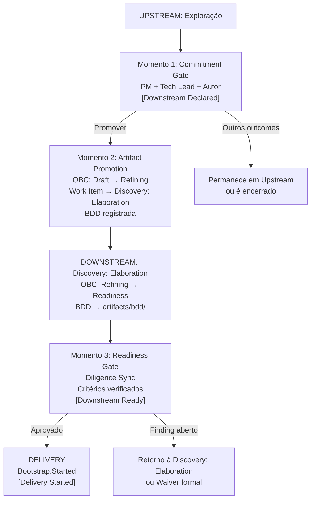
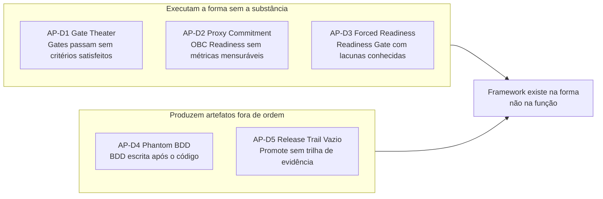

# Capítulo 6: Downstream: o modo do compromisso

---

## Onde o Downstream começa

Existe um equívoco comum sobre o ponto de partida do Downstream. Ele não começa quando o time "termina o discovery". Não começa quando "a equipe sente que está pronta". Não começa quando o Product Manager decide priorizar um item.

O Downstream começa quando o Commitment Gate é executado com o outcome Promover, e não antes. Esse é o momento em que o modo é declarado: o regime de rigor muda de não bloqueante para bloqueante, e o item passa a carregar um compromisso formal.

Essa precisão não é protocolar. É a consequência direta do que o Downstream representa: uma mudança de regime de compromisso. E regimes de compromisso precisam ter um momento de início que seja verificável. "A equipe sentiu que estava pronta" não é verificável. Um Commitment Gate registrado no upstream-trail, com data, participantes e outcome documentado, é.

O que o Commitment Gate não inicia é a Delivery. O framework ProdOps distingue três estados dentro do modo Downstream: **Downstream Declared**: o compromisso foi assumido, o item entra em Discovery: Elaboration; **Downstream Ready**: os requisitos de pré-Delivery foram satisfeitos e verificados; **Delivery Started**: Bootstrap foi iniciado. O Commitment Gate corresponde ao Downstream Declared. Entre ele e o Bootstrap.Started existe um protocolo de readiness que é parte do Downstream, não uma antecâmara fora dele.

---

## Os três momentos da transição

O protocolo detalhado de operacionalização dessa transição (os passos entre Downstream Declared e Delivery Started) é uma proposta do trabalho de canonização do framework ProdOps, robustamente suportada pelos artefatos do experimento, mas ainda aguardando incorporação ao framework principal.



**Momento 1: Commitment Gate** (Downstream Declared). O trio (PM + Tech Lead + Autor) avalia se a evidência produzida justifica o comprometimento. Os critérios incluem: hipótese respondida com o Evidence Threshold satisfeito (se declarado), Decision Package com substância real, OBC Draft existindo como arquivo, e BDD rascunhada e legível. O resultado mais consequente é Promover, o que dispara o Momento 2. O Commitment Gate não cria o compromisso: ele torna verificável e rastreável a decisão que o trio toma sobre o destino da Product Capability.

> **Nota:** O Commitment Gate não pressupõe Upstream prévio. Quando um Business Signal chega ao PIB com contexto de negócio suficientemente claro (sem necessidade de exploração experimental), o Commitment Gate pode ser executado imediatamente na entrada do PIB. Nesse caso, o trio avalia o substrato disponível (Business Signal, OBC Draft, BDD inicial) e, se Promover, o item entra diretamente em Discovery: Elaboration com Downstream Declared. O que o modo Upstream representa é a *exploração prévia opcional*, não uma antecâmara obrigatória.

**Momento 2: Artifact Promotion**. Imediatamente após o Commitment Gate com outcome Promover, os artefatos do experimento transitam para o espaço do Downstream. O OBC muda de Draft para Refining. Um Work Item entra em Discovery: Elaboration referenciando o experimento e o OBC. O upstream-trail é atualizado com o outcome e a referência ao Work Item. O experimento não é fechado: permanece como registro de evidência e aprendizados. Apenas o status muda. O Downstream está ativo, mas a Delivery não começou.

**Momento 3: Readiness Gate** (Downstream Ready). O item sai da Discovery: Elaboration e entra em Delivery: Readiness quando um conjunto de requisitos é satisfeito. O OBC precisa ter atingido o estado Readiness. A BDD Feature precisa estar em `prodops/artifacts/bdd/`. Os riscos precisam estar documentados. Para itens com movimentação financeira, integração externa, mudança de SLO ou risco alto/crítico: um Reliability Plan é exigido. O Readiness Gate não é opcional: é o ponto onde a Diligence verifica, de forma bloqueante, que o Downstream tem o substrato necessário para ser executado com integridade.

A distinção entre os três momentos resolve conflitos frequentes: "o BDD deve estar em `artifacts/bdd/` no Commitment Gate?" Não: draft legível é suficiente no Momento 1; muda para o path comprometido durante o Momento 2 e antes do Momento 3. "O OBC deve estar Readiness no Commitment Gate?" Não: apenas existir como Draft é suficiente no Momento 1; Readiness é obrigatório no Momento 3.

---

## A jornada Discovery no Downstream: da Discovery: Elaboration ao Iteration Plan

Há um período no Downstream que frequentemente não recebe nome: o intervalo entre o Commitment Gate (Momento 1) e o Readiness Gate (Momento 3). O item está em Discovery: Elaboration. O compromisso foi assumido. A Delivery ainda não começou. O que está acontecendo nesse intervalo tem nome: é a **jornada Discovery em modo Downstream**.

O Capítulo 3 estabeleceu que as mesmas cinco jornadas existem em ambos os modos. A Discovery no Downstream não é a mesma coisa que a Discovery no Upstream. O objetivo é diferente, o regime é diferente, e o output é diferente.

No Upstream, a Discovery reduz incerteza: produz evidência para responder hipóteses, constrói o Decision Package, determina se um compromisso pode ser assumido. O output é um conjunto aberto de aprendizados que informa o Commitment Gate.

No Downstream, a Discovery satisfaz condições: transforma os artefatos do Momento 2 (OBC em Refining, BDD em rascunho) nos artefatos que o Readiness Gate exige para liberar a Delivery. O output não é um conjunto aberto de aprendizados; é um conjunto de condições satisfeitas. É um trabalho de refinamento com critério de conclusão verificável.

O que a Discovery Downstream faz concretamente, na Discovery: Elaboration:

- Completa a BDD Feature: a BDD rascunhada no Momento 1 é elaborada, validada e movida para `prodops/artifacts/bdd/`
- Define os Observable Events no OBC: os eventos que tornarão o comportamento verificável em runtime são especificados com suas dimensões obrigatórias
- Resolve questões abertas do Decision Package: perguntas marcadas como abertas no Commitment Gate são respondidas com decisões datadas e registradas
- Produz o Reliability Plan (quando necessário): as condições de confiabilidade são definidas antes de qualquer linha de produção ser escrita
- Faz o OBC transitar de Refining para Readiness: todos os campos do contrato ficam mensuráveis e verificáveis por terceiros sem contexto verbal adicional

O Readiness Gate (Momento 3) é o Gate de conclusão da Discovery Downstream: verifica se essa jornada produziu os artefatos que o compromisso exige. Sem Discovery Downstream completa, o Readiness Gate não abre. Com ela completa, o item sai da Discovery: Elaboration, entra no Iteration Plan, e a jornada Delivery começa.

Isso tem uma implicação direta: todo Business Intent que entra em Discovery: Elaboration (seja vindo de um Upstream com Discovery e Commitment Gate, seja direto de um Business Signal com contexto suficiente) passa pela Discovery Downstream antes de chegar à Delivery. Não existe caminho do Commitment Gate para o Bootstrap que não passe pela Discovery em modo Downstream. O que varia é a duração e a densidade desse trabalho, conforme o quanto do Decision Package já estava pronto no Momento 1.

### O trabalho de UX/UI na Discovery Downstream

A Discovery Downstream não pertence apenas ao Product Manager, ao Tech Lead e ao time de engenharia. Quando o escopo inclui interfaces com o usuário, os designers de UX e UI participam ativamente desta jornada. O trabalho que realizam na Discovery: Elaboration não é exploração aberta: é refinamento com critério de conclusão verificável.

A distinção importa porque, na Discovery em modo Upstream, o design pode explorar múltiplas abordagens, testar direções alternativas e produzir evidência para decidir qual caminho seguir. O Commitment Gate pode incluir protótipos de baixa fidelidade, resultados de entrevistas e hipóteses sobre a solução. Na Discovery Downstream, essa decisão foi tomada. A direção de UX está definida; o que falta é transformá-la em especificação verificável que o time de Delivery possa implementar com confiança.

O que o trabalho de UX/UI produz concretamente durante a Discovery Downstream:

- **Fluxo de usuário detalhado**: mapeamento completo da navegação, com estados intermediários, confirmações, erros e mensagens de sistema
- **Wireframes ou protótipos de alta fidelidade**: representação visual suficientemente precisa para que o time de Delivery não precise adivinhar comportamento, nem para que o usuário precise imaginar o resultado
- **Especificação de estados de UI**: loading, empty, error, success, disabled: cada estado com comportamento e cópia textual definidos
- **Inventário de componentes**: quais componentes do design system serão usados, quais precisam ser criados ou adaptados
- **Critérios de acessibilidade**: contraste, navegação por teclado, leitores de tela: condições verificáveis, não intenções vagas
- **Resultados de teste de usabilidade** (quando aplicável): validação com usuários reais de que o fluxo definido pode ser executado sem atrito relevante

Esses artefatos têm relação direta com os critérios do Readiness Gate.

A **BDD Feature** inclui cenários que descrevem comportamento da interface: "Dado que o usuário selecionou Pix + Boleto como método de pagamento, Quando confirmar o pedido, Então o sistema exibe dois elementos de status independentes." Sem o fluxo detalhado e o wireframe, esses cenários ficam vagos ou incorretos, e o Readiness Gate não pode verificá-los.

Os **Observable Events** no OBC registram interações do usuário como eventos de comportamento observável em runtime. Quais interações instrumentar depende do fluxo de UX finalizado. Se o fluxo define que o usuário pode trocar o método de pagamento até o momento de confirmação, o evento `payment_method_changed` precisa existir com as dimensões corretas antes de qualquer linha de Hack.

Os **acceptance_criteria** no OBC podem incluir critérios de usabilidade mensuráveis como condições de aceitação da Product Capability: taxa de conclusão do fluxo acima de um limiar, ausência de erros de validação em determinado estado, ou tempo máximo de resposta para uma ação crítica.

No contexto do Split Payment da Magazine Siará, a Discovery Downstream de UX/UI produziu:

- O fluxo de seleção de método de pagamento no checkout: o usuário pode combinar Pix com Boleto, com feedback visual imediato para cada combinação válida
- Os estados de confirmação para cada parcela: Pix com QR Code exibido e prazo, Boleto com código de barras e data de vencimento
- O estado de erro crítico: o que o usuário vê quando o Boleto expirou mas o Pix já foi pago. Não é um estado genérico de erro: é um estado específico com cópia, instrução de próximo passo e interface de contato com suporte, porque a operação exige resolução manual pelo time de operações
- A especificação do componente de status de pagamento duplo: um componente novo no design system que exibe o status de cada parcela de forma independente, com estados próprios para cada método

Esse último ponto conecta diretamente ao Observable Event `split_payment.boleto.expired` com a dimensão `pixStatus`: o design do estado de erro estabeleceu que a interface precisaria saber o status do Pix no momento em que o Boleto expira. Essa necessidade de informação se traduziu na dimensão do evento antes de qualquer sessão de Hack. O design de UX não seguiu o evento; o evento seguiu o design. Esta é a sequência correta no modo Downstream: ODD precede a implementação.

---

## Planning: do OBC Readiness ao Iteration Plan

O Readiness Gate verifica que o OBC está pronto para a Delivery. Mas verificar que o OBC está pronto não é o mesmo que montar o trabalho que vai executá-lo. Esse é o papel do Planning: transformar o OBC Readiness em um Iteration Plan executável.

O input do Planning é o OBC em estado Readiness: todos os campos completos e verificáveis por terceiros, a BDD Feature finalizada, os Observable Events definidos com dimensões obrigatórias, os Initial SLIs com targets numéricos, o Reliability Plan ativo. O output é o Iteration Plan: o conjunto de tasks ou espikes que a equipe de Delivery vai executar na sequência Bootstrap → Promote.

O Planning não cria compromisso novo. O compromisso foi feito no Commitment Gate e verificado pelo Readiness Gate. O que o Planning faz é tornar esse compromisso executável: decompõe o OBC em unidades de trabalho concretas, distribui responsabilidades, estima esforço por fase da sequência de Delivery, e registra as dependências que precisam ser resolvidas antes de cada fase começar.

O que o Planning produz concretamente:

- **Tasks por fase da sequência de Delivery**: para cada fase (Bootstrap, Hack, Sync, Finish, Ship, Validate, Promote), quais ações são necessárias, quem as executa e qual é a Definition of Done
- **Decomposição dos cenários BDD em comportamentos implementáveis**: cada cenário da BDD Feature se torna um conjunto de comportamentos com critério de verificação; nenhum comportamento entra na fase Hack sem critério de aceitação declarado
- **Identificação de spikes de risco**: se existir incerteza técnica residual declarada no OBC (como permitido pelo Commitment Gate), o Planning nomeia o spike correspondente e o posiciona na sequência antes da implementação principal
- **Mapeamento de dependências externas**: integrações, serviços de terceiros, acesso a dados: tudo que bloqueia o Bootstrap precisa ter resolução prevista antes do início da fase

O Planning é conduzido pelo trio (PM, Tech Lead, Autor) com participação do time de implementação. O PM valida que as tasks cobrem os acceptance criteria do OBC. O Tech Lead valida que a decomposição técnica é executável na sequência proposta. O time estima e sinaliza impedimentos não visíveis nos artefatos. O resultado fica registrado como Work Item associado ao OBC no PIB, com status Downstream: Delivery: Iteration Plan.

Uma distinção importante: o Planning do ProdOps não é refinamento de backlog genérico. Ele opera sobre um OBC já verificado pelo Readiness Gate, com critérios de aceite mensuráveis e Observable Events definidos. Não existe "definir o que significa pronto" no Planning: isso já está no OBC. O Planning existe para responder "como executamos o que já está definido", não "o que precisa ser feito".

A duração do Planning é proporcional à complexidade da decomposição, não ao tamanho do time. Um OBC com cinco Initial SLIs, seis Observable Events e uma BDD Feature com quatro cenários pode ter um Planning de duas horas com o trio completo. O critério de encerramento do Planning é simples: o Iteration Plan cobre todos os acceptance criteria do OBC de forma rastreável e todos os impedimentos conhecidos têm resolução prevista.

---

## A sequência de Delivery no modo Downstream


*Figura 6. Sequência Bootstrap → Promote: materialização do rigor bloqueante na jornada Delivery, com Release Trail como evidência append-only*

Uma vez que o item passa pelo Readiness Gate e entra no Iteration Plan, a jornada Delivery em modo Downstream executa uma sequência formal:

```
Bootstrap → Hack → Sync → Finish → Ship → Validate → Promote
```

Essa sequência é a materialização do rigor bloqueante dentro da jornada Delivery, não a definição de Downstream como tal. O que a torna obrigatória não é o modo em si, mas a combinação do modo Downstream com a jornada Delivery: qualquer item em Delivery que carregue um compromisso formal precisa de condições verificáveis de avanço em cada etapa, e essa sequência as provê.

A sequência está organizada em dois ciclos. O **CI Sync** (Bootstrap, Hack, Sync, Finish) é o trabalho local e síncrono: preparar o ambiente, implementar, sincronizar a branch, e passar pelos quality Gates de código. O **CI Async** (Ship, Validate, Promote) é o trabalho conduzido pela plataforma: construir e publicar o artefato, implantá-lo, validá-lo em runtime, e promovê-lo com evidência registrada.

Cada fase tem um propósito específico e uma Definition of Done que, se não satisfeita, bloqueia o avanço. O Bootstrap verifica que o ambiente local está operacional e que as pré-condições de implementação estão satisfeitas. O Hack implementa via ProdOps TDD: comportamento observável definido antes de qualquer linha de produção ser escrita. O Sync garante que a branch está atualizada e que os artefatos ProdOps refletem o que foi implementado. O Finish executa os quality Gates de código e produz o Pull Request com narrativa completa. Ship, Validate e Promote transitam o código para produção com rastreabilidade total.

O que o rigor bloqueante significa operacionalmente: se o Bootstrap falha no smoke Gate, o Hack não começa. Se o Finish detecta testes falhos, o Ship não começa. Se o Validate identifica violação de SLO, o Promote não acontece. Não existe "vamos resolver depois": cada Gate existe porque o compromisso precisa ser honrado com evidência, não com intenção.

---

## Os cinco anti-padrões do Downstream

O Downstream tem seu próprio conjunto de anti-padrões: comportamentos que reproduzem a forma do rigor sem a sua substância. Eles emergiram do trabalho de desenvolvimento e revisão do framework ProdOps; não são conceitos universais da literatura, embora fenômenos análogos existam em outras metodologias. O que os distingue é sua relação específica com o modelo modal: cada um representa o colapso da função do rigor bloqueante mantendo sua aparência.

**AP-D1: Gate Theater:** executar os Gates formalmente sem que os artefatos submetidos satisfaçam os critérios. Causa: pressão de prazo ou conveniência social que torna mais fácil declarar o Gate satisfeito do que defender a interdição. Exemplos: OBC marcado como Readiness sem `acceptance_criteria` verificáveis; Readiness Gate aprovado com Findings de Diligence abertos e sem waiver formal; Commitment Gate realizado em reunião onde o Decision Package não foi lido. Consequência: os Gates passam sem que a função de verificação tenha sido exercida. Critério diagnóstico: auditar se os critérios de entrada documentados foram verificados individualmente para cada Gate. Se não há registro de verificação item a item, o Gate foi teatro. O contra-exemplo no corpus da Magazine Siará: o risco RISK-SP-001 (política de boleto vencido com Pix pago) foi fechado pelo PM Eugenio com decisão nomeada e datada no mesmo dia do Commitment Gate: "mantém estado pendente, investigação manual, sem cancelamento automático nem estorno do Pix". Registrado. Verificável. Não é teatro.

**AP-D2: Proxy Commitment:** OBC marcado como Readiness sem que os critérios de sucesso sejam mensuráveis. Causa: pressão para formalizar o compromisso antes de o OBC ter substância verificável. Exemplos: `expected_outcome` vago ("melhorar a experiência do usuário"); `acceptance_criteria` descrevendo o que o sistema faz, não quando é aceitável; `success_metrics` com targets relativos sem baseline. Critério diagnóstico: "como saberei que este item foi entregue com sucesso 30 dias após o Promote?" Se a resposta requer interpretação subjetiva, o OBC não está Readiness de verdade. O OBC `split-payment-pix-boleto` da Magazine Siará é o contra-exemplo: cinco Initial SLIs com targets numéricos explícitos (três em 100%, dois em 99%), seis Observable Events com dimensões obrigatórias, e a regra "o pedido nunca é liberado com apenas uma das porções confirmadas" como critério de aceite verificável sem contexto verbal adicional.

**AP-D3: Forced Readiness:** Readiness Gate aprovado com lacunas conhecidas (artefatos incompletos, Findings abertos, pré-requisitos ausentes) por pressão de prazo ou de stakeholder. Causa: o custo percebido de atrasar a Delivery supera o custo percebido de carregar as lacunas. A distinção em relação ao Gate Theater é de escopo e especificidade: Gate Theater cobre qualquer Gate executado sem substância; Forced Readiness é especificamente o Readiness Gate aprovado com lacunas de artefatos de pré-Delivery que deveriam bloquear. Consequência: o Downstream carrega uma dívida invisível de readiness que se manifesta como problemas durante a implementação. A Magazine Siará demonstra a distinção: o PI-001 do Split Payment lista perguntas abertas (valor mínimo por meio, limite de meios por compra), mas o PI-001 as classifica explicitamente como "perguntas de refinamento: não bloqueiam o início". Isso é uma declaração de incerteza residual aceitável, não Forced Readiness: a lacuna é nomeada, justificada e registrada, não ocultada.

**AP-D4: Phantom BDD:** BDD Feature escrita após o código, descrevendo o que foi implementado em vez do comportamento esperado antes da implementação. Causa: BDD tratada como documentação de conformidade em vez de especificação de comportamento. A BDD existe como artefato formal, mas perdeu sua função: especificar o comportamento acordado *antes* de qualquer linha de código ser escrita. Critério diagnóstico: verificar o timestamp de criação do feature file versus o início da fase Hack. Se o feature file foi criado depois do primeiro commit de implementação, a BDD é phantom. No PI-001 do Split Payment, a instrução é explícita: "OBC e BDD devem ser escritos imediatamente" (no mesmo dia do Business Signal, antes de qualquer sessão de Hack).

**AP-D5: Release Trail Vazio:** Promote executado sem Release Trail preenchido: sem registro das decisões tomadas, dos artefatos produzidos, dos testes executados, e do estado em que o sistema foi deixado após o release. Causa: Release Trail tratado como formalidade opcional em vez de registro de compromisso. Consequência: a rastreabilidade que o Downstream promete, desde o Commitment Gate até a evidência em produção, é destruída. O Release Trail não é documentação opcional; é o registro que permite auditar o compromisso depois que o Promote aconteceu. O EXP-014 da Payments API demonstrou empiricamente (53/53 PASS) que o ProdOps Runtime rastreia automaticamente o estado de Delivery via CloudEvents, tornando o Release Trail Vazio detectável pela Diligence no momento em que acontece, não apenas retrospectivamente.



O padrão subjacente é o mesmo: o framework existe na forma mas não na função. Os rituais são executados, os artefatos existem, as reuniões acontecem, mas sem a substância que tornaria cada um deles um mecanismo real de verificação. O Downstream com Gate Theater, Proxy Commitment e Forced Readiness oferece uma segurança ilusória, pior do que não ter Gates, porque obscurece os problemas reais.

---

## O que acontece quando o Downstream precisa voltar

Existe um cenário que o protocolo de transição precisa contemplar: um item em Delivery revela que a hipótese original foi invalidada, o escopo mudou materialmente, ou uma dependência bloqueante tornou a entrega inviável na forma comprometida.

Nesse caso, existe um protocolo de regressão Downstream → Upstream.

A regressão é a suspensão formal do compromisso, não o retorno a uma etapa anterior do trabalho. Ela é convocada pelo trio, não é uma decisão individual. O trigger típico é uma hipótese central invalidada durante a Delivery: um spike técnico falha, um usuário rejeita a abordagem, uma premissa de negócio desaparece, ou uma dependência bloqueante que não existia no Commitment Gate.

Quando a regressão é decidida, dois registros são feitos: no Release Trail do item em Delivery (com contexto, o que foi descoberto, e a decisão de suspender o compromisso), e em um novo experimento Upstream referenciando o experimento original. O OBC transita de Readiness para Refining: o compromisso formal é suspenso, não abandonado. O item aguarda um novo ciclo de investigação Upstream antes que qualquer novo comprometimento possa ser assumido.

A regressão não é um fracasso do Commitment Gate. É o reconhecimento de que o contexto mudou de forma relevante após o comprometimento, ou que a incerteza residual que o Gate considerou aceitável revelou-se inaceitável durante a implementação. O protocolo existe para que essa situação seja gerenciada com honestidade, não ocultada até que o problema seja grave demais.

O que *não* é regressão: ajuste de parâmetro do OBC dentro da faixa de incerteza residual declarada; Finding de Diligence resolvido por waiver formal; item repriorizado sem descoberta que invalide a hipótese. Esses casos são gestão ordinária do Downstream; não exigem o protocolo de regressão e não suspendem o compromisso.

---

## O Downstream como estrutura, não como pressão

O último ponto deste capítulo é sobre o que o Downstream não é.

O Downstream não é o modo de alta pressão. Não é onde o rigor aumenta porque o time está sendo cobrado. Não é onde a velocidade de entrega é o objetivo primário.

O Downstream é o modo onde o compromisso foi feito e precisa ser honrado com evidência. A sequência Bootstrap → Promote existe para garantir que honrar o compromisso não se transforme em correria sem estrutura. Os Gates existem para proteger o time do custo de erros evitáveis, não para criar burocracia.

A distinção entre Downstream como estrutura e Downstream como pressão é operacionalmente verificável: quando os anti-padrões estão presentes (Gate Theater, Forced Readiness, Proxy Commitment), o Downstream está sendo usado como instrumento de pressão, não como estrutura de compromisso. A forma está lá, mas a função está invertida.

---

*Capítulo 6 de 11 | Parte II: Os Modos*

---

[← Capítulo 5 — Upstream: o modo da incerteza explícita](capitulo-05.md)
[→ Capítulo 7 — O Commitment Gate: a fronteira com nome](capitulo-07.md)
