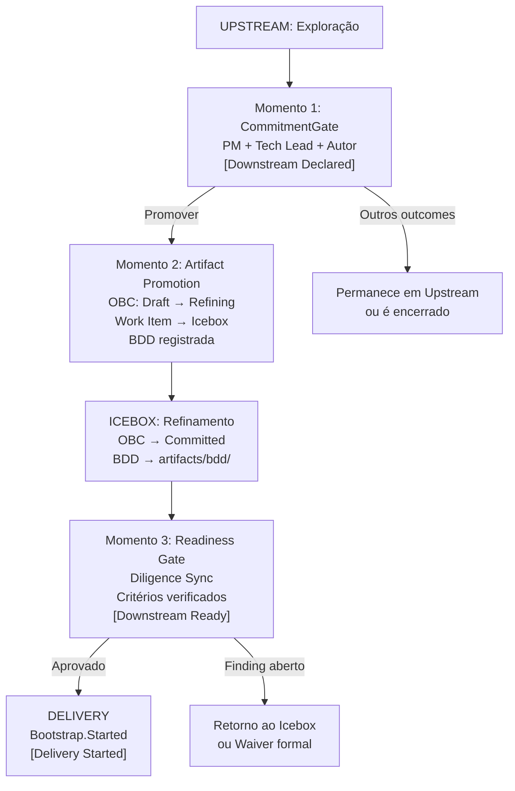

# Capítulo 6: Downstream: o modo do compromisso

---

## Onde o Downstream começa

Existe um equívoco comum sobre o ponto de partida do Downstream. Ele não começa quando o time "termina o discovery". Não começa quando "a equipe sente que está pronta". Não começa quando o Product Owner decide priorizar um item.

O Downstream começa quando o CommitmentGate é executado com o outcome Promover, e não antes. Esse é o momento em que o modo é declarado: o regime de rigor muda de não bloqueante para bloqueante, e o item passa a carregar um compromisso formal.

Essa precisão não é protocolar. É a consequência direta do que o Downstream representa: uma mudança de regime de compromisso. E regimes de compromisso precisam ter um momento de início que seja verificável. "A equipe sentiu que estava pronta" não é verificável. Um CommitmentGate registrado no upstream-trail, com data, participantes e outcome documentado, é.

O que o CommitmentGate não inicia é a Delivery. O framework ProdOps distingue três estados dentro do modo Downstream: **Downstream Declared**: o compromisso foi assumido, o item entra no Icebox para refinamento; **Downstream Ready**: os requisitos de pré-Delivery foram satisfeitos e verificados; **Delivery Started**: Bootstrap foi iniciado. O CommitmentGate corresponde ao Downstream Declared. Entre ele e o Bootstrap.Started existe um protocolo de readiness que é parte do Downstream, não uma antecâmara fora dele.

---

## Os três momentos da transição

O protocolo detalhado de operacionalização dessa transição (os passos entre Downstream Declared e Delivery Started) é uma proposta do trabalho de canonização do framework ProdOps, robustamente suportada pelos artefatos do experimento, mas ainda aguardando incorporação ao framework principal.



**Momento 1: CommitmentGate** (Downstream Declared). O trio (PM + Tech Lead + Autor) avalia se a evidência produzida justifica o comprometimento. Os critérios incluem: hipótese respondida com o Evidence Threshold satisfeito (se declarado), Decision Package com substância real, OBC Draft existindo como arquivo, e BDD rascunhada e legível. O result mais consequente é Promover, o que dispara o Momento 2. O CommitmentGate não cria o compromisso: ele torna verificável e rastreável a decisão que o trio toma sobre o destino da capability.

**Momento 2: Artifact Promotion + Icebox Entry**. Imediatamente após o CommitmentGate com outcome Promover, os artefatos do experimento transitam para o espaço do Downstream. O OBC muda de Draft para Refining. Um Work Item é criado no Icebox referenciando o experimento e o OBC. O upstream-trail é atualizado com o outcome e a referência ao Work Item. O experimento não é fechado: permanece como registro de evidência e aprendizados. Apenas o status muda. O Downstream está ativo, mas a Delivery não começou.

**Momento 3: Readiness Gate** (Downstream Ready). O item sai do Icebox e entra no Iteration Backlog quando um conjunto de requisitos é satisfeito. O OBC precisa ter atingido o estado Committed. A BDD Feature precisa estar em `prodops/artifacts/bdd/`. Os riscos precisam estar documentados. Para itens com movimentação financeira, integração externa, mudança de SLO ou risco alto/crítico: um Reliability Plan é exigido. O Readiness Gate não é opcional: é o ponto onde a Diligence verifica, de forma bloqueante, que o Downstream tem o substrato necessário para ser executado com integridade.

A distinção entre os três momentos resolve conflitos frequentes: "o BDD deve estar em `artifacts/bdd/` no CommitmentGate?" Não: draft legível é suficiente no Momento 1; muda para o path comprometido durante o Momento 2 e antes do Momento 3. "O OBC deve estar Committed no CommitmentGate?" Não: apenas existir como Draft é suficiente no Momento 1; Committed é obrigatório no Momento 3.

---

## A sequência de Delivery no modo Downstream


*Figura 6. Sequência Bootstrap → Promote: materialização do rigor bloqueante na jornada Delivery, com Release Trail como evidência append-only*

Uma vez que o item passa pelo Readiness Gate e entra no Iteration Plan, a jornada Delivery em modo Downstream executa uma sequência formal:

```
Bootstrap → Hack → Sync → Finish → Ship → Validate → Promote
```

Essa sequência é a materialização do rigor bloqueante dentro da jornada Delivery, não a definição de Downstream como tal. O que a torna obrigatória não é o modo em si, mas a combinação do modo Downstream com a jornada Delivery: qualquer item em Delivery que carregue um compromisso formal precisa de condições verificáveis de avanço em cada etapa, e essa sequência as provê.

A sequência está organizada em dois ciclos. O **CI Sync** (Bootstrap, Hack, Sync, Finish) é o trabalho local e síncrono: preparar o ambiente, implementar, sincronizar a branch, e passar pelos quality gates de código. O **CI Async** (Ship, Validate, Promote) é o trabalho conduzido pela plataforma: construir e publicar o artefato, implantá-lo, validá-lo em runtime, e promovê-lo com evidência registrada.

Cada fase tem um propósito específico e uma Definition of Done que, se não satisfeita, bloqueia o avanço. O Bootstrap verifica que o ambiente local está operacional e que as pré-condições de implementação estão satisfeitas. O Hack implementa via ProdOps TDD: comportamento observável definido antes de qualquer linha de produção ser escrita. O Sync garante que a branch está atualizada e que os artefatos ProdOps refletem o que foi implementado. O Finish executa os quality gates de código e produz o Pull Request com narrativa completa. Ship, Validate e Promote transitam o código para produção com rastreabilidade total.

O que o rigor bloqueante significa operacionalmente: se o Bootstrap falha no smoke gate, o Hack não começa. Se o Finish detecta testes falhos, o Ship não começa. Se o Validate identifica violação de SLO, o Promote não acontece. Não existe "vamos resolver depois": cada gate existe porque o compromisso precisa ser honrado com evidência, não com intenção.

---

## Os cinco anti-padrões do Downstream

O Downstream tem seu próprio conjunto de anti-padrões: comportamentos que reproduzem a forma do rigor sem a sua substância. Eles emergiram do trabalho de desenvolvimento e revisão do framework ProdOps; não são conceitos universais da literatura, embora fenômenos análogos existam em outras metodologias. O que os distingue é sua relação específica com o modelo modal: cada um representa o colapso da função do rigor bloqueante mantendo sua aparência.

**AP-D1: Gate Theater:** executar os gates formalmente sem que os artefatos submetidos satisfaçam os critérios. Causa: pressão de prazo ou conveniência social que torna mais fácil declarar o gate satisfeito do que defender a interdição. Exemplos: OBC marcado como Committed sem `acceptance_criteria` verificáveis; Readiness Gate aprovado com Findings de Diligence abertos e sem waiver formal; CommitmentGate realizado em reunião onde o Decision Package não foi lido. Consequência: os gates passam sem que a função de verificação tenha sido exercida. Critério diagnóstico: auditar se os critérios de entrada documentados foram verificados individualmente para cada gate. Se não há registro de verificação item a item, o gate foi teatro. O contra-exemplo no corpus da Magazine Siará: o risco RISK-SP-001 (política de boleto vencido com Pix pago) foi fechado pelo PM Eugenio com decisão nomeada e datada no mesmo dia do CommitmentGate — "mantém estado pendente, investigação manual, sem cancelamento automático nem estorno do Pix". Registrado. Verificável. Não é teatro.

**AP-D2: Proxy Commitment:** OBC marcado como Committed sem que os critérios de sucesso sejam mensuráveis. Causa: pressão para formalizar o compromisso antes de o OBC ter substância verificável. Exemplos: `expected_outcome` vago ("melhorar a experiência do usuário"); `acceptance_criteria` descrevendo o que o sistema faz, não quando é aceitável; `success_metrics` com targets relativos sem baseline. Critério diagnóstico: "como saberei que este item foi entregue com sucesso 30 dias após o Promote?" Se a resposta requer interpretação subjetiva, o OBC não está Committed de verdade. O OBC `split-payment-pix-boleto` da Magazine Siará é o contra-exemplo: cinco Initial SLIs com targets numéricos explícitos (três em 100%, dois em 99%), seis Observable Events com dimensões obrigatórias, e a regra "o pedido nunca é liberado com apenas uma das porções confirmadas" como critério de aceite verificável sem contexto verbal adicional.

**AP-D3: Forced Readiness:** Readiness Gate aprovado com lacunas conhecidas (artefatos incompletos, Findings abertos, pré-requisitos ausentes) por pressão de prazo ou de stakeholder. Causa: o custo percebido de atrasar a Delivery supera o custo percebido de carregar as lacunas. A distinção em relação ao Gate Theater é de escopo e especificidade: Gate Theater cobre qualquer gate executado sem substância; Forced Readiness é especificamente o Readiness Gate aprovado com lacunas de artefatos de pré-Delivery que deveriam bloquear. Consequência: o Downstream carrega uma dívida invisível de readiness que se manifesta como problemas durante a implementação. A Magazine Siará demonstra a distinção: o PI-001 do Split Payment lista perguntas abertas (valor mínimo por meio, limite de meios por compra), mas o PI-001 as classifica explicitamente como "perguntas de refinamento — não bloqueiam o início". Isso é uma declaração de incerteza residual aceitável, não Forced Readiness: a lacuna é nomeada, justificada e registrada, não ocultada.

**AP-D4: Phantom BDD:** BDD Feature escrita após o código, descrevendo o que foi implementado em vez do comportamento esperado antes da implementação. Causa: BDD tratada como documentação de conformidade em vez de especificação de comportamento. A BDD existe como artefato formal, mas perdeu sua função: especificar o comportamento acordado *antes* de qualquer linha de código ser escrita. Critério diagnóstico: verificar o timestamp de criação do feature file versus o início da fase Hack. Se o feature file foi criado depois do primeiro commit de implementação, a BDD é phantom. No PI-001 do Split Payment, a instrução é explícita: "OBC e BDD devem ser escritos imediatamente" — no mesmo dia do Business Signal, antes de qualquer sessão de Hack.

**AP-D5: Release Trail Vazio:** Promote executado sem Release Trail preenchido: sem registro das decisões tomadas, dos artefatos produzidos, dos testes executados, e do estado em que o sistema foi deixado após o release. Causa: Release Trail tratado como formalidade opcional em vez de registro de compromisso. Consequência: a rastreabilidade que o Downstream promete, desde o CommitmentGate até a evidência em produção, é destruída. O Release Trail não é documentação opcional; é o registro que permite auditar o compromisso depois que o Promote aconteceu. O EXP-014 da Payments API demonstrou empiricamente (53/53 PASS) que o ProdOps Runtime rastreia automaticamente o estado de Delivery via CloudEvents, tornando o Release Trail Vazio detectável pela Diligence no momento em que acontece — não apenas retrospectivamente.


O padrão subjacente é o mesmo: o framework existe na forma mas não na função. Os rituais são executados, os artefatos existem, as reuniões acontecem, mas sem a substância que tornaria cada um deles um mecanismo real de verificação. O Downstream com Gate Theater, Proxy Commitment e Forced Readiness oferece uma segurança ilusória, pior do que não ter gates, porque obscurece os problemas reais.

---

## O que acontece quando o Downstream precisa voltar

Existe um cenário que o protocolo de transição precisa contemplar: um item em Delivery revela que a hipótese original foi invalidada, o escopo mudou materialmente, ou uma dependência bloqueante tornou a entrega inviável na forma comprometida.

Nesse caso, existe um protocolo de regressão Downstream → Upstream.

A regressão é a suspensão formal do compromisso, não o retorno a uma etapa anterior do trabalho. Ela é convocada pelo trio, não é uma decisão individual. O trigger típico é uma hipótese central invalidada durante a Delivery: um spike técnico falha, um usuário rejeita a abordagem, uma premissa de negócio desaparece, ou uma dependência bloqueante que não existia no CommitmentGate.

Quando a regressão é decidida, dois registros são feitos: no Release Trail do item em Delivery (com contexto, o que foi descoberto, e a decisão de suspender o compromisso), e em um novo experimento Upstream referenciando o experimento original. O OBC transita de Committed para Refining: o compromisso formal é suspenso, não abandonado. O item aguarda um novo ciclo de investigação Upstream antes que qualquer novo comprometimento possa ser assumido.

A regressão não é um fracasso do CommitmentGate. É o reconhecimento de que o contexto mudou de forma relevante após o comprometimento, ou que a incerteza residual que o gate considerou aceitável revelou-se inaceitável durante a implementação. O protocolo existe para que essa situação seja gerenciada com honestidade, não ocultada até que o problema seja grave demais.

O que *não* é regressão: ajuste de parâmetro do OBC dentro da faixa de incerteza residual declarada; Finding de Diligence resolvido por waiver formal; item repriorizado sem descoberta que invalide a hipótese. Esses casos são gestão ordinária do Downstream; não exigem o protocolo de regressão e não suspendem o compromisso.

---

## O Downstream como estrutura, não como pressão

O último ponto deste capítulo é sobre o que o Downstream não é.

O Downstream não é o modo de alta pressão. Não é onde o rigor aumenta porque o time está sendo cobrado. Não é onde a velocidade de entrega é o objetivo primário.

O Downstream é o modo onde o compromisso foi feito e precisa ser honrado com evidência. A sequência Bootstrap → Promote existe para garantir que honrar o compromisso não se transforme em correria sem estrutura. Os gates existem para proteger o time do custo de erros evitáveis, não para criar burocracia.

A distinção entre Downstream como estrutura e Downstream como pressão é operacionalmente verificável: quando os anti-padrões estão presentes (Gate Theater, Forced Readiness, Proxy Commitment), o Downstream está sendo usado como instrumento de pressão, não como estrutura de compromisso. A forma está lá, mas a função está invertida.

---

*Capítulo 6 de 11 | Parte II: Os Modos*

---

[→ Capítulo 7 — O CommitmentGate: a fronteira com nome](capitulo-07.md)
[← Capítulo 5 — Upstream: o modo da incerteza explícita](capitulo-05.md)
