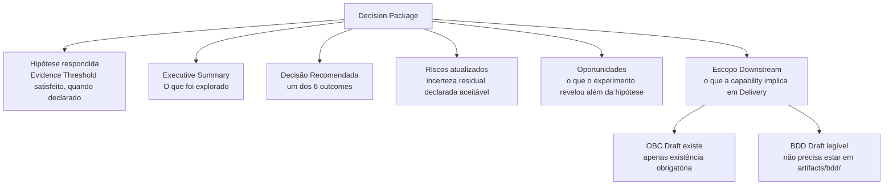

# Capítulo 7: O CommitmentGate: a fronteira com nome

---

## O problema das fronteiras implícitas

*Figura 7. Os 6 outcomes canônicos do CommitmentGate: não é uma reunião de aprovação, é uma decisão coletiva com critérios verificáveis*

Na ausência de uma fronteira explícita, a transição de exploração para entrega acontece de qualquer maneira. O item "passa" quando alguém decide que está pronto, geralmente o Product Owner, em uma sessão de planejamento de sprint, baseado em uma avaliação que ninguém formalizou com critérios verificáveis. O item "passa" porque o time quer começar a construir, ou porque o prazo está se aproximando, ou porque o item já está na fila há tempo suficiente para parecer maduro.

Esse tipo de transição tem dois problemas com origem comum. O primeiro: o que foi avaliado não está registrado de forma auditável. Se o item sair errado (se a funcionalidade não corresponder ao que os usuários precisavam, se a premissa técnica que fundamentou a implementação mostrar-se incorreta), não há como verificar o que foi considerado na transição, por quem, com que critérios. Sem registro, não há como distinguir uma decisão bem-informada de uma decisão por conveniência. O segundo: a ausência de formalidade cria incentivo para manter o item em exploração indefinidamente, porque a transição não tem custo explícito. Ninguém convoca a decisão porque ninguém é responsável por convocá-la. O Perpetual Discovery, tratado no Capítulo 5, é a consequência direta de uma fronteira sem consequências.

Os dois efeitos têm a mesma causa: fronteira implícita produz ou promoção prematura (a decisão acontece antes de a evidência ser suficiente) ou exploração sem decisão (a evidência acumula, mas a decisão nunca é tomada). O CommitmentGate resolve ambos com um único mecanismo: torna a fronteira explícita, verificável e com consequências.

---

## O que o CommitmentGate é

O CommitmentGate é o gate que medeia a transição Upstream → Downstream. É convocado pelo trio (PM + Tech Lead + Autor) quando o Decision Package do experimento estiver pronto. Qualquer membro do trio pode convocar. O CommitmentGate não cria o compromisso: ele torna verificável e rastreável a decisão que o trio toma sobre o destino da capability.

Três características o distinguem de uma reunião de planejamento ordinária.

A primeira: o CommitmentGate decide sobre o *destino da capability*, se ela avança para o Downstream, em que condições, se retorna para mais exploração, ou se é encerrada. Não decide sobre quando começar a construir. Um item pode ter código pronto, inclusive código de qualidade de produção, e ainda assim precisar passar pelo CommitmentGate antes de ter o compromisso de capability formalizado. O gate não está decidindo se o código existe; está decidindo o que a organização vai fazer com ele.

A segunda: o Decision Package é um contrato de entrada, não documentação retroativa. Ele precisa existir e ter substância antes da reunião: não ser produzido durante ela. Um Decision Package com campos preenchidos genericamente ("será validado no Downstream") é Gate Theater (AP-D1): a forma sem a função.

A terceira: os 6 outcomes canônicos cobrem toda a fenomenologia possível da decisão, não apenas a aprovação. A expectativa cultural de que um CommitmentGate resulta em "sim" ou "não" subestima o que o gate resolve.

Em síntese: **o CommitmentGate decide o compromisso. O Readiness Gate verifica a prontidão para executá-lo. O OBC torna o compromisso observável e auditável.**

---

## Os seis outcomes canônicos

Cada outcome é uma decisão operacionalmente distinta, com ações obrigatórias específicas.

**Promover**: a evidência justifica o comprometimento. O OBC transita de Draft para **Refining** (Momento 2), a BDD Feature é movida para os paths comprometidos, e o item entra no **Icebox** com o Downstream declarado. O Downstream inicia: a jornada Discovery roda em modo bloqueante, as perguntas abertas do Decision Package são resolvidas com decisões datadas, e o **Readiness Gate** (Momento 3) verifica que o OBC atingiu o estado **Committed** antes de autorizar o Planning e o Bootstrap.

**Promover com restrição**: parte da capability está pronta para o compromisso; outra parte precisa continuar em exploração. O compromisso formal é assumido **exclusivamente** sobre o subconjunto aprovado — a capability original, em sua totalidade, não está comprometida. O subconjunto aprovado transita para o Downstream. As partes restritas permanecem em Upstream para um novo experimento com hipótese mais específica. A restrição é registrada explicitamente no upstream-trail: ela não é uma lacuna silenciosa.

**Requer outro experimento**: a evidência produzida não é suficiente para o comprometimento, mas a hipótese ainda é válida. Um novo experimento é criado com hipótese mais específica ou com rota de coleta de evidência diferente. O experimento atual é marcado com o Decision Package indicando esse outcome. Não é fracasso: é o reconhecimento de que a exploração precisa de mais uma iteração.

Os três outcomes acima resolvem o destino da capability no momento do gate. Os dois seguintes suspendem a decisão enquanto uma condição externa não é satisfeita: são o único caso em que o gate não decide o destino da capability, mas registra o que impede essa decisão.

**Aguardar decisão de negócio**: o trio não pode comprometer porque existe uma decisão de negócio pendente (de orçamento, de estratégia, de stakeholder) que não está no escopo da equipe resolver. O item fica bloqueado na Product Tracking List com o decisor identificado e uma data esperada de resolução. Nenhum novo experimento é aberto até a decisão chegar. O gate foi executado: a incapacidade de decidir o destino está registrada com sua causa.

**Aguardar dependência externa**: o comprometimento é inviável por dependência técnica ou de terceiro que está fora do controle da equipe. A dependência é registrada no Reliability Plan e na Product Tracking List. O Continuous Assessment monitora o status. Quando a dependência for resolvida, o trio é reconvocado.

**Descartar**: a hipótese foi refutada ou o contexto mudou de forma que o investimento não se justifica. O aprendizado é registrado em `prodops/framework/journeys/discovery/learnings.md`. O experimento é formalmente encerrado com justificativa no upstream-trail. Descartar não é fracasso do time: é o resultado mais eficiente possível quando a exploração produz evidência de que uma direção não vale o compromisso.

A existência dos seis outcomes é o que torna o CommitmentGate diferente de uma reunião de aprovação. Uma reunião de aprovação tem dois resultados possíveis: aprovado ou não aprovado. O CommitmentGate tem seis, e quatro deles não são nem aprovação nem rejeição, mas respostas estruturadas a situações que a dicotomia aprovado/rejeitado não resolve.

---

## O Decision Package: contrato de entrada

O Decision Package é o conjunto de artefatos que o Autor prepara para tornar o CommitmentGate possível. Não é documentação: é um contrato de entrada no gate.

Os componentes canônicos:

**Hipótese respondida com evidência**: a hipótese central do experimento tem uma resposta suportada por evidência verificável, com o Evidence Threshold satisfeito quando declarado. "Verificável" significa que um membro do trio que não participou do experimento pode ler os artefatos e chegar à mesma conclusão sem contexto verbal adicional. Se isso não for possível, a evidência não é suficiente.

**Executive Summary**: síntese do que foi descoberto, em linguagem que PM, Tech Lead e stakeholders possam ler em 5 minutos. Não é o upstream-trail completo: é a destilação do que importa para a decisão.

**Recomendação**: a sugestão do Autor para o outcome do CommitmentGate. O trio não é obrigado a seguir a recomendação, mas o Autor precisa ter uma posição fundamentada.

**Riscos e incerteza residual declarada**: o que permanece desconhecido, qual é o nível de risco residual que o Downstream assumirá, e a declaração explícita de que essa incerteza é aceitável para avançar. Riscos não declarados no CommitmentGate são riscos gerenciados sem visibilidade: o pior cenário.

**Oportunidades**: o que o experimento revelou além da hipótese central que pode informar decisões futuras. Quando existe, não deve ser omitido do Decision Package: é conhecimento que o Upstream produziu e que pertence ao registro.

**Escopo Downstream**: o que a capability implica em termos de Delivery. Dois artefatos precisam existir como pré-condição de entrada no gate: o OBC Draft (mesmo que incompleto) e a BDD rascunhada e legível. A completude não é exigida no CommitmentGate; a existência, sim. A seção de Escopo Downstream do Decision Package referencia esses artefatos e descreve o que precisará ser construído.

O critério substantivo que atravessa todos os componentes é o mesmo: verificabilidade por quem não participou do experimento. Se o membro do trio que não estava no experimento consegue ler o Decision Package e chegar às mesmas conclusões, o package tem substância. Se precisa de contexto verbal adicional, não tem.

---

## Comparação com mecanismos análogos na literatura

O CommitmentGate tem semelhanças superficiais com mecanismos de outros frameworks, mas resolve um problema diferente.

A *betting table* do Shape Up (Singer) é o momento em que a organização decide comprometer um projeto a um ciclo de seis semanas. Na leitura do autor, essa decisão é sobre *quando* comprometer um projeto já shapado: a betting table não verifica se o shaping foi suficiente para garantir o comprometimento; o processo de shaping cumpre esse papel antes de o projeto chegar à mesa. O CommitmentGate, por contraste, verifica explicitamente se a evidência justifica o comprometimento, independentemente do processo de preparação que o precedeu.

A revisão de resultados do Design Sprint, o momento de síntese em que o time avalia se os testes de usuário justificam avançar, é mais próxima do CommitmentGate na sua orientação à evidência. O que a diferencia é a ausência de um registro formal do outcome: quem participou, com que critérios, qual foi a decisão, e o que acontece como consequência. A rastreabilidade que o CommitmentGate exige não está presente como requisito estrutural no Design Sprint.

O IPDS Milestone Review (Integrated Product Development System) da indústria aeroespacial é formalmente mais rigoroso que o CommitmentGate em documentação e aprovação hierárquica. Mas opera em contextos onde a incerteza é menor e os custos de retrabalho são existencialmente maiores, o que justifica um nível de formalidade que seria contraproducente no contexto de produto digital com ciclos de feedback mais curtos.

O CommitmentGate está calibrado para um equilíbrio específico: formal o suficiente para ser verificável e auditável, ágil o suficiente para não tornar a transição mais cara do que a exploração que a precedeu. O que ele resolve de forma particular é uma combinação que esses mecanismos análogos tratam separadamente ou não tratam: uma decisão com nome, critérios verificáveis, participantes identificados, e um outcome com consequência registrada.

---

## O CommitmentGate como mecanismo de observabilidade

O CommitmentGate é projetado especificamente para tornar dois problemas opostos observáveis e tratáveis.

O Perpetual Discovery: sem um gate formal com critério de parada e participantes definidos, um experimento pode continuar indefinidamente porque ninguém convoca a decisão. O CommitmentGate não apenas cria a pressão para decidir: ele nomeia o problema. Quando um experimento exibe os sinais diagnósticos do Perpetual Discovery (tratados no capítulo anterior), a convocação do CommitmentGate é a resposta operacional específica: não para aprovar, mas para decidir o que fazer. O gate torna o estado "em exploração sem critério de parada" visível e tratável com um conjunto conhecido de outcomes.

A Promoção Prematura: comprometer uma capability antes de ter evidência suficiente, seja por pressão de prazo, seja por otimismo não verificado. O Decision Package como contrato de entrada, com a regra de que o membro do trio que não participou do experimento deve poder ler os artefatos e chegar às mesmas conclusões, é o mecanismo de proteção. Mas o que o gate adiciona além do Decision Package é o registro: o outcome é documentado, os participantes são identificados, as condições em que a decisão foi tomada ficam no upstream-trail. Nenhum processo impede comportamento adversarial intencional, mas esse comportamento deixa de ser invisível, e comportamentos registrados são tratáveis de formas que comportamentos invisíveis não são.

Os dois problemas são simétricos: Perpetual Discovery é exploração sem pressão para decidir; Promoção Prematura é decisão sem evidência suficiente. O CommitmentGate é a fronteira que, por ter nome, critérios, participantes e outcomes, transforma ambos de estados implícitos em estados registrados e, portanto, tratáveis.

---

## Um CommitmentGate sem Upstream: o caso BS-001

O corpus da Magazine Siará registra um caso que parece contrariar o protocolo, mas na verdade o confirma. O Business Signal BS-001 (Split Payment, 2026-08-04) levou ao PI-001 com CommitmentGate e OBC Committed no mesmo dia — sem nenhum experimento Upstream prévio.

Isso não é Promoção Prematura. É a demonstração de que o CommitmentGate decide sobre o *destino da capability*, não sobre a conclusão de uma fase de exploração. Quando a demanda é confirmada por dois canais independentes, o escopo está delimitado (Pix + Boleto para lançamento com fornecedor parceiro), o deadline é não negociável (15 dias), e as perguntas abertas são de refinamento — não de hipótese central —, o Decision Package pode ser construído sem exploração prévia: a evidência está no sinal de negócio e na clareza do escopo.

O PI-001 documenta a justificativa do outcome Downstream: "há clareza suficiente sobre o que construir; o prazo de 15 dias não permite exploração Upstream." Essa declaração é o Decision Package em sua forma mais comprimida. O trio avaliou que a incerteza residual é aceitável para avançar, registrou as perguntas abertas como refinamento, e assumiu o compromisso. Não é teatro: é a calibração correta do rigor ao contexto.

O que "sem Upstream" descreve com precisão é a ausência de experimentos pré-CommitmentGate — não a ausência de discovery. Após o CommitmentGate, o Split Payment percorreu a jornada Discovery em modo Downstream: o OBC transitou para Refining, os seis Observable Events com dimensões obrigatórias foram definidos, a BDD Feature foi escrita, as perguntas abertas do PI-001 foram resolvidas com decisões datadas (incluindo o RISK-SP-001, fechado pelo PM Eugenio com decisão explícita sobre a política de boleto vencido com Pix pago). O Readiness Gate verificou que essas condições estavam satisfeitas antes de autorizar a entrada no Delivery. O Planning gerou o Iteration Plan. Só então o Bootstrap, primeira fase do Delivery, começou. A diferença em relação à trajetória EXP-001/002/003 não é a presença ou ausência de discovery: é o regime sob o qual o discovery ocorreu — em modo Upstream (rigor consultivo, pré-CommitmentGate) ou na jornada Discovery em modo Downstream (rigor bloqueante, pós-CommitmentGate, com Readiness Gate antes do Delivery).

---

*Capítulo 7 de 11 | Parte III: A Fronteira*

---

[→ Capítulo 8 — Observabilidade como epistemologia, não como infraestrutura](capitulo-08.md)
[← Capítulo 6 — Downstream: o modo do compromisso](capitulo-06.md)
