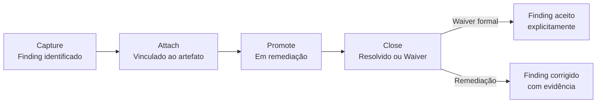

# Capítulo 8: Diligence: guardião da consistência

---

## O problema que a Diligence resolve

*Figura 8. Knowledge Space (artefatos Markdown) e Execution Space (Issues, Projects) divergem naturalmente. No Upstream, a inconsistência não é bloqueante porque o compromisso não foi assumido; no Downstream é risco operacional porque o compromisso precisa ser verificável.*

Em qualquer sistema de trabalho que opera em dois modos com características diferentes, existe um problema estrutural que não é de processo e não é de tecnologia: a divergência entre o que o sistema *sabe* e o que o sistema *faz*.

O ProdOps tem dois espaços que representam realidades diferentes sobre o mesmo trabalho.

O **Knowledge Space** é onde o conhecimento vive: arquivos Markdown, OBCs, BDD Features, experimentos, trails, planos, evidências, todos no repositório git. Esses artefatos têm identidade permanente e estado canônico. Um OBC sobrevive a dezenas de releases. Um experimento preserva o conhecimento que produziu mesmo depois de encerrado. Quando há divergência entre o que está registrado num artefato Markdown e o que aparece nas ferramentas de execução, a divergência se resolve em favor do artefato: o Knowledge Space é a autoridade sobre o conteúdo e o estado dos artefatos.

O **Execution Space** é onde o trabalho acontece: GitHub Issues, Pull Requests, GitHub Projects, pipelines. Esses artefatos têm natureza operacional: rastreiam o trabalho em andamento, não acumulam permanência do conhecimento. A autoridade do Execution Space é sobre o estado operacional do trabalho em curso: quem está fazendo o quê, em qual estágio, com qual prioridade. Um GitHub Issue pode ser fechado, reaberto, deletado. Um campo de um GitHub Project pode ser editado sem rastreabilidade.

O problema é que esses dois espaços divergem naturalmente. O Knowledge Space avança quando o time produz artefatos. O Execution Space avança quando o time executa operações. Quando as duas progressões não estão sincronizadas, o sistema de trabalho perde confiabilidade: os artefatos dizem uma coisa e as Issues dizem outra.

No Upstream, essa inconsistência não é bloqueante. O trabalho é exploratório: os artefatos evoluem de forma não-linear, a hipótese pode mudar entre sessões, o OBC permanece em Draft. A inconsistência temporária entre Knowledge Space e Execution Space é o preço da liberdade exploratória; o custo de aceitá-la é controlável porque o compromisso não foi assumido. Não existe um contrato que precise ser verificável para que o trabalho avance.

No Downstream, a divergência é risco operacional. O compromisso foi assumido. Um OBC que está Committed nos artefatos mas ainda aparece como Refining no Execution Space gera confusão sobre o que está pronto para Delivery. Um Finding de Diligence aberto que não tem representação no Execution Space pode passar despercebido até que cause um problema durante a implementação. A consistência não é conforto organizacional: é condição para que o compromisso possa ser honrado com confiança.

A Diligence existe para gerenciar essa divergência.

---

## O que a Diligence faz e o que não faz

A Diligence é a jornada transversal do ProdOps responsável por manter o sistema de trabalho sincronizado e consistente. Ela opera em ambos os modos, com consequências diferentes em cada um.

O que a Diligence **faz**: verifica se o estado dos artefatos do Knowledge Space está refletido corretamente no Execution Space. Captura Findings quando detecta divergências. Gerencia o ciclo de vida desses Findings até que sejam resolvidos ou recebam waiver formal. Garante que os pré-requisitos de cada gate (CommitmentGate, Readiness Gate, quality gates) estão satisfeitos antes que o gate seja executado.

O que a Diligence **não faz**: implementa software. Cria Pull Requests de implementação. Modifica código do produto. Toma decisões de produto: ela informa e alerta, mas não decide. Prioriza o backlog: essa é responsabilidade do Product Owner.

Essa separação é necessária para que a Diligence mantenha sua função: se a Diligence implementasse ou priorizasse, deixaria de ser guardiã da consistência e passaria a ser um ator no processo de entrega, misturando as responsabilidades de verificação e execução.

---

## Dois ciclos, dois propósitos

A Diligence opera em dois ciclos com propósitos distintos.

O **diligence-sync** é o ciclo event-driven: acionado por um evento específico (novo OBC criado, item transitando entre estados, CommitmentGate convocado). Seu propósito é verificar, no momento do evento, se o estado atual satisfaz os critérios necessários para avançar. No Downstream, se um OBC está Refining quando o Readiness Gate é chamado, o diligence-sync gera um Finding bloqueante, e o item não avança até que o Finding seja resolvido ou receba waiver formal. No Upstream, o mesmo ciclo opera, mas os Findings gerados têm caráter advisory: alertam sem bloquear, porque o compromisso não foi assumido.

O **diligence-async** é o ciclo proativo: executado periodicamente para varrer o estado do sistema e identificar divergências antes que causem problemas. Seu propósito é detectar drift: um OBC que deveria ter transitado de estado e não transitou, um BDD Feature em `prodops/artifacts/bdd/` sem OBC correspondente Committed, um experimento ativo sem entradas no upstream-trail há mais de duas semanas (sinal S1 do Perpetual Discovery). O diligence-async opera tanto no Upstream quanto no Downstream: no Upstream com rigor advisory, alertando sem bloquear; no Downstream com rigor bloqueante, gerando Findings que impedem o avanço.

---

## O ciclo de vida de um Finding

A unidade de trabalho da Diligence é o Finding: uma divergência identificada entre o que o sistema de trabalho deveria estar mostrando e o que está mostrando.

Um Finding progride pelas quatro Phases do ciclo diligence-sync:

**Capture**: o Finding é identificado, seja pelo diligence-sync, seja pelo diligence-async, seja manualmente por um membro do time. O Finding é documentado com: o que foi detectado, onde (qual artefato, qual backlog, qual estado), quando, e qual é o impacto esperado se não for resolvido.

**Attach**: o Finding é associado ao item ou artefato afetado. No Execution Space, isso se traduz em um Work Item que referencia o Finding. O item afetado não avança em seu ciclo de vida enquanto o Finding estiver aberto e sem waiver; no Downstream, isso é bloqueante.

**Promote**: o Finding está sendo endereçado. A equipe responsável está tomando a ação necessária: completando o OBC, atualizando o BDD, documentando o risco. Findings que não estiverem sendo endereçados dentro de prazo adequado podem ser escalados para o trio. Quando a resolução imediata não for viável, o processo de waiver pode ser iniciado durante esta fase; a decisão formal é registrada no Close.

**Close**: o Finding foi resolvido (o artefato satisfaz o critério, com evidência) ou o waiver foi aprovado pelo trio com data de expiração. O Finding é fechado com registro do que foi feito.

O waiver merece atenção especial. Um waiver é o reconhecimento explícito de que um critério não está satisfeito, a justificativa de por que o item avança assim mesmo, e um compromisso de resolver o problema dentro de um prazo definido. O waiver não é a aprovação de uma lacuna sem consequência: é o compromisso de gerenciar a lacuna de forma transparente. A diferença entre um waiver e o Forced Readiness (AP-D3) é precisamente essa: o waiver é explícito e registrado; o Forced Readiness é silencioso.

---

## A Diligence nos dois modos

No **Upstream**, a Diligence opera em modo advisory. Ela pode verificar se o experimento tem os artefatos mínimos obrigatórios (experiment.md e upstream-trail.md), se o upstream-trail está sendo atualizado regularmente, se os sinais de Perpetual Discovery (S1-S4) estão ativos. Quando encontra problemas, alerta, mas não bloqueia. No Upstream, o custo de bloquear exploração por inconsistência de artefatos seria maior do que o custo de aceitar a inconsistência temporariamente: não existe compromisso formal que exija que a consistência seja verificável agora.

No **Downstream**, a Diligence é bloqueante. Ela verifica se o OBC está Committed antes do Readiness Gate. Se a BDD Feature está em `prodops/artifacts/bdd/`. Se os Findings abertos têm waiver formal ou foram resolvidos. Se o Release Trail está sendo preenchido em cada fase da sequência Bootstrap → Promote. Quando encontra problemas, não apenas alerta: gera Findings que impedem o avanço até resolução.

Essa diferença não é de quantidade de rigor aplicado: é de natureza da consequência. No Upstream, a inconsistência não precisa ser resolvida imediatamente porque o compromisso não foi assumido. No Downstream, a consistência é necessária porque o compromisso precisa ser verificável, e verificabilidade exige que o estado dos artefatos e o estado operacional coincidam.

---

## Por que a Diligence não é governança burocrática

A palavra "governança" frequentemente evoca burocracia: camadas de aprovação, documentação por documentação, processos que consomem mais tempo do que protegem.

A Diligence do ProdOps é diferente por uma razão estrutural: ela opera em resposta a divergências reais, não a procedimentos genéricos. Um Finding é criado quando existe uma divergência específica: um OBC que deveria estar Committed e não está, um BDD que deveria existir e não existe. Não existe uma checklist de formulários que precisa ser preenchida por protocolo.

A medida de saúde da Diligence não é o volume de Findings criados: é a ausência de divergências entre Knowledge Space e Execution Space. Uma Diligence saudável num produto saudável tende a ter poucos Findings abertos porque o time mantém os artefatos sincronizados em tempo real, como consequência do processo de trabalho. Mas essa relação não é invertível: poucos Findings podem também ser sinal de instrumentação insuficiente, não de produto saudável. A saúde real se verifica na ausência de divergências detectáveis, não apenas na ausência de Findings registrados.

Quando a Diligence produz muitos Findings repetidamente sobre o mesmo tipo de problema, isso é um sinal de processo: o time está sistematicamente produzindo uma divergência que precisa ser endereçada na causa, não apenas corrigida cada vez que aparece.

O EXP-014 da Payments API testou essa propriedade empiricamente: será que o ProdOps Runtime rastreia automaticamente o estado de Delivery de cada Feature via CloudEvents, e a Diligence captura e anexa evidência operacional ao mesmo Work Item em tempo real? **53/53 PASS.** A sincronização entre GitHub Project e Datadog foi verificada para cada fase da sequência Bootstrap → Promote. A Diligence não precisou de intervenção humana para detectar divergências: o ciclo event-driven acionou a verificação no momento de cada transição de fase. Esse resultado transforma a Diligence de um processo de auditoria periódica em um sistema de verificação contínua — que é a única forma de governança que não cria burocracia proporcional ao volume de entregas.

---

## A relação entre Diligence e Assessment

A Diligence e o Assessment são as duas jornadas transversais do ProdOps: ambas operam sobre todas as jornadas de produto (Discovery, Delivery, Operation) sem serem uma delas.

A diferença de propósito é precisa: a Diligence mantém a consistência do sistema de trabalho *agora*: ela opera no presente, verificando e corrigindo. O Assessment analisa a evolução do sistema de trabalho *ao longo do tempo*: ele opera no passado e projeta recomendações para o futuro.

A relação entre elas é bidirecional. A Diligence produz Findings e evidências de execução que o Assessment consome para avaliar maturidade operacional: se o número de Findings de um tipo específico está crescendo, isso é um dado para o Assessment. O Assessment produz recomendações que podem se materializar como novos critérios de verificação no catálogo da Diligence. Uma recomendação de melhorar o processo de verificação de OBCs pode resultar em novos checks que a Diligence passa a executar.

Essa bidirecionalidade significa que a Diligence não é subordinada ao Assessment, nem o Assessment é subordinado à Diligence. São jornadas com responsabilidades distintas que se alimentam mutuamente.

---

*Capítulo 8 de 10 | Parte IV: O Substrato Comum*
