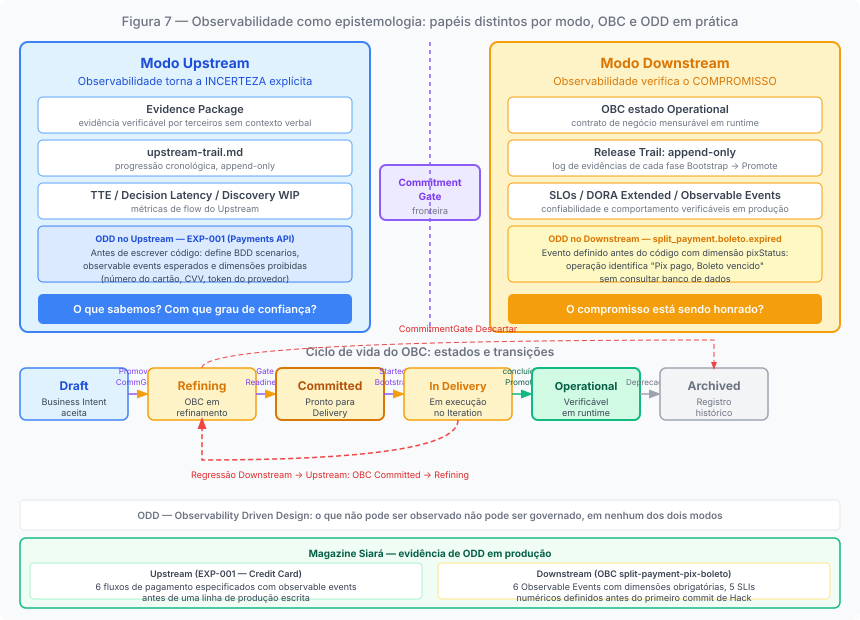
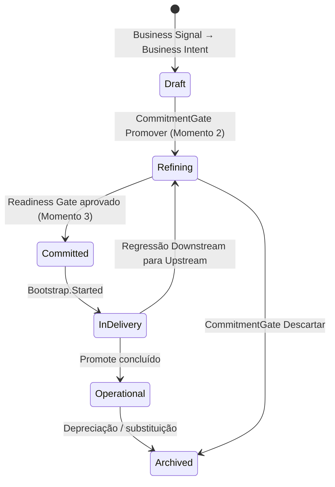
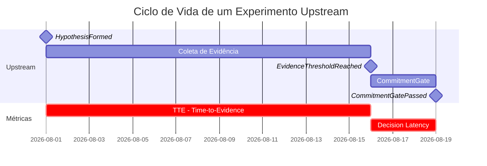

# Capítulo 8: Observabilidade como epistemologia, não como infraestrutura

---

## O que a observabilidade faz em cada modo

*Figura 8. No Upstream, observabilidade torna a incerteza explícita. No Downstream, verifica o compromisso. Sem evidência observável, governança e decisão tornam-se dependentes de percepção, não de verificação.*

Há uma distinção que o ProdOps introduz que não é sobre tecnologia de observabilidade: logs, métricas, traces, dashboards. É sobre o papel epistêmico que a observabilidade desempenha em cada modo de execução.

No Downstream, observabilidade verifica o compromisso. SLOs, métricas DORA, Release Trail: todos existem para responder uma pergunta: o compromisso assumido está sendo honrado? A capability foi entregue com o comportamento prometido? As métricas de confiabilidade estão dentro dos limites acordados? O OBC em estado Operational representa precisamente isso: o contrato de negócio transitou para um estado em que seu cumprimento pode ser verificado em runtime.

No Upstream, observabilidade torna a incerteza explícita. Os artefatos de evidência do experimento (denominados neste capítulo como Evidence Package), o Upstream Trail, o Decision Package existem para responder uma pergunta diferente: o que sabemos, o que não sabemos, e com que grau de confiança podemos afirmar cada coisa? No Upstream, a observabilidade não está verificando um compromisso: está documentando o estado do conhecimento sobre uma hipótese.

Essa assimetria não é acidental. Ela deriva diretamente do que cada modo exige. O Downstream exige que o compromisso seja verificável em runtime: portanto, a observabilidade é o mecanismo de verificação. O Upstream exige que a incerteza seja explícita e gerenciável: portanto, a observabilidade é o mecanismo de explicitação.

---

## ODD: o princípio antes da implementação

ODD (Observability Driven Design) é o princípio do ProdOps que afirma que observabilidade precisa ser projetada antes da implementação, não adicionada depois.

O Princípio 3 do framework é explícito: "Observabilidade, estratégia de deploy e testes são definidos antes de escrever código de produção, nessa ordem de prioridade." E o Princípio 7 complementa: "Logs, erros, métricas e rastreabilidade fazem parte da implementação, não são complementos adicionados depois. Uma feature não está pronta se seu comportamento não puder ser observado em produção."

ODD não é uma prescrição técnica de instrumentação antes do código. É um princípio de design: o que precisa ser observável deve ser decidido antes de qualquer linha de produção ser escrita. Essa distinção importa porque sem a decisão prévia sobre o que observar, a instrumentação que vem depois tende a registrar o que é fácil de medir, não o que é necessário para verificar o compromisso ou explicitar a incerteza.

A motivação epistemológica de ODD é que, sem evidência observável, não há verificação confiável: sem verificação, governança e decisão tornam-se dependentes de percepção ou contexto verbal. Isso é especialmente crítico no contexto do framework porque o que não pode ser observado não pode ser auditado pela Diligence, não pode fundamentar um Decision Package, e não pode satisfazer os critérios de um gate bloqueante.

ODD aplica-se a ambos os modos, com formas diferentes. No Upstream, ODD significa documentar o que será observado para verificar a hipótese, antes de coletar a evidência. Um experimento bem conduzido define seus critérios de falsificação antes de executar, não depois. No Downstream, ODD significa definir os Observable Events e as métricas de sucesso do OBC antes de escrever código: o contrato do que será observável em produção precisa existir antes da implementação que o tornará observável.

O OBC `split-payment-pix-boleto` da Magazine Siará demonstra ODD em operação: seis Observable Events com dimensões obrigatórias foram definidos antes de qualquer código de produção ser escrito. Entre eles, `split_payment.boleto.expired` com a dimensão `pixStatus` — um evento de falha com contexto suficiente para que a operação identifique imediatamente que o Pix foi pago mas o Boleto venceu, sem precisar consultar o banco de dados. O design do evento foi uma decisão de produto, não uma consequência da implementação.

No Upstream, o EXP-001 demonstra o mesmo princípio aplicado ao modo exploratório: antes de qualquer linha de produção sobre cartão de crédito ser escrita, o experimento especificou os BDD scenarios obrigatórios, os Observable Events esperados para cada fluxo (autorização, confirmação, análise de risco, recusa, cancelamento, estorno), e as dimensões de observabilidade que nunca poderiam aparecer nos logs (número do cartão, CVV, token do provedor). ODD no Upstream define o que precisa ser observável para validar a hipótese; ODD no Downstream define o que precisa ser observável para verificar o compromisso.

---

## O OBC como contrato de observabilidade

O Observable Business Contract não é um SLA técnico: é a declaração de que o contrato de negócio tem dimensões mensuráveis que podem ser verificadas em runtime.

O ponto de partida ontológico é relevante: o compromisso é a variável causal. Os estados do OBC não determinam o modo nem produzem o compromisso: eles tornam o compromisso observável. O que faz um OBC transitar entre estados é a satisfação de critérios que refletem o grau de maturidade do compromisso vigente, não uma decisão de mudar o modo de trabalho. O modo é a causa; os estados são o registro verificável de onde o compromisso está em seu ciclo de vida.

O OBC percorre seis estados ao longo do ciclo de vida de uma capability:

**Draft**: nasce na transição de um Business Signal para um Business Intent. No Upstream, é memória do aprendizado: pode ser atualizado continuamente, pode permanecer incompleto, não bloqueia experimentos. A ausência de campos completos no Draft é esperada, não uma falha.

**Refining**: o estado que o OBC assume no início do Downstream (Momento 2 da transição, após o CommitmentGate com outcome Promover). Os campos começam a ser refinados com substância real: `expected_outcome` deixa de ser vago, `success_metrics` ganha baseline e target, `acceptance_criteria` torna-se verificável por terceiros.

**Committed**: o estado exigido pelo Readiness Gate. Neste estado, o contrato está completo o suficiente para que a Delivery comece. Todo critério de aceite é verificável sem contexto verbal adicional. As métricas de sucesso têm baseline e target. Os Observable Events estão definidos. O Reliability Plan (quando necessário pelos gatilhos de risco) está presente. Um OBC que não atingiu Committed não passa pelo Readiness Gate: essa é a proteção contra o Phantom BDD e o Proxy Commitment.

**In Delivery**: o OBC está associado a um item em execução no Iteration Plan. Mudanças de parâmetro são permitidas dentro da faixa de incerteza residual declarada; mudanças estruturais exigem regressão ao Upstream.

**Operational**: o comportamento prometido no OBC pode ser verificado em runtime. A capability está em produção com os Observable Events funcionando e as métricas de sucesso acompanhadas. O OBC em estado Operational é o registro de que o compromisso foi honrado, e continua sendo atualizado conforme novas evidências operacionais (incidentes, métricas de uso, postmortems) refinam o entendimento sobre a capability.

**Archived**: a capability foi descontinuada ou substituída. O OBC permanece como registro histórico, não é deletado.

A progressão de estados não é linear por decreto: é verificada. O que faz um OBC transitar de Refining para Committed não é uma decisão subjetiva do Product Owner; é a satisfação de critérios verificáveis que a Diligence pode auditar.

---

## As métricas de flow do Upstream

O modelo operacional do ProdOps instrumenta completamente a jornada de Delivery: Lead Time, Cycle Time, e os eventos do Operational Event Model permitem calcular automaticamente quando cada item passou por cada fase.

A jornada de Discovery, no Upstream, não tem instrumentação equivalente ainda. O trabalho de canonização de eventos do ProdOps propõe um conjunto de métricas de flow específicas para experimentos Upstream. Esta especificação está em processo de canonização, sem implementação de coleta automática disponível ainda:

**TTE (Time to Evidence)**: tempo entre o início de um experimento Upstream (abertura do `experiment.md`) e a produção da primeira evidência executável. Mede a velocidade com que um experimento começa a produzir aprendizado real, não apenas documentação de intenção.

**Decision Latency**: tempo entre o Evidence Threshold declarado como atingido e a convocação do CommitmentGate. Uma Decision Latency alta é um sinal do Perpetual Discovery: o time sabe que tem evidência suficiente mas não está convocando a decisão.

**Discovery WIP (Work in Progress)**: número de experimentos Upstream ativos simultaneamente. O nome é por analogia com o WIP do Kanban e refere-se a experimentos em curso, independentemente da jornada (Discovery, Assessment ou outra) em que estão inscritos; o critério é o modo Upstream, não a jornada. Um Discovery WIP alto indica que o time está dispersando atenção entre múltiplas hipóteses, o que tende a aumentar o TTE de todas elas.

Essas três métricas, quando implementadas, permitiriam identificar o Perpetual Discovery antes que os sinais S1-S4 se tornem críticos, transformando um diagnóstico reativo em monitoramento proativo.

---

## As métricas DORA Extended

Para a jornada de Delivery no Downstream, o ProdOps adota um modelo expandido de 7 métricas que estende as 4 métricas do DORA Research Program com 3 extensões orientadas a produto e operação.

As quatro métricas DORA Core, com os nomes usados pelo ProdOps: Lead Time for Change (tempo do commit até produção), Release Frequency (adaptação do nome original "Deployment Frequency", medida como frequência de deploys bem-sucedidos para produção), Change Fail Rate (percentual de mudanças que causam falha em produção), e Mean Time to Recovery (tempo médio de recuperação após falha).

As três extensões ProdOps: Reaction Time (tempo entre um sinal externo, incidente, reclamação de usuário ou mudança regulatória, e a primeira ação processada sobre ele), Rate of Return (defeitos escapados e rework: retentativas, estornos, correções pós-Promote), e Availability (uptime operacional do serviço).

O Reaction Time é particularmente relevante para entender a saúde do Downstream: mede se o time está respondendo a sinais externos com velocidade adequada, o que é distinto de medir a velocidade de entregas planejadas. Um time que entrega com Lead Time baixo mas tem Reaction Time alto está operando bem internamente e mal em resposta ao ambiente.

Os pesos dessas métricas variam por estágio de produto, conforme o modelo canonizado no framework. Em estágios iniciais (PoC), Lead Time for Change e Reaction Time têm peso máximo: velocidade de aprendizado e responsividade importam mais que a confiabilidade de um sistema que ainda está sendo descoberto. Em MVP, Lead Time mantém peso máximo enquanto Reaction Time reduz, indicando que a velocidade de entrega ainda domina mas a responsividade passa a dividir atenção com outras dimensões. Em estágios avançados (MVT, MLP), Change Fail Rate, MTTR e Availability dominam: a confiabilidade torna-se o critério diferenciador.

---

## Evidence Package vs. Release Trail: os registros de cada modo

O Upstream e o Downstream têm mecanismos de registro distintos que refletem seus propósitos distintos.

No Upstream, o mecanismo primário de registro é o conjunto de evidências produzidas pelo experimento (denominado aqui Evidence Package) que fundamenta o Decision Package apresentado no CommitmentGate. A característica central do Evidence Package é a verificabilidade: cada evidência deve ser legível por um membro do trio que não participou do experimento, sem contexto verbal adicional. Se a evidência depende de contexto que não está documentado, não constitui evidência verificável: é memória não documentada. O Evidence Package responde à pergunta "o que descobrimos?".

No Downstream, o mecanismo primário de registro é o Release Trail: o log append-only de evidências de cada fase da sequência Bootstrap → Promote. O Release Trail responde a uma pergunta diferente: não "o que descobrimos?" mas "como honramos o compromisso, passo a passo, com que evidências?". Cada fase do ciclo de Delivery produz seus registros no trail; nada é substituído ou reescrito, apenas acrescido. O Promote sem Release Trail preenchido é o anti-padrão AP-D5: a rastreabilidade prometida pelo Downstream é destruída.

A distinção entre os dois mecanismos de registro é uma consequência direta da distinção entre os modos. O Upstream registra o que foi aprendido. O Downstream registra como o compromisso foi executado. Misturar as funções, usar o Release Trail para documentar aprendizados ou o Evidence Package para verificar execução, é sintoma de confusão modal, não de pragmatismo.

---

## Por que observabilidade é epistemologia

A palavra epistemologia (o estudo do conhecimento e de como o conhecemos) pode parecer fora de lugar em um capítulo sobre práticas de engineering. Mas é precisamente o que observabilidade faz no modelo ProdOps: ela é o mecanismo pelo qual o time sabe o que sabe, e pode afirmar isso de forma verificável.

No Upstream, sem observabilidade da evidência (sem artefatos verificáveis, sem critérios de falsificação documentados, sem Evidence Threshold declarado), o time não sabe o que sabe. Tem convicções, tem intuições, tem memória de conversas. Mas não tem conhecimento verificável. O CommitmentGate, sem Evidence Package com substância, é Gate Theater: a forma sem a função.

No Downstream, sem observabilidade do comportamento em produção (sem SLOs, sem métricas de confiabilidade, sem Observable Events no OBC), o time não sabe se o compromisso está sendo honrado. Tem a sensação de que as coisas estão funcionando. Mas não tem evidência verificável. O Promote, sem Release Trail preenchido, é Release Trail Vazio.

Em ambos os casos, a ausência de observabilidade não é um problema técnico de instrumentação: é um problema epistemológico de não saber o que se sabe, e consequentemente de não poder distinguir percepção de evidência. É por isso que o framework trata observabilidade como uma prioridade de design, não como um complemento de implementação. O que o sistema pode afirmar sobre si mesmo é exatamente o que foi projetado para ser observável.

---

*Capítulo 8 de 11 | Parte IV: O Substrato Comum*
