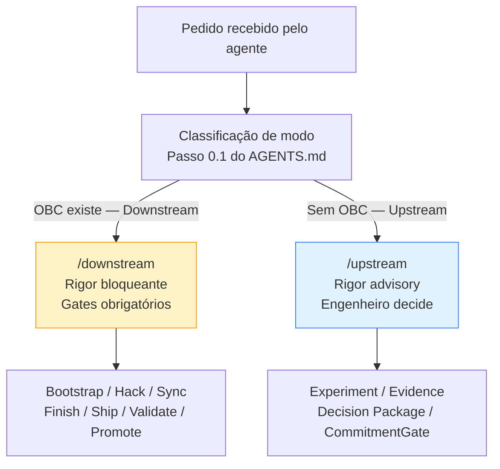

# Capítulo 9: O problema de modo para agentes de IA

---

## Por que agentes não têm sensibilidade de modo por padrão

*Figura 9. Fluxo de decisão para classificação de modo: OBC é o sinal primário. Na ausência de OBC, o tipo de pedido determina o modo.*

Um engenheiro humano que trabalha com um framework de produto por tempo suficiente desenvolve algo que poderíamos chamar de sensibilidade de modo: a capacidade de perceber, a partir de sinais contextuais (a conversa na reunião, o estado do backlog, o tom das mensagens do PM), em que tipo de compromisso o trabalho está operando. Ele não precisa verificar formalmente se o OBC está Committed; percebe pela postura da equipe que algo foi decidido e o trabalho agora é de entrega.

Essa sensibilidade é valiosa. Ela permite que o rigor seja calibrado sem que cada decisão precise ser formalizada explicitamente. O problema é que ela é adquirida, não está presente no início, e não existe em agentes de IA.

Um agente de IA não acumula sensibilidade de modo através de sessões. Cada sessão começa com o contexto que lhe é fornecido (documentação, artefatos, instruções) e nada mais. O histórico de conversas de sessões anteriores não existe a menos que seja explicitamente carregado. A pressão social de uma reunião, o tom de uma mensagem no canal de Slack, a urgência implícita de um deadline: nenhum desses sinais está disponível para um agente sem instrumentação específica.

Isso não significa que agentes sejam incapazes de operar com sensibilidade de modo. Significa que a sensibilidade de modo precisa ser fornecida explicitamente: através de protocolos formalizados, interfaces de modo declaradas, e instruções que tornem verificável em que modo o trabalho está operando.

---

## Os dois modos de falha de um agente sem modo explícito

Na ausência de interface de modo explícita, agentes de IA tendem a defaultar para um de dois extremos, e ambos produzem problemas reais.

**Rigor máximo indiscriminado**: o agente trata qualquer trabalho como se fosse Downstream: aplica gates onde não cabem, exige artefatos que não existem ainda, bloqueia exploração por ausência de critérios de aceite formais. Em modo Upstream, isso é destrutivo: a disciplina do Upstream é a liberdade de explorar com rigor na evidência, não na burocracia de artefatos. Um agente que para para exigir um OBC Committed durante a exploração de uma hipótese está aplicando o rigor errado no momento errado.

**Permissividade total**: o agente trata qualquer trabalho como se fosse Upstream: executa sem verificar pré-condições, avança sem gates, implementa sem checar se o OBC está Committed ou se o BDD existe. Em modo Downstream, isso é arriscado: o compromisso foi assumido e os gates existem para protegê-lo. Um agente que implementa sem verificar o Readiness Gate está executando sem a estrutura que o compromisso exige.

Os dois modos de falha são simétricos e igualmente problemáticos. O rigor máximo indiscriminado bloqueia o aprendizado. A permissividade total destrói a rastreabilidade do compromisso. Em ambos os casos, o agente está causando dano, mas não por incompetência técnica. Por ausência de contexto de modo.

---

## O protocolo de recebimento de trabalho

O AGENTS.md do repositório do Procurare define um protocolo de recebimento de trabalho que funciona como interface de modo implícita para agentes.

O protocolo começa com uma classificação do pedido por tipo:

| Tipo de pedido | Jornada | Skill de entrada |
|---|---|---|
| Nova feature, endpoint, comportamento de negócio | Delivery | `/downstream` |
| Investigação, descoberta, análise técnica | Discovery | `/upstream` |
| Auditoria, risco, conformidade, sinal de negócio | Diligence | `/diligence` |
| Pergunta, explicação, leitura de código | nenhuma jornada | responder diretamente |

O AGENTS.md inclui uma nota explícita que é, ela mesma, evidência do problema que este capítulo descreve: "Nesta tabela, 'Discovery' é a jornada. O skill `/upstream` é o entry point da jornada Discovery executada em modo Upstream. Os modos não são jornadas: são o nível de rigor com que qualquer jornada é executada. A distinção completa está em `prodops/framework/execution-model/README.md`."

Essa nota existe porque o próprio AGENTS.md cometia o erro de usar "Jornada: Upstream", tratando Upstream como jornada em vez de modo. A contradição foi identificada no trabalho de separação formal dos modos como "contaminação conceitual": o framework usando seus próprios termos de forma inconsistente com a definição canônica.

---

## A contradição que foi identificada e parcialmente resolvida

O trabalho de separação formal entre os modos de execução identificou três tipos de contaminação conceitual no repositório:

**Contaminação estrutural**: o AGENTS.md e o `prodops/README.md` usavam "Jornada: Upstream" e "Jornada: Discovery / Upstream", mapeando Upstream como jornada em vez de modo. Um agente que lê esses documentos sem também ler `execution-model/README.md` aprende uma definição incorreta.

**Contaminação conceitual**: o `upstream/SKILL.md` mencionava "committed OBCs" e "committed BDD Features" como targets do Upstream: estados exclusivos do Downstream que o Upstream não está autorizado a exigir.

**Contaminação por ausência**: os skills de fase (Bootstrap, Hack, Sync, Finish, Ship, Validate, Promote) descreviam apenas o comportamento Downstream, sem documentar como cada fase se comporta com rigor advisory no Upstream. Um agente Upstream que quer usar o skill `/hack` no modo advisory não tem orientação sobre como fazê-lo.

A correção parcial já realizada foi a nota no AGENTS.md que esclarece a distinção entre modo e jornada. A correção completa (documentar o comportamento por modo em cada skill de fase) está planejada e ainda não concluída.

---

## Skills como interface de modo

A arquitetura de skills do ProdOps resolve parte do problema de modo para agentes de uma forma elegante: cada skill de entrada implicitamente carrega um modo.

`/upstream` ativa a jornada Discovery com rigor advisory: sem gates obrigatórios, sem sequência imposta, com liberdade para o agente usar as práticas que forem úteis para responder a hipótese. O agente que invoca `/upstream` está em modo de exploração.

`/downstream` ativa a jornada Delivery com rigor bloqueante: pré-condições verificadas, sequência obrigatória, gates que impedem avanço quando não satisfeitos. O agente que invoca `/downstream` está em modo de compromisso.

O que ainda falta (e é a fronteira atual da implementação) é a documentação explícita de como cada fase individual (Bootstrap, Hack, Sync, etc.) se comporta quando invocada em modo Upstream. Um agente Upstream pode querer usar `/hack tdd` com rigor completo (ciclo Red/Green/Refactor idêntico ao Downstream), sem que isso constitua uma obrigação de ter OBC Committed ou Release Trail. O skill não documenta essa distinção ainda.

---

## O protocolo como contexto carregado

Existe uma hipótese subjacente a este livro que ainda não foi verificada: se um livro bem estruturado sobre a distinção de modos pode servir como context loading para agentes, reduzindo erros de classificação de modo.

A ideia é que um agente treinado com o conteúdo deste livro (ou que tenha acesso a ele como contexto de sessão) teria a sensibilidade de modo que não é adquirida por sessões: ele saberia distinguir, a partir da descrição do trabalho, se está operando em Upstream ou Downstream, e calibraria seu rigor correspondentemente.

Isso permanece como hipótese. O que o repositório atual demonstra é o primeiro passo: um protocolo de recebimento de trabalho que torna a classificação de modo explícita e verificável. O segundo passo (instrumentar os skills de fase com comportamento por modo) está planejado. O terceiro passo (verificar se o conhecimento formal sobre modos transfere-se para melhor calibração de rigor por parte de agentes) ainda está por investigar.

---

## O que esse capítulo demonstra sobre o framework

O fato de que o próprio repositório continha contradições terminológicas sobre Upstream e Downstream não é embaraçoso: é evidência da tese central do livro.

O problema de configuração de rigor não é um problema que afeta apenas times humanos. Afeta qualquer sistema de agência (humano ou artificial) que opera com orientação fornecida por artefatos. Quando os artefatos são inconsistentes (usando "jornada" onde deveria estar "modo"), o agente aprende a distinção errada. Quando os artefatos são consistentes, o agente tem a base para calibrar o rigor corretamente.

O ProdOps, ao identificar e nomear essa contradição, e ao criar um protocolo explícito de classificação de trabalho (AGENTS.md), está resolvendo o problema de modo para agentes da única forma que funciona: tornando a distinção verificável nos próprios artefatos que os agentes leem.

---

*Capítulo 9 de 10 | Parte V: Agentes nos dois Modos*
