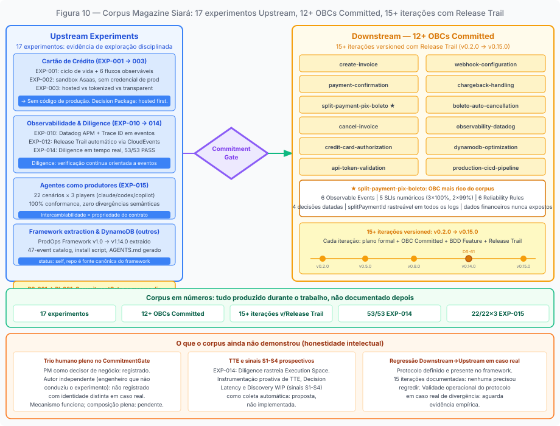

# Capítulo 11: A Magazine Siará como evidência

---

## O laboratório vivo

A Magazine Siará é uma empresa brasileira de e-commerce multi-tenant — fictícia, mas construída com a textura de uma empresa real. Seu time de pagamentos opera a Payments API: uma plataforma que isola os sistemas internos (Checkout, Order Management) do PSP externo (Asaas) e serve como System of Record de todos os eventos de pagamento. Como produto, a Payments API foi construída inteiramente sob o framework ProdOps desde o primeiro dia. Como laboratório, é o caso mais documentado disponível de um sistema real operando os dois modos — Upstream e Downstream — com evidência verificável em cada transição.

Essa coincidência não é acidental. O ProdOps, como framework, precisa ser testado em condições reais para gerar evidência de que funciona. A Payments API, como produto, precisava de um framework de trabalho que tornasse o processo de construção explícito o suficiente para ser examinado e melhorado. Os dois precisavam um do outro.

O que torna o laboratório da Magazine Siará diferente de um estudo de caso retrospectivo é que o corpus de artefatos foi produzido *durante* o trabalho, não documentado depois. Os upstream-trails registram o que foi descoberto sessão a sessão. Os OBCs mostram o estado real do compromisso em cada data. Os Release Trails documentam como cada fase foi honrada. O que este capítulo examina é o que esse corpus demonstra sobre o framework — e o que ele ainda não demonstrou.

*Figura 11. O corpus da Magazine Siará como grafo de dependências: 17 experimentos Upstream, 12+ OBCs Committed, 15+ iterações Downstream com Release Trail.*

---

## O Upstream como exploração disciplinada

O trabalho exploratório da Payments API começou com uma questão de alto risco: como a API deve suportar o ciclo completo de cartão de crédito sem cruzar a fronteira PCI nem acoplar o Checkout ao contrato do Asaas?

Essa questão não tinha resposta óbvia. O cartão de crédito não é um fluxo único: é pelo menos três opções de produto distintas — entrada hosted (menor risco PCI), reutilização de cartão salvo (melhor UX, exige decisão de token storage), e entrada transparente de novo cartão (maior controle, maior responsabilidade de conformidade). Cada opção implicava decisões que não eram do time de Payments: escopo PCI aprovado por Security, modelo de token decidido pela Arquitetura, UX definida com o time de Checkout.

O EXP-001 foi o primeiro experimento. Ele não produziu código de produção. Produziu um Decision Package com a recomendação precisa: apenas a entrada hosted avança para Downstream. O restante permanece em Upstream aguardando decisões externas. O EXP-002 mapeou as capacidades e limitações do sandbox Asaas e confirmou o Validation Workbench como ambiente de simulação para cenários que o sandbox não consegue reproduzir deterministicamente — a validação completa dos cenários do provedor permanece em aberto, dependente de evidência externa. O EXP-003 comparou sistematicamente os três modelos de integração — hosted, tokenizado, transparente — e concluiu a hipótese central: hosted é o primeiro slice. Tokenized permanece em Upstream aguardando decisões de Security e Checkout. Direct Capture fora do escopo.

Três experimentos sequenciais. Nenhuma linha de código de produção escrita durante os três. A feature de cartão de crédito entrou no Downstream apenas quando havia evidência suficiente para comprometer a capability com segurança — e apenas a fração que a evidência suportava.

Esse é o Upstream como engenharia séria de exploração. Não uma fase de baixa disciplina antes da "verdadeira" engenharia. Um esforço estruturado de redução de incerteza que produziu conhecimento verificável — e um Decision Package que tornou o CommitmentGate possível.

---

## Downstream direto: quando o Signal é suficiente para o CommitmentGate

O corpus da Payments API registra um caso diferente. O Business Signal BS-001, registrado em 2026-08-04, descreve um problema com pressão imediata: clientes da Magazine Siará não conseguem dividir uma compra entre múltiplos meios de pagamento, gerando abandono de carrinho e contratos perdidos. O prazo: um lançamento com fornecedor parceiro em até 15 dias, não negociável.

O PM Eugenio avaliou a situação e tomou uma decisão que está documentada no PI-001:

> *"Modo de execução: Downstream — há clareza suficiente sobre o que construir; o prazo de 15 dias não permite exploração Upstream. OBC e BDD devem ser escritos imediatamente."*

A justificativa também está documentada: demanda confirmada por dois canais independentes (clientes finais e time de vendas), escopo delimitado (Pix + Boleto), dono de produto identificado, prazo não negociável, perguntas em aberto são de refinamento — não bloqueiam o início.

O OBC do Split Payment foi committed no mesmo dia. As perguntas abertas no PI-001 — valor mínimo e máximo por meio, limite de meios por compra, política para boleto vencido com Pix pago — foram tratadas como refinamento, não como incerteza que bloquearia o CommitmentGate. O risco RISK-SP-001 (política de expiração do boleto) foi fechado por decisão explícita do PM Eugenio no mesmo dia: manter estado pendente, investigação manual pela operação, sem cancelamento automático nem estorno do Pix.

Esse caso demonstra algo que o EXP-001/002/003 não demonstrava: o CommitmentGate não é um ritual de conclusão de exploração. É uma decisão sobre o destino da capability. Quando a demanda é confirmada, o escopo é delimitado e o prazo é não negociável, o CommitmentGate pode ser executado no mesmo dia do Business Signal — e isso não é atalho. É a calibração correta do rigor ao tipo de compromisso que está sendo assumido.

O que o PI-001 nomeia como "sem Upstream" é preciso: não houve experimentos pré-CommitmentGate. Mas não houve ausência de discovery. Após o CommitmentGate, o Split Payment percorreu a jornada Discovery em modo Downstream: o OBC transitou para Refining, os seis Observable Events com dimensões obrigatórias foram definidos, a BDD Feature foi escrita antes de qualquer código de produção, as perguntas abertas do PI-001 foram resolvidas com decisões datadas (RISK-SP-001 fechado pelo PM Eugenio com decisão explícita sobre o boleto vencido). O Readiness Gate verificou que essas condições estavam satisfeitas antes de autorizar a entrada no Delivery. O Planning gerou o Iteration Plan. Só então o Bootstrap, primeira fase do Delivery, começou.

"Downstream direto" não significa discovery ausente. Significa que o discovery ocorreu dentro do compromisso — na jornada Discovery executada em modo Downstream, com rigor bloqueante e Readiness Gate — em vez de ocorrer antes do compromisso, em modo Upstream.

A feature foi entregue na iteração v0.14.0 (DS-61), dentro do prazo.

---

## O Upstream paralelo ao Downstream: o caso EXP-007

O corpus da Magazine Siará registra um padrão que a narrativa linear Upstream → Downstream não captura. Durante a execução do Downstream para o Split Payment — pós-CommitmentGate de BS-001, com DS-61 em andamento — o time abriu um experimento Upstream paralelo: o EXP-007.

O EXP-007 investigou questões que a velocidade do CommitmentGate de BS-001 não havia resolvido em profundidade: as combinações prioritárias de meios de pagamento (Pix + Boleto, Pix + Cartão), o modelo de domínio adequado para composição, os eventos de negócio necessários para rastrear cada combinação e a política de falha parcial — o que acontece quando um dos meios falha enquanto o outro já foi confirmado. O OBC Draft de `payment-composition` foi produzido durante o experimento.

O que torna esse caso rico como evidência não é a exceção que ele representa: é a normalidade operacional que ele demonstra. Downstream e Upstream coexistindo para o mesmo produto ao mesmo tempo. O Downstream manteve o compromisso de entrega (DS-61 dentro do prazo). O Upstream enriqueceu o modelo com rigor de exploração. Quando o EXP-007 concluiu, o aprendizado — incluindo código produzido durante a exploração — foi promovido e integrado ao Downstream em andamento.

Isso é o que o ProdOps nomeia como coexistência de modos: dois regimes de compromisso operando em paralelo para objetos de trabalho distintos. Não sequência. Não alternância. Coexistência.

---

## O Downstream em operação: 15 iterações com Release Trail

O que o corpus da Payments API demonstra que nenhum caso de estudo puramente teórico consegue é o ciclo Downstream em operação continuada. Não uma iteração. Quinze iterações versionadas, de v0.2.0 a v0.15.0, cada uma com plano formal, OBC Committed, BDD Feature, Release Trail com entradas reais de cada fase.

Os 12 OBCs committed no corpus cobrem capabilities que vão do núcleo do produto (criação de invoice Pix, confirmação de pagamento via webhook, cancelamento de invoice) até capabilities de plataforma (observabilidade no Datadog, otimização do DynamoDB, pipeline de CI/CD para produção). Cada OBC tem Observable Events com dimensões obrigatórias, Initial SLIs com targets numéricos, Reliability Rules, e decisões explícitas registradas com data e responsável.

O OBC `create-invoice` documenta o requisito de idempotência com a semântica precisa: a mesma chave retorna o mesmo resultado, retentativas não criam cobranças duplicadas. O OBC `payment-confirmation` documenta a estratégia de correlação do webhook do Asaas pelo `providerPaymentId` ou `externalReference`, com o evento `payment.confirmation.unmatched` emitido quando o webhook chega sem invoice correspondente — observabilidade do caso de falha, não apenas do caminho feliz.

O OBC `split-payment-pix-boleto` é o mais rico: seis Observable Events com dimensões obrigatórias, cinco Initial SLIs (três com target 100%, dois com 99%), seis Reliability Rules incluindo a regra explícita sobre boleto vencido com Pix pago, e quatro decisões documentadas com data e responsável. O `splitPaymentId` é rastreável em todos os logs. Dados financeiros nunca aparecem em respostas de erro públicas.

Esses não são contratos propostos. São contratos operando em produção, com evidência de que o comportamento prometido pode ser verificado em runtime.

---

## A Diligence em números reais

O EXP-014 testou uma hipótese específica: o ProdOps Runtime consegue rastrear automaticamente o estado de Delivery de cada Feature via CloudEvents e a Diligence captura e anexa evidência operacional ao mesmo Work Item, mantendo GitHub Project e Datadog sincronizados em tempo real?

O resultado foi **53/53 PASS**.

Os 53 checks cobriram: emissão de eventos CloudEvents por cada fase do ciclo de Delivery (Bootstrap.Started, Bootstrap.Completed, Hack.Started, etc.), sincronização do status no GitHub Project, registro das métricas no Datadog, comportamento da Diligence ao detectar divergência entre Knowledge Space e Execution Space, e o protocolo de waiver formal para Findings que não podem ser resolvidos imediatamente.

Esse resultado tem consequência direta para o framework: a Diligence não é um processo humano de auditoria periódica. É um sistema event-driven que verifica, no momento do evento, se o estado do sistema satisfaz os critérios necessários para avançar. O EXP-014 demonstra isso empiricamente, com 53 verificações verificáveis.

---

## Agentes como produtores de eventos: o EXP-015

O EXP-015 testou se Delivery Skills conseguem atuar como produtores de eventos operacionais via um contrato CloudEvents 1.0 canônico, independentemente de qual agente de IA está executando o skill.

A suite de conformidade executou 22 cenários em 3 players (claude, codex, copilot). O resultado: **22/22 × 3 players — 100% de conformidade. Zero divergências semânticas.**

O que isso demonstra: quando existe um contrato explícito (a tool `prodops_emit_event` com o catálogo de eventos e as regras de emissão), agentes de diferentes origens produzem o mesmo output. A intercambiabilidade não é uma propriedade dos agentes; é uma propriedade do contrato. Um agente sem contrato explícito diverge. Um agente com contrato explícito converge — independentemente de qual agente é.

Uma nota de honestidade registrada no próprio relatório do EXP-015: os agentes Codex e Copilot não foram invocados diretamente nessa validação. A conformidade foi verificada pela execução da tool player-neutral com os IDs de player correspondentes. A suite valida o contrato da interface, não o comportamento direto dos agentes externos. Esse registro é ele mesmo um exemplo do que o Upstream bem conduzido produz: não apenas conclusões, mas conclusões com grau de confiança declarado.

---

## O framework como produto de si mesmo

O corpus da Payments API registra uma situação incomum: o repositório opera simultaneamente como produto consumidor do ProdOps Framework e como fonte canônica do mesmo framework. O `framework-lock.yaml` documenta isso com `status: self`.

O ProdOps Framework v1.14.0 foi extraído do repositório como distributable instalável por one-liner bash em qualquer repo. A extração não foi planejada antes do desenvolvimento começar: emergiu da prática real de delivery. O framework versão 1.0.0 foi a primeira versão sem leakage de artefatos específicos do produto. As versões 1.1.0 a 1.14.0 documentam a maturação: catálogo de 47 eventos, script de instalação, scripts de setup, geração automática de AGENTS.md e CLAUDE.md para consumidores, templates de dashboard do Datadog, arquivos de governança do framework.

Esse resultado inverte a ordem convencional: o framework não precedeu o produto. Emergiu do produto. Isso é a demonstração mais direta do que o livro argumenta sobre o Upstream: exploração disciplinada não é uma fase de baixa seriedade. Quando conduzida com rigor de evidência, ela pode produzir artefatos que se tornam infraestrutura de outros produtos.

---

## O que o corpus ainda não demonstrou

A honestidade intelectual exige especificar o que o repositório atual não demonstra.

**O CommitmentGate com trio humano independente.** Os CommitmentGates documentados no corpus foram executados com o PM como decisor de negócio, mas a figura do "Autor" independente (o engenheiro que não conduziu o experimento e verifica se o Decision Package é legível sem contexto verbal adicional) não aparece registrada com identidade distinta. O mecanismo funciona; a separação plena de papéis entre Autor, PM e Tech Lead como três pessoas físicas independentes ainda está por ser documentada em um caso real.

**Os sinais diagnósticos de Perpetual Discovery (S1-S4) aplicados prospectivamente.** Os sinais foram definidos como detectáveis sem julgamento subjetivo. O EXP-014 demonstrou que a Diligence pode rastrear o Execution Space em tempo real. Mas a instrumentação que detectaria Perpetual Discovery proativamente — monitorando TTE, Decision Latency e Discovery WIP — ainda é proposta, não implementada como coleta automática.

**O protocolo de regressão Downstream → Upstream em um caso real.** Nenhum item das 15 iterações documentadas precisou regredir. O protocolo foi definido e está no framework; sua validade operacional em um caso de divergência real ainda precisa de evidência empírica.

---

## O que o corpus demonstra sobre a tese do livro

A tese central é que Upstream e Downstream são modos de execução que configuram o tipo de compromisso, não fases de um processo sequencial.

O corpus da Magazine Siará suporta essa tese de quatro formas distintas.

**Primeiro:** o EXP-001/002/003 demonstra que o mesmo tipo de trabalho — análise técnica de alto rigor, mapeamento de contratos, exploração de modelos de integração — pode ser executado em modo Upstream sem produzir compromisso de entrega, mesmo quando o trabalho tem qualidade técnica que poderia ir para produção. Isso prova que a distinção de modo não é uma distinção de qualidade. É uma distinção de compromisso.

**Segundo:** o BS-001/PI-001/Split Payment demonstra que o CommitmentGate não exige exploração prévia. Quando a demanda é confirmada e o escopo é delimitado, o CommitmentGate é executado no mesmo dia — e isso é correto. O framework não impõe exploração onde a exploração não é necessária. Impõe que a decisão de modo seja explícita e justificada.

**Terceiro:** os 53/53 do EXP-014 e os 22/22 × 3 players do EXP-015 demonstram que o problema de modo afeta não apenas times humanos, mas qualquer sistema de agência que opera com orientação por artefatos. Quando o contrato é explícito (OBC com Observable Events, tool com catálogo canônico), agentes convergem. Quando o contrato é ausente ou inconsistente, agentes divergem. A solução é tornar o contrato verificável nos próprios artefatos — não enunciá-lo.

**Quarto:** o `status: self` demonstra que o Upstream não produz apenas features. Quando conduzido com rigor de evidência e com critério de falsificação declarado, pode produzir infraestrutura replicável — o ProdOps Framework v1.14.0 instalável em qualquer repositório.

---

## O próximo território

O que o corpus da Magazine Siará ainda não documentou é o ciclo de vida completo de um OBC que nasce com o Business Intent (a partir do Business Signal), percorre o Upstream, atravessa o CommitmentGate com trio humano pleno, entra no Downstream com OBC Committed e BDD Feature formalizada, é entregue com Release Trail completo, e chega ao estado Operational com SLOs medidos e postmortem documentado.

Esse ciclo existe em partes — alguns OBCs já estão Operational; o CommitmentGate existe mas sem o trio completo registrado; os Release Trails existem mas sem o ciclo desde o Business Signal original. A composição completa num único caso rastreável de ponta a ponta é o território que está à frente.

Quando esse ciclo for documentado com o mesmo nível de rigor com que os 17 experimentos documentaram o Upstream, o framework terá dado o passo que transforma uma teoria coerente com evidências extensas em um método com rastreabilidade completa de intenção a resultado.

---

*Capítulo 11 de 11 | Parte VI: O Laboratório*

---

[← Capítulo 10 — O problema de modo para agentes de IA](capitulo-10.md)
[→ Conclusão](conclusao.md)
