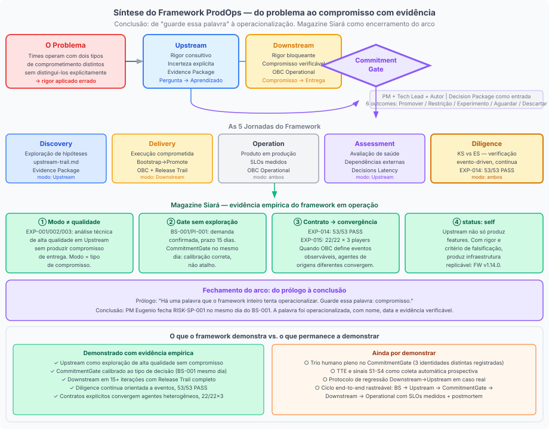

# Conclusão: O que o framework sabe e o que ainda tem por demonstrar

---

## A tese em uma frase

*Figura 11. Síntese do framework: o problema de configuração de rigor, os dois modos, o CommitmentGate como fronteira, as 5 jornadas universais e o substrato comum*

Upstream e Downstream não são fases de um processo: são modos de execução que configuram o tipo de compromisso que um time está mantendo, e portanto o tipo de rigor que deve ser aplicado a qualquer trabalho.

Essa é a tese que o livro sustentou ao longo de dez capítulos, com suporte em artefatos verificáveis do corpus da Magazine Siará. O leitor que chegou até aqui tem as ferramentas para reconhecer o problema que a tese resolve, e para distinguir quando a vê sendo resolvida de quando está sendo apenas renomeada.

---

## O que o framework sabe

O ProdOps sabe, com alto grau de confiança, baseado em evidência verificável:

Que a confusão entre exploração e compromisso não é um problema de sequência: é um problema de configuração de rigor. Times que têm processos excelentes de discovery e delivery ainda podem entregar as coisas erradas se o rigor aplicado ao trabalho não corresponder ao tipo de compromisso que o trabalho carrega. A solução não é mais discovery, nem mais delivery: é clareza sobre em que modo o trabalho está operando em qualquer momento.

Que a distinção entre os modos é operacionalizável. O CommitmentGate (com seus 6 outcomes canônicos, seu Decision Package como contrato de entrada, seu trio de participantes) é o mecanismo que torna a transição entre modos verificável e auditável. No corpus da Magazine Siará, esse mecanismo operou em dois contextos distintos: como conclusão de exploração Upstream (EXP-001/002/003 sobre cartão de crédito, com três experimentos antes da primeira linha de produção) e como CommitmentGate executado no mesmo dia do Business Signal sem Upstream prévio (BS-001/PI-001/Split Payment, deadline não negociável de 15 dias), com o discovery ocorrendo em seguida na jornada Discovery em modo Downstream — rigor bloqueante, Readiness Gate antes da entrada no Delivery. Ambos são usos corretos do mecanismo — e a diferença entre eles é o que o framework nomeia como calibração de modo: discovery pré-CommitmentGate (Upstream) ou discovery pós-CommitmentGate dentro do compromisso (Downstream).

Que as mesmas cinco jornadas (Discovery, Delivery, Operation, Assessment, Diligence) existem em ambos os modos. O que muda não é o tipo de trabalho, mas o compromisso sob o qual o trabalho é executado. Essa distinção resolve o problema que a interpretação sequencial deixa implícito: não existe um ponto no tempo em que toda a exploração relevante terminou e toda a entrega relevante começa.

Que a observabilidade é o substrate epistemológico de ambos os modos. No Upstream, ela torna a incerteza explícita e verificável: Evidence Package, Upstream Trail, Evidence Threshold, Observable Events especificados antes do código de exploração. No Downstream, ela verifica o compromisso: OBC em estado Operational, Release Trail, SLOs, DORA Extended, eventos CloudEvents emitidos em cada fase da sequência Bootstrap → Promote. O que não pode ser observado não pode ser governado, em nenhum dos dois modos.

Que o problema de modo afeta não apenas times humanos mas qualquer agente que opera com orientação por artefatos. O EXP-015 demonstrou empiricamente o inverso simétrico: quando o contrato é explícito e verificável (a tool `prodops_emit_event` com o catálogo de eventos), agentes de origens distintas (claude, codex, copilot) produzem output idêntico — 22/22 × 3 players, zero divergências. A intercambiabilidade é uma propriedade do contrato, não dos agentes. A solução para o problema de modo em agentes é tornar o contrato verificável nos próprios artefatos que os agentes leem, não treinar cada agente individualmente.

Que o Downstream em operação continuada é verificável. O corpus da Magazine Siará documenta 15 iterações versionadas com Release Trail, 12 OBCs Committed com Observable Events e SLIs numéricos, e o EXP-014 com 53/53 PASS demonstrando que a Diligence rastreia automaticamente o estado de cada Feature em tempo real. A teoria não está apenas bem articulada; está empiricamente sustentada.

---

## O que o framework ainda tem por demonstrar

Com a mesma honestidade intelectual que aplicou ao longo do livro, o ProdOps precisa reconhecer o que ainda não está demonstrado com evidência empírica:

O ciclo completo de ponta a ponta — desde o Business Signal até o OBC em estado Operational — num único caso rastreável. Partes do ciclo existem no corpus: alguns OBCs estão Operational, alguns CommitmentGates foram executados, os Release Trails existem. A composição completa num único caso, com rastreabilidade contínua desde o sinal de negócio original até a evidência de operação em produção, ainda está por documentar.

O CommitmentGate com trio humano pleno. Os CommitmentGates documentados no corpus têm o PM como decisor nomeado e a justificativa registrada. A figura do "Autor" independente — o engenheiro que não conduziu o experimento e verifica se o Decision Package é legível sem contexto verbal adicional — não aparece com identidade distinta em nenhum registro. O mecanismo funciona; a separação plena de três papéis como três pessoas físicas independentes ainda está por ser documentada.

O Evidence Threshold com demonstração em múltiplos experimentos de diferentes graus de rigor. O critério de "evidência suficiente" para o CommitmentGate tem definição operacional, mas o que é "suficiente" ainda é julgamento coletivo sem calibração baseada em múltiplos ciclos com graus variados de incerteza inicial.

As métricas de flow do Upstream (TTE, Decision Latency, Discovery WIP) com implementação de coleta automatizada. A instrumentação que tornaria o Perpetual Discovery detectável proativamente — antes que os sinais S1-S4 se tornem críticos — ainda é proposta.

O protocolo de regressão Downstream → Upstream em um caso real. Nenhum item das iterações documentadas precisou regredir. O protocolo está definido no framework; sua validade operacional em um caso de divergência real ainda precisa de evidência.

---

## O que o leitor carrega

Há duas formas de ler este livro e uma que o desperdiça.

A primeira forma: como descrição de um processo a seguir. O risco dessa leitura é transformar a distinção de modos em mais uma metodologia: um conjunto de passos e rituais que podem ser executados formalmente sem que a distinção de compromisso seja realmente compreendida. Gate Theater é o exemplo perfeito: todos os rituais, nenhuma substância.

A segunda forma: como um conjunto de perguntas para fazer em qualquer trabalho de produto. Em que modo estamos operando agora? O rigor que estamos aplicando corresponde ao tipo de compromisso que estamos mantendo? Se há uma transição de modo, ela foi explícita e verificável? O que estamos declarando como evidência é verificável por terceiros?

Essas perguntas não dependem de nenhum framework específico para serem úteis. Dependem apenas de que o leitor tenha internalizado a distinção fundamental: a diferença entre explorar e comprometer não é de sequência, não é de vocabulário, e não é de nível de seriedade. É de tipo de compromisso mantido, e das consequências que fluem desse compromisso.

A forma que desperdiça o livro: tratá-lo como confirmação de que processos de discovery e delivery precisam de melhores nomes. O ProdOps não está renomeando conceitos. Está argumentando que a distinção entre exploração e compromisso é mal resolvida quando tratada como sequência, e bem resolvida quando tratada como modo. Se o leitor termina o livro com "OK, então Upstream é discovery e Downstream é delivery com outros nomes", o argumento não foi transferido.

---

## As fronteiras do conhecimento atual

Um framework que não sabe o que não sabe é mais perigoso do que um que sabe. As fronteiras do conhecimento atual do ProdOps são claras, e essa clareza é parte do que o framework oferece.

O prólogo pediu ao leitor que guardasse uma palavra: compromisso. Não como ritual, não como aprovação em reunião, não como item de backlog priorizado. Como ato que muda o tipo de rigor exigido do trabalho. O corpus da Magazine Siará demonstra o que essa mudança significa operacionalmente: o PM Eugenio decidindo Downstream no mesmo dia do Business Signal porque a evidência já estava no sinal; o EXP-001 permanecendo em Upstream por três experimentos porque a evidência ainda não estava; o EXP-014 com 53 verificações automatizadas confirmando que o compromisso pode ser rastreado em tempo real.

Guardar a palavra não é suficiente. Usá-la com precisão é o que transforma um framework em prática.

---

*Conclusão | Upstream e Downstream sob a ótica do ProdOps*
