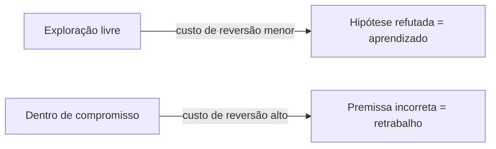

# Chapter 1: The Confusion Is Not about Process; It's about Commitment

---

## The Team That Did Everything Right and Delivered the Wrong Things

Imagine a product team that has the following: a well-established discovery practice, with regular user interviews, metrics analysis, opportunity mapping, and careful prioritization. An equally structured delivery process, with acceptance criteria, code reviews, CI/CD pipelines, and retrospective meetings. The team doesn't skip steps. The process exists and is followed.

And yet, at the end of six months, the deliveries don't match what the market needed. Features were built with technical excellence for problems that users didn't prioritize. Decisions that seemed solid in the discovery phase proved fragile when tested in production. Some hypotheses that discovery never confirmed were simply assumed to be true during execution.

The usual diagnosis in this scenario is one of process: insufficient discovery, lack of alignment between product and engineering teams, poor prioritization, or inadequate communication. The prescribed solution is usually more process: more rituals, more artifacts, more alignment ceremonies.

That diagnosis is wrong. Or, more precisely, it is incomplete in a way that matters.

The problem is not just in what the team did. It lies, above all, in the *type of commitment under which the team was operating* at each moment.

---

## The Four Wounds That Process Didn't Heal

Over the past few decades, much of the literature and practice around building digital products has revolved around a few recurring tensions. The concepts of Upstream and Downstream appear, in different product and development contexts, as attempts to organize some of these tensions, but they rarely named them all at the same time. The result is that several generations of frameworks solved part of the problem and left the rest implicit.

**The first tension: the cost of building the wrong thing.** Features implemented with technical excellence for problems users didn't have. Hypotheses assumed to be true without sufficient evidence. Discovery decisions that prove fragile when tested in production. This problem is real and well documented. But it is only one of the problems.

**The second tension: lead time as the enemy of innovation.** In markets where windows of opportunity open and close within months, the time between a strategic decision and its materialization as software running in production determines whether an organization can or cannot achieve business results. A team that takes twelve months to validate a hypothesis does not compete with a team that validates the same hypothesis in three weeks, even if the slow team's final product is technically superior. The problem is not just *what* is built: it's how long it takes to learn that it was wrong — or right.

High lead time is not merely operational inefficiency. It is the erosion of an organization's strategic capacity. When learning cycles are too long, the strategy that guided the investment has already aged before it can be validated. The organization is not just building slowly; it is building on stale information.

**The third tension: the chasm between strategy and software.** Bridging the gap between the strategy executives formulate in planning meetings and the materialization of that strategy as functioning software requires short, iterative, incremental cycles. But those cycles rarely found a cultural home inside large corporations. The mental model of large projects, quarterly milestones, and waterfall deliveries still dominated the environments where investment decisions were made. Strategy was thought in years; software was built in sprints; and between the two lay a translation gap that no process adequately formalized.

The effect was predictable: strategy arrived at development disfigured by layers of interpretation, political prioritization, and loss of context. The resulting software was faithful to what was specified, not to what was intended.

**The fourth tension: the abstraction that executives never had.** Most executives at large organizations had never experienced a high-engineering-maturity environment. They had no empirical reference for the fact that it was possible to take an experiment from zero to production in days, not months. Many harbored the conviction that this kind of speed existed only at startups, and that corporate scale inevitably meant slowness. This bias was, in part, a self-fulfilling prophecy: believing that speed was impossible, organizations did not create the conditions for it to become possible.

Generative artificial intelligence began to dismantle that myth in a significant way. Executives who had never written a line of code started generating entire applications using internet services — some out of curiosity, others out of necessity. This experience, even if superficial, produced a perceptual shift that decades of agile evangelism had not managed to achieve: the separation between "those who think the business" and "those who build the software" began to look less like a law of nature and more like an organizational choice. And organizational choices can be remade.

**These four tensions are not independent.** A team that builds the wrong things also has high lead time, because rework is embedded in the process. An organization that cannot translate strategy into software quickly also cannot respond to the market in time. Executives who have never experienced high-delivery-velocity environments do not create the conditions for the chasm between strategy and software to be bridged. The problems feed one another.

What these concepts sought to address is real. What was missing was a formulation that recognized all four tensions and identified the root that connects them.

---

## The Cost of Being Wrong Changes Everything

*Figure 1. Delivery rigor applied during exploration (line A) and exploration rigor applied during delivery (line B) produce the same result: waste*

There is a distinction that is rarely articulated explicitly in product organizations: the distinction between the cost of being wrong during exploration and the cost of being wrong during delivery.

When a team is exploring (investigating whether a hypothesis is valid, testing an approach, mapping a problem space), the reversal cost of an incorrect hypothesis tends to be lower. Exploration can be costly: interviews, prototypes, and experiments consume time and resources. What is controllable, before a formal commitment to deliver, is the cost of changing course when a hypothesis proves incorrect. A refuted hypothesis is valuable information. A prototype that doesn't work eliminates a bad option before it becomes a more expensive commitment to reverse. Exploration is the mechanism by which a team learns what not knowing can cost.

When a team is delivering (implementing something that has been committed, for a date, with defined acceptance criteria), the cost of being wrong increases radically. An incorrect premise discovered during implementation requires rework. A poorly defined API contract can block integrations. A vague acceptance criterion results in debate about whether the item is "done." Delivery is the mechanism by which a team honors commitments, and breaking commitments has real costs.

The problem with the team at the opening of this chapter is not that discovery was inadequate in a vacuum. It is that the type of rigor applied to the work was not calibrated to the type of commitment the work required at each moment.

At some moments, the team applied delivery rigor during exploration: hypotheses were treated as requirements before being verified, which turned preliminary insights into premature specifications. At other moments, the team maintained an exploratory posture during delivery: decisions that should have been locked remained open, acceptance criteria remained vague, and the uncertainty that should have been eliminated before commitment was carried into implementation.

The result in both cases is the same: wasted effort. In the first case, by exploring with excessive rigor before knowing what is worth committing to. In the second, by committing without having eliminated the uncertainty that would make the commitment honorable.

---

## What Changes When There Is Commitment

Committing to something — a feature, a behavior, a deadline — is not a bureaucratic formality. It is a transformation in the type of work the team takes on.

Before commitment, the work is about reducing uncertainty. The question guiding decisions is: "What do we need to know to decide with confidence?" The failure of a hypothesis is a legitimate outcome — possibly the most valuable outcome. The quality of the work is measured by the quality of the evidence produced and the clarity with which questions were answered or declared unanswerable.

After commitment, the work is about honoring what was promised. The guiding question changes: "How do we deliver what we committed to, with the quality we committed to, within the committed timeline?" Failure now has a different cost: it is not a learning data point, it is a breach of agreement. The quality of the work is measured by the correspondence between what was promised and what was delivered.

These two modes of work coexist in any organization that builds products. The problem is that they are rarely distinguished explicitly. Teams transition from one to the other without anyone formalizing that transition. What was being explored begins to be treated as committed. What was committed continues to be treated as explorable.

This confusion is not about process. The organization often has the right processes. It is a *rigor-configuration* confusion: the rigor applied to the work does not correspond to the type of commitment the work requires.

---

## Why Sequence Doesn't Solve It

The most common answer to this problem is structural: formally separating the exploration phase from the delivery phase, ensuring that the former precedes and informs the latter. Discovery before delivery. Exploration before commitment.

This answer has genuine merit. Without it, many organizations would make the mistake of committing without having explored anything. It produces a temporal separation that helps teams avoid conflating the two modes of work.

But it does not solve the problem because it did not formulate it correctly.

The problem is not that teams don't explore before delivering. It is that teams frequently don't know, at any given moment, *what type of commitment they are maintaining* and, therefore, *what type of rigor they should be applying*. A Discovery phase that extends indefinitely because no stopping criterion was defined. A delivery phase that begins with premises still open because commitment happened before evidence was sufficient. An item that transitions from "we are exploring" to "we are delivering" without anyone having made an explicit decision about that transition.

The problem is one of configuration, not of sequence. What is missing is not a process that ensures exploration precedes delivery. What is missing is a mechanism that makes explicit, at any given moment, what type of rigor the work requires, and that forces a decision when that type changes.

---

## Rigor as Configuration, Not as a Fixed State

Using the term "rigor" in the context of this analysis requires care. Rigor is not synonymous with bureaucracy, or with heavy process, or with formality for its own sake.

Rigor, here, means the degree of demands applied to reduce relevant uncertainty, sustain a decision, or verify the fulfillment of a commitment. Its manifestation changes according to the type of commitment the work carries. In Upstream, the rigor regime is predominantly oriented toward evidence quality, learning, and reduction of relevant uncertainty. In Downstream, the rigor regime is predominantly oriented toward verification of fulfillment, preservation of commitment, change control, and evidence of outcome. These are not two universal, closed types: they are regimes that emerge from the type of commitment in effect.

The point is that rigor is not a fixed state applied uniformly to all work. It is a configuration that must be calibrated to the type of commitment the work carries.

A team can apply very high rigor during exploration: interviews with complete transcripts, benchmarks with documented methodology, prototypes tested with acceptance criteria declared before the test — without that constituting a delivery commitment. The rigor is in service of evidence quality, not of a promised outcome.

A team can apply different rigor during delivery: measurable acceptance criteria, decision traceability, evidence at each stage — without that being bureaucracy. The rigor is in service of honoring the commitment, not of the appearance of process.

Confusion occurs when the rigor regime does not correspond to the type of commitment. When a delivery-oriented regime is applied to work that is still exploratory, learning is blocked by premature gates. When an exploratory regime is applied to work that already carries a commitment, execution loses the structure needed to honor it.

---

## The Question the Next Chapter Answers

If the central problem is one of rigor configuration — not of sequence, not of the amount of discovery, not of alignment between teams — then what does a product framework need in order to solve this problem?

It needs a way to distinguish, explicitly, when a team is operating with exploration rigor and when it is operating with commitment rigor. It needs a mechanism that formalizes the transition between these different rigor regimes. And it needs to do this without simply renaming "discovery" as "exploration" and "delivery" as "commitment," because the problem is not in the names of the phases — it's in what the names don't capture.

A recurring interpretation in product literature and practice, by separating Discovery and delivery as distinct phases, has genuine merit: it reduces the risk of committing without exploring. But this interpretation addresses the sequence and leaves implicit the type of commitment each phase carries. The next chapter examines why this interpretation, however influential, does not solve the fundamental problem this chapter described.

---

## The journey that begins before the first

The ProdOps framework defines five journeys, but four of them — Discovery, Delivery, Operation, and Diligence — have a clear entry point: a capability that needs to be explored, built, operated, or verified. The fifth journey, **Assessment**, has no fixed entry point: it is present from the moment a Business Signal appears on the product horizon.

Assessment is the framework's informational governance layer. It evaluates whether the informational environment is prepared for the decisions the cycle requires: the transformation of a Signal into a Business Intent, the sufficiency of evidence for the CommitmentGate, the correspondence between the commitment assumed and the commitment honored, and what the completed cycle reveals about the cycle to come. It is not a periodic evaluation phase; it is a continuous responsibility that ProdOps names and structures so that it does not depend on the informal judgment of whoever happens to be paying attention at the moment.

The connection to the problem described in this chapter is direct. The cost of being wrong increases with the level of commitment assumed because the confusion between exploration rigor and commitment rigor is rarely visible at the moment it happens: it becomes visible afterward, when the cost of correction has already risen. Assessment is the mechanism that makes this confusion detectable before the cost reaches its maximum — not because Assessment decides, but because Assessment prepares and qualifies the informational context so that the right decision is more likely.

Chapter 4 describes Assessment in depth: what it evaluates, what it produces, and what it explicitly does not do. What is worth registering here, at the end of the chapter that describes the central problem, is that the solution does not begin with the modes framework: it begins with the responsibility to maintain the informational environment controlled throughout the full cycle.

---

*Chapter 1 of 11 | Part I: The Problem*

---

## Review Notes

**Opening:** "The problem is not in what the team did" → "The problem is not just in what the team did." Preserves the force of the thesis without eliminating the process dimension present in the example itself.

**Historical generalizations:** "For decades, the conversation…" → "Over the past few decades, much of the literature and practice…". "each generation of frameworks solves… and ignores" → "several generations of frameworks solved… and left the rest implicit." Reduces the scope of historical claims.

**Upstream/Downstream as genealogy:** "Upstream and Downstream, as frameworks and as practice, attempted to address…" → "The concepts of Upstream and Downstream appear, in different product and development contexts, as attempts to organize some of these tensions…". Avoids attributing a specific historical genealogy without evidence.

**Generative AI:** removed "irreversibly"; removed "For the first time." Phrasing becomes "Generative artificial intelligence began to dismantle that myth in a significant way." Avoids absolute empirical generalization.

**Cost of being wrong:** reformulated to distinguish exploration cost (which can be high) from reversal cost (which tends to be lower before a formal commitment). Consistent with the formulation in Chapter 2.

**Mermaid diagram:** labels "low cost" and "high cost" → "lower reversal cost" and "higher reversal cost." Aligns with the conceptual distinction adopted.

**Definition of rigor:** replaced the specific operational definition ("rigor is the quality of evidence" / "rigor is the satisfaction of acceptance criteria") with the formulation: "Rigor is the degree of demands applied to reduce relevant uncertainty, sustain a decision, or verify the fulfillment of a commitment." Followed by the description of the two regimes as emerging from the type of commitment, not as closed and universal types. The "confusion" paragraph was adjusted to use "regime" instead of fixed labels with descriptive parentheses.

**Closing about the literature:** "The most common answer in the literature (separating discovery from delivery sequentially)" → "A recurring interpretation in product literature and practice, by separating Discovery and delivery as distinct phases." Acknowledges the genuine merit of the sequential interpretation before identifying its limitation. Consistent with the revision already made in Chapter 2.

---

[→ Chapter 2 — Why the market interpretation does not solve it](chapter-02.md)
[← Prologue](prologue.md)
