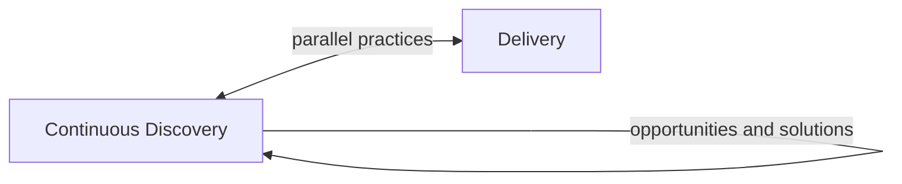
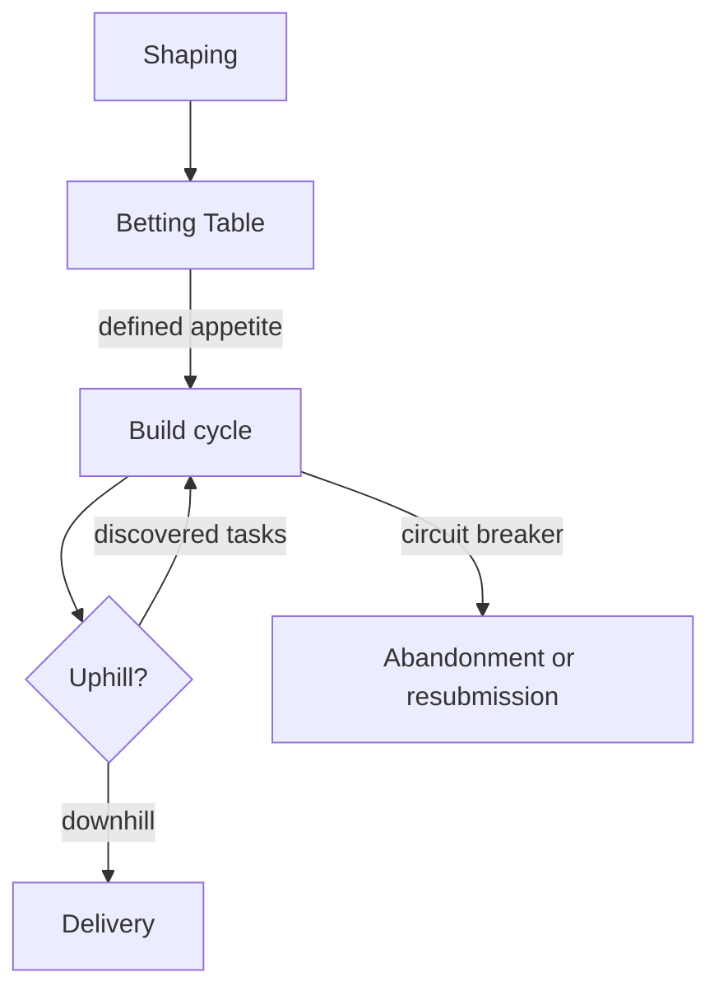
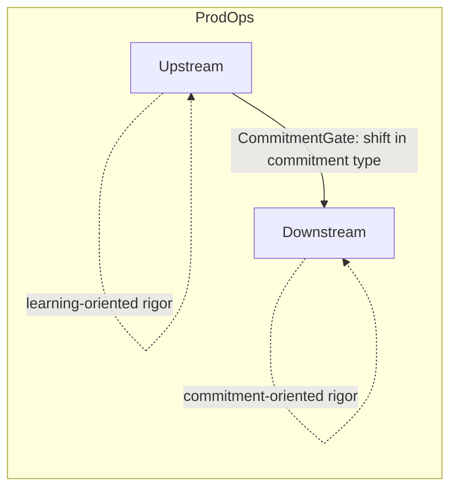

# Chapter 2: Why market reading doesn't solve it

---

## The consensus that lacks precision

*Figure 2. Sequential interpretation (left) vs. modal interpretation of ProdOps (right): the distinction is not one of vocabulary, it is one of commitment type*

There is a reasonably stable consensus in the product literature on how to structure development work: do discovery before delivery. Explore the problem before committing to a solution. Understand users before specifying features.

This consensus is correct as general guidance. The problem is that it is imprecise in what matters. And this imprecision is not cosmetic: it produces structural consequences that the previous chapter began to describe.

Works such as *Inspired* by Marty Cagan, *Continuous Discovery Habits* by Teresa Torres, and *Shape Up* by Ryan Singer each address, in their own way, the problem of organizations that build the wrong things because they commit resources before understanding enough. Each proposes more rigorous practices of exploration, validation, and risk control before or during commitment. Cagan proposes that product teams test ideas with users before committing significant engineering resources to building a solution, reducing risk across the dimensions of value, usability, viability, and feasibility. Torres proposes that discovery be a continuous practice, close to users, based on opportunities and solutions that coexist with delivery rather than preceding it. Singer proposes a shaping cycle that transforms rough ideas into bets with reduced risk, followed by a betting table that formalizes the commitment to a build cycle.

These works are sophisticated and their contributions are genuine. The literature review that grounds the ProdOps framework examined a broad set of works on discovery, delivery, and product management, to be documented in greater detail in a methodological appendix, and identified that a recurring operational interpretation of this literature transforms the distinction between discovery and delivery into a difference in temporal position: first you explore, then you deliver. This is not to say that the more sophisticated authors reduce their argument to this sequence, but it is how a relevant portion of market practice frequently operationalizes the frameworks these works inspired.

This structure has genuine value. Without it, organizations would commit resources to build solutions for problems that don't exist or that don't carry the weight that was assumed. The guidance to perform discovery before committing significant construction resources is an important historical correction relative to development processes that treated initial specifications as truths to be implemented.

But the consensus, in its most common operational interpretation, has a blind spot that the ProdOps framework identifies as its most specific contribution: the *type of commitment in force* does not emerge, in these works, as a transversal operational variable that determines the rigor regime of the work. This difference in formulation, apparently technical, has practical consequences.

---

## What the sequential interpretation leaves implicit

The sequential interpretation of discovery and delivery rests on two assumptions that are rarely made explicit.

The first assumption: all discovery work is of the same type. A team investigating whether there is market demand for a new product category and a team refining the acceptance criteria for an already-committed feature are both "doing discovery." But the type of commitment each carries is radically different. In the first case, exploration exists before any promise. In the second, exploration exists *within* a promise that has already been made. Treating them as instances of the same process ignores this difference.

The second assumption: once discovery ends, what remains is delivery. This implies that all relevant exploration must happen before commitment, and that post-commitment work is pure implementation of something already well understood. In practice, this rarely holds. Architecture decisions during implementation reveal assumptions that discovery did not test. Technical integrations uncover constraints that the exploration phase did not anticipate. Formal commitment does not eliminate the need for exploration; it merely changes the cost of being wrong during it.

The consequence of the first assumption is what Chapter 1 called "delivery rigor applied during exploration": when a team treats all discovery as preparation for an imminent commitment, it applies premature gates that block learnings that could change the course before the commitment is made.

The consequence of the second assumption is what can be called "discovery in the Downstream": exploration that occurs within a formal commitment without recognition that the cost of being wrong has now changed radically. The open assumptions a team carries into the delivery phase do not disappear; they simply become more expensive when they turn out to be incorrect.

---

## Contributions and conceptual gaps

Identifying where influential frameworks fail to formulate a given abstraction requires precision. The goal is not to depreciate established works or reduce complex arguments to caricatures, but to locate what each work resolves and what remains unarticulated as an operational variable.

**Cagan and risk reduction before construction**

In *Inspired*, Cagan treats discovery as the mechanism by which product teams reduce risk before committing engineering resources at scale. Risk reduction operates across four dimensions: value (will customers want this?), usability (can they use it?), viability (does it work within the company's business?), and feasibility (can engineering build it?). Different initiatives carry different risk profiles, and discovery effort should be calibrated accordingly. Prototypes, experiments, and user interviews serve the goal of producing sufficient evidence, across the relevant dimensions, so that the production product is built with greater confidence. Discovery artifacts are instruments of learning, not preliminary versions of the final product. The production product is built from what was learned, with a deeper understanding of the problem and the associated risks.

This model powerfully resolves the problem of untested assumptions and offers a rigorous taxonomy of where risks may reside. The contribution is clear and remains valid.

What is not articulated as a transversal principle: the type of commitment in force as an operational variable that determines the rigor regime of the work. Cagan formulates with precision what needs to be learned and reduced before construction. What ProdOps adds is not a new theory of risk reduction, but an additional operational abstraction: risk determines what needs to be learned; the commitment in force determines the regime under which that learning can occur. This distinction does not contradict Cagan; it is an operational layer that the framework does not formulate as a principle independent of the methodology.

**Torres and the continuity of exploration**

In *Continuous Discovery Habits*, Torres makes an important break with the idea of discovery as a prior, self-contained stage before delivery. Torres proposes discovery as a continuous practice, executed in regular cycles close to users, that coexists with delivery. Opportunities, solutions, hypotheses, and experiments compose a learning flow that does not end with the start of construction. Torres clearly perceives and incorporates the idea that discovery can and should occur after commitment has begun.

This contribution meaningfully resolves the second assumption of the sequential interpretation and should be recognized as such.

What is not explicitly formulated: Torres does not present the framework primarily as an operating model in which the type of commitment in force explicitly alters the operational regime, the rigor, the gates, and the required evidence. The practice of continuous discovery does not operate with the type of commitment as an explicit variable that determines the mode of execution and the acceptable cost of error. ProdOps's contribution is not to claim that Torres does not perceive the overlap between discovery and delivery: she clearly does. The contribution is to propose that the type of commitment be an explicit operational property of the work, with measurable consequences for the rigor required. Torres answers with precision the central question of her framework: how to maintain continuous learning close to users? ProdOps adds a different question: how does the commitment in force alter the operational regime in which that learning takes place?

**Singer and commitment as a bounded bet**

In *Shape Up*, Singer is, of the three authors, the one who most explicitly operationalizes commitment as a variable that structures the work. The shaping cycle reduces uncertainty before the bet is formalized. The betting table is the moment when the organization decides to commit a project to a cycle. The appetite defines what the organization is willing to spend before knowing the outcome. The circuit breaker allows abandoning the cycle if execution reveals that the project is not converging. Singer also distinguishes modes of work with distinct operational characteristics: R&D mode, Production mode, and Cleanup mode, each with different expectations regarding scope, uncertainty, and expected outcome.

Singer also explicitly acknowledges that new unknowns emerge during execution. Hill charts distinguish the uphill phase, characterized by uncertainty about how to solve, from the downhill phase, characterized by execution with sufficient clarity. Discovered tasks are tasks that only reveal themselves during construction. Experimental bets allow structuring high-uncertainty work as a distinct bet, with an intentionally more open scope. The abandonment or resubmission of a bet are explicit possibilities within the framework.

Shape Up is therefore sophisticated in its structure of commitment, in its recognition of uncertainty during execution, and in its distinction of modes of work. More than that: Shape Up empirically demonstrates that commitment, appetite, uncertainty, and mode of execution alter the operational behavior of work. This is precisely the relationship that ProdOps seeks to articulate as a transversal principle. In this sense, Shape Up is not a target of criticism, but evidence of the thesis: the intuition the framework contains, especially in the uphill/downhill distinction, in the use of appetite and circuit breaker, and in the existence of distinct modes of work, is aligned with the central argument of this book.

The difference lies not in sophistication, but in the scope of generalization. The mechanisms of Shape Up are formulated within a specific methodology of planning and delivery, with fixed six-week cycles, betting tables at regular intervals, and a particular model of work organization. The modes of work Singer describes are distinctions internal to that method. ProdOps does not propose introducing the idea of distinct modes of work: it proposes treating the type of commitment in force as the variable that governs the mode of execution, in a transversal way and independent of the methodology used. The abstraction ProdOps formulates is not an invention about what Shape Up ignores; it is a generalization of what Shape Up already operationalizes in a concrete way within its own method.

**What the three works share**

Cagan reduces risk before construction through structured validation. Torres transforms discovery into a continuous learning practice that coexists with delivery. Singer transforms commitment into a bounded bet, with explicit mechanisms to structure, control, and eventually interrupt the work.

ProdOps proposes making explicit, as a single transversal operational chain, relationships that appear partially and methodologically situated in each of these works: COMMITMENT → MODE OF EXECUTION → RIGOR → EVIDENCE → CONTROL. This idea is present in different degrees in each framework, but does not appear, in any of them, as an abstraction independent of methodology and applicable to any operating model. ProdOps's claim is not that each component of this chain is original; it is that the systemic articulation between them constitutes an operational abstraction that existing frameworks do not formulate explicitly.

---

## The problem of discovery within commitment

The blind spot has an operational name in the ProdOps context: Discovery in the Downstream.

Discovery in the Downstream is the exploration carried out after a decision has come to carry an operational, economic, or temporal commitment, causing the same uncertainty that would be acceptable in the Upstream to now carry a cost of reversal, renegotiation, or rework. The problem is not discovering after commitment. The problem is carrying uncertainty into a commitment without recognizing that the cost of being wrong has changed.

When a team assumes a formal commitment—with acceptance criteria, with a deadline, with stakeholder expectations—and still carries unresolved exploration into that commitment, what is happening is not discovery followed by delivery. It is delivery with embedded discovery, without recognition that the two things are coexisting under different cost regimes.

This matters for a precise reason: the cost of changing course is radically different in the two cases.

When a hypothesis is refuted during free exploration, the result is information. The exploration effort was not wasted; it was the price of learning. The team can redirect without breaking a promise.

When a premise is revealed to be incorrect during implementation, after the commitment has been made, the result is rework. The effort invested in the wrong direction carries a real opportunity cost. The team cannot simply redirect; it must renegotiate the commitment, adjust expectations, possibly delay delivery. And if the organizational culture penalizes course changes after commitment, the team has an incentive not to reveal the problem until it is too serious to ignore.

Discovery in the Downstream is not merely inefficient: it is structurally risky. And the risk does not diminish by ignoring it.

---

## The missing distinction: mode, not sequence

What the most common operational interpretation of the product literature leaves implicit, ProdOps makes explicit: the difference between exploration and delivery is not a difference in moment in time, but in the type of commitment being maintained.

Upstream and Downstream do not describe where the work is in time. They describe which commitment is governing the work.

Discovery is not necessarily Upstream, and delivery is not necessarily Downstream. An investigation can occur in the Downstream when a formal delivery commitment exists. Experimental construction can occur in the Upstream when no production commitment yet exists. What determines the mode of execution is the commitment in force, not the nature of the activity.

Exploration without formal commitment can happen at any time: before, during, or in parallel with what other teams call "delivery." What characterizes it is not its position on the timeline, but the fact that the cost of being wrong is still controllable: the hypothesis can be refuted without breaking a promise.

Delivery with formal commitment can also involve exploration, but that exploration happens under radically different conditions. The cost of being wrong is higher. The gates that protect the commitment need to be more rigorous. The uncertainty that can be tolerated during free exploration cannot be carried indefinitely within a commitment.

In the Upstream, rigor is predominantly oriented toward learning, experimentation, and uncertainty reduction. Upstream does not mean the absence of rigor: it means that rigor is in service of evidence quality, not the honoring of a commitment. In the Downstream, rigor is related to the preservation of commitment, execution verification, change control, and the realization of the expected outcome. Downstream does not mean the absence of discovery: it means that any discovery that occurs there carries a different cost and requires a different control regime.

The distinction missing from the sequential interpretation is not "when to explore," but "with what type of commitment is the work being executed." This distinction, when articulated with precision, is what ProdOps calls the mode of execution.

The operational synthesis that organizes this distinction can be expressed as three action regimes: LEARN → COMMIT → REALIZE. The arrow does not represent a temporal sequence; it represents the progressive transformation of the type of commitment governing the work. Each regime determines what counts as quality, what counts as error, and what constitutes valid evidence.

The next chapter defines what a mode of execution is and why that definition resolves the problem that the sequential interpretation cannot formulate.

---

*Chapter 2 of 10 | Part I: The Problem*

---

## Revision Notes

### Round 1: deep conceptual review

**Cagan (*Inspired*):** the claim "delivery starts from scratch" was removed. The critique was reformulated to recognize that Cagan offers powerful mechanisms for risk reduction before construction, operating across the four dimensions of value, usability, viability, and feasibility.

**Torres (*Continuous Discovery Habits*):** the suggestion that Torres does not perceive overlap between discovery and delivery was removed. The critique was reformulated: Torres resolves the problem of continuity, but the framework is not presented primarily as an operating model where the type of commitment in force explicitly alters the rigor regime.

**Singer (*Shape Up*):** the factually incorrect claim that Shape Up "has no protocol" for late discoveries was removed. The diagram "no protocol → Late discovery" was replaced by a faithful representation of the framework.

**18 works:** the specific quantity was removed from the main narrative; the reference was maintained as "a broad set of works," with documentation referred to the methodological appendix.

**Diagrams:** revised to not attribute absences or limitations that the authors do not possess.

### Round 3: three targeted adjustments

**Cagan (commitment):** "before any engineering commitment at scale" → "before committing significant engineering resources to building a solution." Clarifies that the issue is avoiding premature commitment of construction resources, without suggesting that no commitment exists during discovery.

**Discovery/delivery consensus:** "The discovery-before-delivery consensus" → "The guidance to perform discovery before committing significant construction resources." Avoids treating a temporal sequence as the uniform position of all three authors, consistent with the fact that Torres works with continuous discovery and Singer acknowledges uncertainty during execution.

**LEARN → COMMIT → REALIZE:** a sentence was added explicitly stating that the arrow does not represent a temporal sequence, but a progressive transformation of the type of commitment governing the work. Aligns the synthesis with the central thesis of the chapter.
