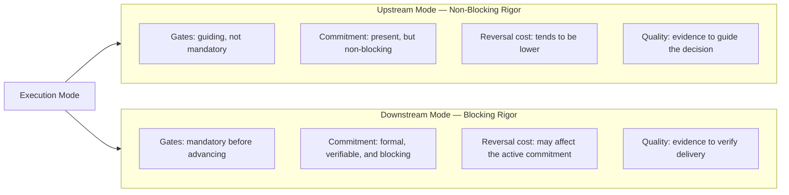

# Chapter 3: What an execution mode is

---

## A distinction that is not about vocabulary

*Figure 3. Journeys and modes matrix: the same 5 journeys exist in both modes, under different commitment regimes*

The previous chapters described a problem: product teams apply the wrong kind of rigor to the work they are doing — not because they lack processes, but because no mechanism makes explicit the type of commitment the work carries at any given moment.

The solution ProdOps proposes is structural: instead of distinguishing Upstream from Downstream by the point in time at which they occur, it distinguishes them by the *type of commitment* they are maintaining. This distinction is what the framework calls an *execution mode*.

Introducing two terms (Upstream and Downstream) and saying that one represents exploration and the other represents delivery would merely rename a problem without solving it. The point of the modal model is not the vocabulary. It is what the vocabulary carries: a commitment distinction that can be verified at any moment, applied to any type of work, and managed with explicit mechanisms.

This chapter defines what an execution mode is in the technical sense that ProdOps uses the term. Without this precise definition, the chapters on Upstream and Downstream will appear to be merely process descriptions, and the reader will miss what is genuinely different about this approach.

---

## What a mode modifies

The canonical ProdOps definition is straightforward: "The mode defines the rigor, not the journeys. The same 5 journeys exist in both modes; what changes is the commitment."

To understand what this means operationally, it is first necessary to understand what the journeys are, and why the distinction between journeys and modes is more than terminological.

ProdOps organizes product work into five journeys:

- **Discovery**: reduce uncertainty and prepare the work
- **Delivery**: build, validate, and promote the solution
- **Operation**: operate and evolve the product in production
- **Assessment**: produce analyses to support decisions
- **Diligence**: ensure consistency of the work system

Each journey has a unique responsibility and its own lifecycle. Discovery is not Delivery. Operation is not Assessment. The boundaries between them are real and carry operational consequences.

A mode, in turn, is not a journey. It is a *commitment configuration* that applies over any journey. A team doing Discovery can be in Upstream mode or in Downstream mode. A team doing Delivery can equally be in either mode. The journey is the same; what changes is the commitment the work carries and, consequently, the rigor regime under which it is executed.

The triad that organizes this distinction is simple: *the journey defines the work; the mode defines the commitment; the gate defines the condition for advancing*. The three concepts are different, and confusing them is the source of most misinterpretations of the model.

---

## What the mode determines concretely

Saying that the mode determines the rigor is not sufficient without specifying what "rigor" means operationally in the ProdOps context.

In **Upstream** mode, rigor is *non-blocking*: practices, artifacts, and evidence are available and recommended, but do not constitute mandatory conditions for advancing. Checkpoints and guiding criteria may exist, but not gates whose satisfaction is mandatory in order to proceed. The practitioner decides which practices to apply, to what depth, and when. This does not mean an absence of discipline or an absence of commitment: it means that the commitment regime is non-blocking. The team can commit to an investigation, to an analysis, to the production of specific evidence; what does not exist is a blocking commitment — one in which the failure to satisfy a condition prevents advancement. Work poorly conducted in Upstream is a problem; the difference is that the cost of correcting course remains manageable because the prevailing regime does not make changing direction a violation of a blocking commitment.

In **Downstream** mode, rigor is *blocking*: gates are verifiable and must be satisfied before advancing, artifacts must be in defined states, the sequence of steps is enforced. An item in Downstream mode does not proceed with gaps to be resolved later; the work stops until the mandatory conditions are met. In the Delivery journey, this structure materializes in the ProdOps framework as the sequence Bootstrap → Hack → Sync → Finish → Ship → Validate → Promote, with gates between each step. This sequence is a materialization of blocking rigor within the Delivery journey, not the definition of Downstream as such. The reason for this structure is not bureaucracy: it is that a formal commitment has been made, and honoring it requires verifiable evidence at each point of advancement.

| Dimension | Upstream | Downstream |
|---|---|---|
| Gates | Guiding; non-blocking | Blocking and mandatory |
| Rigor regime | Non-blocking rigor; practitioner decides the depth | Blocking rigor; mandatory sequence and gates |
| Reversal cost | Tends to be lower; changing direction does not violate a blocking commitment | Potentially high; a change may affect a formal commitment and requires an explicit decision about it |
| Artifacts | Make the active commitment observable; states reflect the regime | Verifiable conditions for advancement; states confirm delivery |
| Quality criterion | Quality of the evidence to inform the commitment decision | Verifiability of the correspondence between what was promised and what was delivered |

Commitment is what determines which column an item belongs to. The state of artifacts is evidence of the commitment, not its definition: a more advanced artifact does not automatically make the work Downstream, just as an artifact in an initial state does not guarantee that the work is in Upstream.

---

## The same journeys in two modes

Here is the point that most frequently produces confusion: when ProdOps says that "the same 5 journeys exist in both modes," it is not saying that Discovery in Upstream and Discovery in Downstream are identical. It is saying that both are instances of the Discovery journey, with the same central responsibility (reduce uncertainty and prepare the work), but executed under different commitment regimes.

Discovery in **Upstream** operates under non-blocking rigor: no mandatory artifacts, no formal exit gate, with freedom to pursue hypotheses in unanticipated directions. In many cases, the experiment is the unit of work and the primary output is an answer to the hypothesis, even if that answer is "not confirmed" or "refuted." Neither of these answers violates a blocking commitment.

Discovery in **Downstream** operates under blocking rigor: the capability has already passed through verifiable conditions that justified committing resources to it. Discovery now serves a different purpose: refining artifacts and evidence to the level the active commitment demands. The output is no longer an open set of learnings; it is a set of satisfied conditions that allows advancing with the confidence a formal commitment requires.

The same contrast applies to the other journeys. Delivery in Upstream mode operates without a mandatory sequence: the steps are available as a reference, but the practitioner decides which to apply and to what depth, without formal gates between them. Delivery in Downstream mode is executed with a mandatory sequence and gates: each step must be satisfied before advancing, because there is a commitment that must be honored with evidence at each point. Operation in Upstream mode can, for example, be executed in controlled environments, without formal SLOs, while behaviors have not yet been formally committed to. Operation in Downstream mode is real production: defined SLOs, existing runbooks, formal incident response protocols.

The full implementation of these distinctions in the framework's mechanisms is in continuous evolution, but the principle is invariant: the journey defines what is being done; the mode defines under which commitment regime it is being done.

A single team can operate simultaneously in different modes for different work objects. A committed capability can be in Downstream, with active gates and a mandatory sequence. A related architectural hypothesis can be in Upstream, under a non-blocking regime, advancing as evidence accumulates. Neither of these modes interferes with the other: they coexist because they represent different commitment regimes, not different points in time.

---

## Why "mode" and not "phase"

The distinction between mode and phase is not terminological pedantry. It resolves a problem that the sequential-phase interpretation cannot.

If Upstream and Downstream were phases (specific moments on the product timeline), then an item would need to pass through Upstream mode before entering Downstream. Every capability would first need to be treated under the non-blocking regime before receiving the blocking regime. This exactly reproduces the problem of Chapter 2: it treats all exploration as the same type, and all delivery as beginning after exploration ends.

As modes (commitment configurations that apply over any journey), Upstream and Downstream can coexist within the same team for different items. An item can be in Downstream mode, with a formal commitment and active gates, while a parallel experiment operates in Upstream mode, under a non-blocking regime and without mandatory gates. The mode decision is not temporal; it is one of commitment. And an item can change mode, but only through an explicit decision — not through the passage of time.

This also means that there is no automatic transition between modes. An item in Upstream mode does not transition to Downstream simply because the team decided to begin implementation. The transition represents an explicit change of commitment, supported by verifiable conditions that confirm the commitment is justified. Chapter 6 describes how this transition is structured in the ProdOps framework.

---

## What the modal model does not do

Defining what the modal model is also requires defining what it is not.

An execution mode is not a classification of team maturity. A team operating in Upstream mode is not in a state of lesser discipline than a team in Downstream mode. The discipline of Upstream has a different form, oriented toward the quality of evidence and the explicit maintenance of uncertainty, but it is not lesser. Work poorly conducted in Upstream — without a falsifiable hypothesis, without a stopping criterion, without verifiable evidence — is just as problematic as an item poorly executed in Downstream.

An execution mode is not a classification of the type of work. There is no work that is "by nature" Upstream or "by nature" Downstream. A technical component can be treated under a non-blocking regime and later implemented under a blocking regime. A product feature can equally traverse both modes, or enter Downstream directly if the evidence already exists and the commitment is justified.

An execution mode is not artifact maturity. The state of an artifact can be evidence of the active commitment, but it is not what defines the mode. The commitment determines which conditions and evidence are necessary; the artifacts make that commitment observable. An artifact in a given state does not automatically make the work Upstream or Downstream: causality begins with the commitment, not with the artifact.

An execution mode is not a temporal location in the product lifecycle. An item is not in Upstream because it has just started, nor in Downstream because it is close to being delivered. The position in time is irrelevant; what matters is the type of commitment currently in effect.

An execution mode is not synonymous with a journey. Upstream is not "the Discovery journey." Downstream is not "the Delivery journey." Each of the five journeys can be executed in either mode, with different operational consequences.

An execution mode is not an indicator of the level of certainty about what is being done. It is possible to have incomplete knowledge in Downstream, because a commitment does not require omniscience: it requires verifiability. It is possible to have abundant knowledge in Upstream, because the decision not to formalize a blocking commitment may be strategic, not a consequence of ignorance. The level of knowledge can inform the decision to assume a commitment, but does not define the mode. What defines the mode is the active commitment and the conditions it makes blocking.

What determines the mode is not the type of work, nor the moment in the lifecycle, nor the state of the artifacts, nor the volume of accumulated knowledge. It is the type of commitment the team is maintaining about the outcome.

---

## The sentence the framework uses as a comprehension test

The ProdOps framework uses a specific sentence to verify whether the modal model has been understood: "The mode defines the rigor, not the journeys. The same 5 journeys exist in both modes; what changes is the commitment."

Any compression that maps Upstream to a specific journey ("Upstream is where discovery happens," "Upstream is the exploration phase") is wrong. These phrases reproduce the market interpretation that Chapter 2 examined. They are intuitively attractive because they capture something true (exploration tends to occur with greater frequency in Upstream), but they obscure what is distinctive about the model: that the same journey can be executed in either mode, and that what changes between them is not the content of the work, but the commitment regime that governs it.

With this distinction established, the two following chapters can describe each mode in depth — not as phases with different content, but as commitment configurations with different disciplines.

---

*Chapter 3 of 10 | Part II: The Modes*
