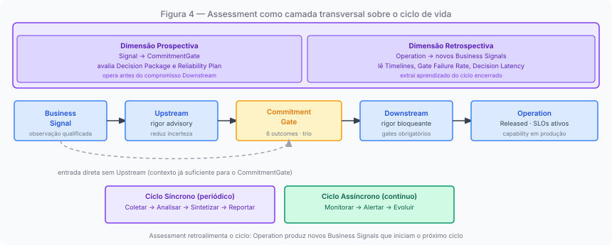
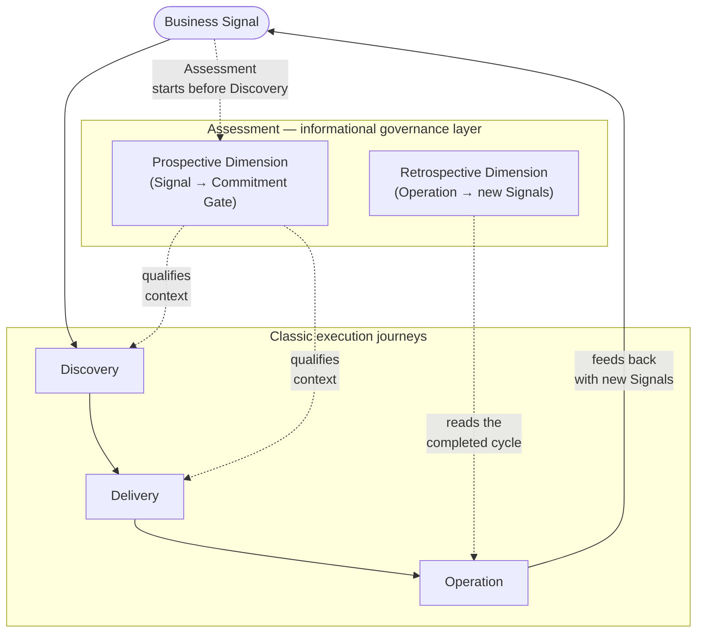
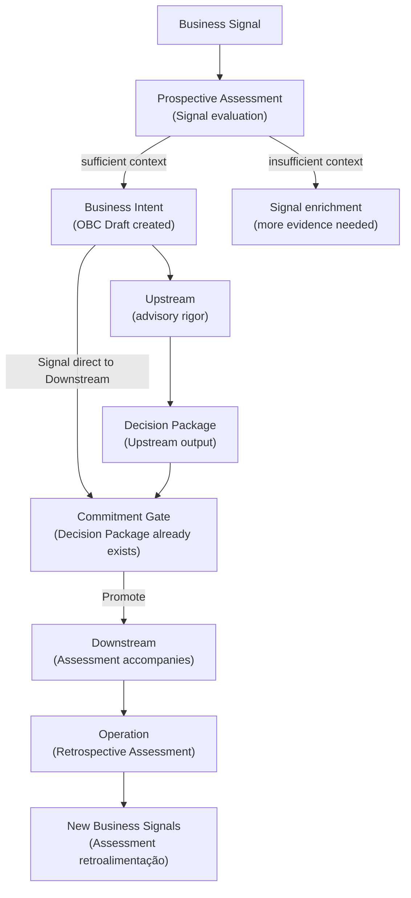
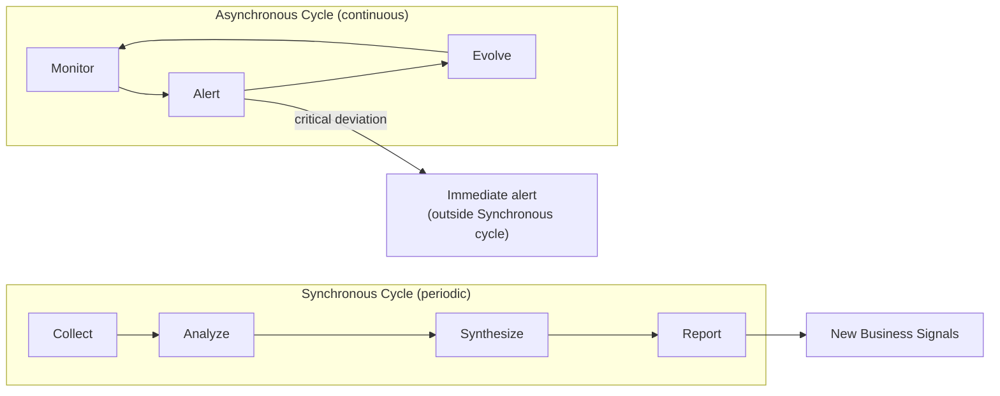
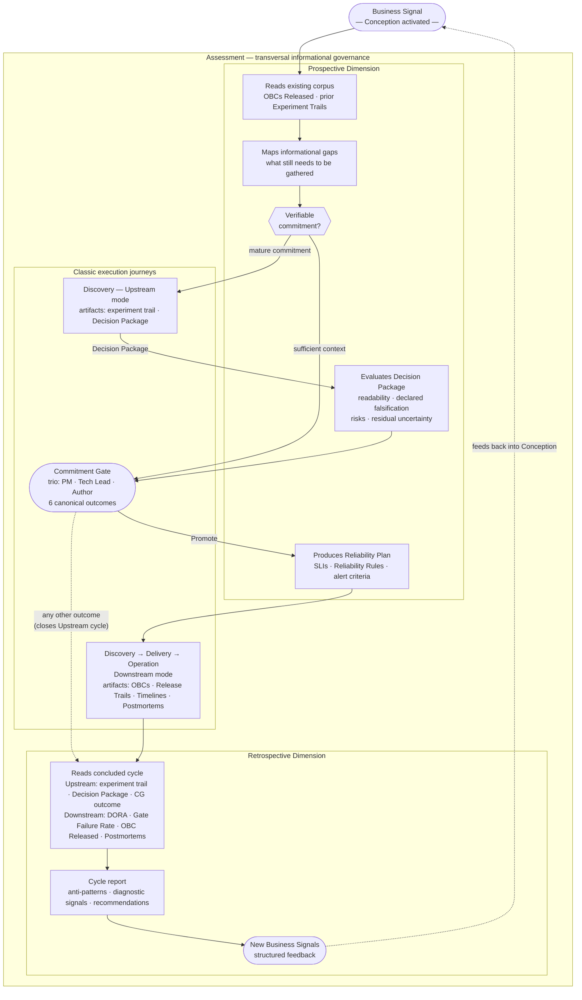

# Chapter 4: Assessment, the journey that accompanies all others

---

## Before the three classic journeys

*Figure 4. Assessment as a transversal layer: active from the Business Signal, accompanying each classic journey, feeding back into the next cycle with new Business Signals*

When the ProdOps framework lists five journeys, the natural reading is to treat them as equivalent: Discovery, Delivery, Operation, Assessment, and Diligence as five responsibilities of the same level, each with its own entry point. That reading is incorrect, and the error matters.

Assessment is not a journey that begins after Discovery and before Delivery. It is not a periodic evaluation phase that happens in parallel to the three classic product journeys. It is the framework's informational governance layer, the journey with transversal reach across the full cycle: it acts from the Business Signal onward, accompanies each journey throughout its full duration, and feeds back into the cycle with new Business Intents after Operation.

The distinction is more than positional. A journey that begins after Discovery is subordinate to the three classics: it depends on work having already started to have something to evaluate. Assessment, as defined by ProdOps, has reach that extends to the moment a Business Signal appears on the product horizon, before any decision to initiate Discovery has been made.

What this means operationally: every relevant decision in the lifecycle of a Product Capability (whether to transform the Signal into Intent, whether to advance to the Commitment Gate, whether the assumed commitment is being honored, what the cycle produced as learning for the next) has a contribution from the Assessment journey. Not because Assessment decides, but because Assessment produces the informational context without which decisions would be made based on perception, not evidence.

---

## Informational governance begins with the Business Signal

The Business Signal is the entry point of a **Product Capability**'s lifecycle: the observation, qualitative or quantitative, that indicates there may be an opportunity or problem that warrants attention. A Product Capability is any feature, behavior, or service the team will explore, build, and operate: a new payment method, a fiscal audit report, an engineering process automation, an infrastructure migration. Before any Upstream experiment, before any decision to transform the Signal into a Business Intent, Assessment already has work to do.

Every Business Signal carries exactly one **Origin Stream**: the classification of where the need was born. The Origin Stream does not determine how the work will be executed, but it informs the context and success criteria the Signal carries. The framework defines four:

- **Business**: needs generated by the market or the customer. Purpose: increase delivered market value (new channels, conversion, retention, churn reduction). Example: Pix support at checkout to reduce cart abandonment. The resulting OBC defines observable product behavior, verifiable via BDD Feature.

- **Enterprise**: needs imposed by legal, regulatory, contractual, or corporate governance requirements. Purpose: ensure compliance, satisfy audits, integrate internal systems. Example: aligning the API to the Central Bank's Open Finance regulation. The OBC defines auditable and traceable behavior.

- **Team**: needs generated by the team itself to evolve how they work (tooling, automations, onboarding, engineering flow). Purpose: improve productivity, quality, and engineer experience. Example: an automated Bootstrap skill to reduce manual setup. The OBC defines behavior verifiable in the team's own process.

- **Technology**: technical platform needs (security, infrastructure, reliability, technical debt). Purpose: evolve architecture, observability, scalability, and system resilience. Example: adopting OpenTelemetry for distributed traceability. The OBC defines measurable technical criteria: SLOs, security metrics, performance benchmarks.

A Business Signal has exactly one Origin Stream. When it seems to belong to two, the tiebreaker is the primary beneficiary of the change: customer or market → Business; organization or compliance → Enterprise; engineering team → Team; system or platform → Technology.

In practice, a Business Signal frequently carries characteristics of more than one Origin Stream: an infrastructure migration may have compliance implications; a new product feature may depend on technical evolution; an internal process automation may reduce operational cost with indirect customer impact. This is not a problem and does not require splitting the Signal. Classifying into a single Origin Stream does not erase the characteristics of the others; it defines the **entry point** through which the Framework will guide the author and team in the transition from Business Signal to Business Intent. Each Origin Stream activates a distinct set of questions, contexts, and success criteria that orient the investigation: a Business Signal asks about market value and user behavior; an Enterprise Signal asks about compliance and traceability; a Team Signal asks about workflow and engineer experience; a Technology Signal asks about technical metrics and reliability criteria. Classifying correctly is ensuring the investigation starts with the right questions.

The question Assessment answers at this moment is not "what will we build?" or "how will we build it?". It is: **is the informational environment sufficiently prepared for the decision to advance (or not to advance) to be made with clarity about what is known and what is not?**

This implies three smaller questions. Does the Signal have enough context to be distinguished from noise: is it a grounded observation or an intuition without data? Does the Signal connect to other existing Signals in the corpus: is there a pattern, a precedent, a convergence with what the history of prior experiments and cycles has already produced? And what informational risks are associated with advancing: what is still unknown that would need to be known to commit resources responsibly?

Assessment does not decide whether the Signal becomes a Business Intent. That decision belongs to the Product Manager and the team. What Assessment does is ensure the decision is made with controlled informational entropy: without invisible gaps, without implicit dependencies, without risks that will only surface after the commitment has been assumed.

---

## The prospective dimension: preparing the environment for the decision

The prospective dimension of Assessment begins at the Business Signal itself, during the **Conception** phase: the period between the Signal being registered and its entry into the Business Intent Backlog (global flow) or the Product Backlog (local flow). No execution journey has been activated yet. No commitment has been made. Assessment already has work to do.

The central question is not "what will we build?" or "how will we build it?". It is: **does the informational environment have sufficiently controlled entropy for the decision to move forward to be made with clarity about what is known and what is not?**

Prospective Assessment answers this question from two sources. The first is the **existing corpus**: what have previous cycles already produced about similar needs? Are there related Signals already registered? Are there closed experiments with relevant evidence? Are there OBCs in Released state that document already-delivered behavior with implications for this new Signal? The corpus is read before any new investigation begins.

The second source is the **map of what is still missing**: if the existing corpus is not sufficient for a decision with controlled entropy, prospective Assessment identifies which information needs to be gathered and in what form. It is from this evaluation that the Signal's path is defined:

- If the informational environment is already sufficient to establish a verifiable commitment, the recommended path is **direct Downstream**: the Business Intent has enough substance for the Commitment Gate without prior exploration.
- If the verifiable commitment needs to be matured, the recommended path is an **Upstream journey**: one or more experiments from the Discovery journey, in non-blocking mode, to accumulate the necessary evidence.

The journey that produces the **Decision Package** is Discovery in Upstream mode. Prospective Assessment does not produce the Decision Package: it evaluates its epistemic quality. Is the Decision Package readable by a trio member who did not participate in the experiment, without additional verbal context? Were hypotheses answered with declared falsification criteria, or merely asserted? Were risks evaluated based on evidence or simply listed? Is the residual uncertainty explicitly declared as acceptable, or was it simply omitted?

When a Business Intent follows directly to Downstream without an Upstream journey, what substitutes for the Decision Package of an experiment is the Signal documentation with the context that justified dispensing with exploration: which independent channels confirmed the demand, what the risk profile of the assumed commitment is, and why the residual uncertainty is acceptable for committing resources. Prospective Assessment evaluates whether this substance is real or merely declared.

The **Reliability Plan** is the second relevant output of the prospective dimension. It defines, before entry into Delivery, the reliability conditions the Product Capability needs to satisfy throughout the cycle: Initial SLIs, Reliability Rules, alert and escalation criteria. For high-risk Product Capabilities, the Reliability Plan may be required as a condition for entering the Readiness Gate; without it, the Gate is not opened. For lower-risk Product Capabilities, the plan may be produced during Downstream with less formality. The calibration is the responsibility of each team's Runtime; the ProdOps Framework defines that the evaluation of which conditions apply belongs to prospective Assessment.

---

## The retrospective dimension: reading what the past produced

If the prospective dimension of Assessment prepares the environment for the decision, the retrospective dimension extracts learning from any concluded cycle and feeds it into the next.

Retrospective Assessment is activated at the end of any cycle with a formal record: at the conclusion of an Upstream experiment (regardless of the Commitment Gate outcome), or after the completion of a full Downstream cycle, with the Product Capability in Released state and the Release Trail finalized. In both cases, its focus is what the cycle produced as evidence about how the work system functioned. The question retrospective Assessment always asks is the same: what was learned? How did the cycle work? What does the history reveal about the health of the process?

The sources vary according to the type of concluded cycle. For **Upstream** cycles: the experiment trail (the chronological record of the investigation), the Decision Package produced, the Commitment Gate outcome, and the state of answered or refuted hypotheses. For **Downstream** cycles: the Timelines and the measurement artifacts generated, including DORA Extended metrics, Gate Failure Rate (frequency with which Gates were blocked before being satisfied), Decision Latency (time between available evidence and Commitment Gate convening), Discovery WIP (simultaneous experiments in progress), Postmortems, and OBCs in Released state.

From these sources, retrospective Assessment produces two outputs. The first is the **cycle report**: a synthesis of what the cycle revealed about process health: detected anti-patterns, activated diagnostic signals, recommendations for the next cycle. The second, more important, is the set of **new Business Signals**: observations derived from Operation or from Upstream experiment results that indicate opportunities or problems to investigate in the next cycle. This is the mechanism through which ProdOps feedback operates, not as a disconnected retrospective ritual, but as the structured production of inputs for the start of the next cycle.

| Data source | What retrospective Assessment reads |
|---|---|
| Experiment Trails | How the Upstream experiment was conducted; hypotheses answered or refuted |
| Decision Packages | Quality of the evidence produced; recommendation and Commitment Gate outcome |
| Release Trails | How each Delivery phase was executed; where flow stalled |
| Gate Failure Rate | Frequency of Gate blocks not yet satisfied; signal of inadequate rigor |
| Decision Latency | Time between evidence and Commitment Gate; signal of Perpetual Discovery |
| Postmortems | Operation incidents; what the Reliability Plan did not anticipate |
| OBC Released | Actual behavior vs. promised behavior; SLO deviations |

---

## The Assessment cycle

Assessment operates in two complementary cycles: the Synchronous cycle, structured and periodic, and the Asynchronous cycle, continuous and event-driven.

The **Synchronous** cycle has four phases: **Collect** (aggregate cycle artifacts: Timelines, OBCs, Release Trails, metrics, postmortems), **Analyze** (identify patterns, diagnostic signals, deviations between what was promised and what was delivered), **Synthesize** (produce conclusions and recommendations with declared confidence level), and **Report** (communicate conclusions to the trio and team, with actionable next steps). The Synchronous cycle is the moment Assessment becomes visible to the team: the cycle report, the evidence-based retrospective, the structured input for planning the next cycle.

The **Asynchronous** cycle has no defined start and end: it is continuous monitoring of the work system's state. While the Synchronous cycle reads the past to guide the future, the Asynchronous cycle observes the present to detect deviations before they become problems. It operates in three phases: **Monitor** (observe flow metrics, Perpetual Discovery signals, divergences between artifacts and actual state), **Alert** (flag deviations requiring immediate attention, before the Synchronous cycle detects them with delay), and **Evolve** (incorporate new monitoring criteria based on what previous cycles revealed as blind spots).

The relationship between the two cycles is one of complementarity: Asynchronous detects deviations in real time; Synchronous contextualizes them within the cycle's history. A deviation detected by Asynchronous can be addressed immediately, without waiting for the cycle report. A pattern the Synchronous cycle identifies may become a new monitoring criterion for the Asynchronous cycle.

---

## What Assessment does not do

Clarity about what Assessment does not do is as important as clarity about what it does.

**Assessment does not write to Timelines.** Timelines are append-only records produced by the classic journeys: Discovery, Delivery, and Operation. Assessment reads Timelines; it never modifies them. This restriction is not technical: it is epistemological. The integrity of each journey's records is the condition that makes retrospective Assessment reliable. If Assessment could modify the records it reads, its outputs would lose the objective basis that distinguishes them from perception and subjective judgment.

**Assessment does not decide a Product Capability's fate.** It does not approve or reject the transformation of a Signal into Intent, does not vote at the Commitment Gate, does not authorize the start of Downstream. Those decisions belong to the trio (PM, Tech Lead, and Author). What Assessment does is prepare and qualify the informational context so that decisions are made with clarity, but the decision itself does not belong to Assessment.

**Assessment does not define what will be built.** That is the responsibility of Discovery and Delivery. Assessment evaluates the quality of the informational context that informs those decisions, not the merit of the decisions themselves.

**Assessment is not a compliance audit.** It does not verify whether artifacts were filled out according to a template: that is the responsibility of Diligence. What Assessment evaluates is the epistemic quality of the work: whether hypotheses were formulated with falsification criteria, whether evidence has substance, whether risks were identified with specificity. The form of artifacts concerns Diligence; the epistemic content of artifacts concerns Assessment.

---

## Assessment in the corpus: the Magazine Siará feedback cycle

The Magazine Siará corpus contains a case that concretely illustrates Assessment's feedback mechanism.

Business Signal BS-001 (the Signal that originated the Split Payment feature) did not emerge from nothing. It is traceable to observations from Operation: customers abandoning carts, contracts with partner suppliers being lost due to lack of payment flexibility. These observations are exactly the type of output that retrospective Assessment produces when it reads the Released state of existing Product Capabilities and identifies gaps between promised behavior and actual market needs.

PI-001 documents why BS-001 entered Downstream directly without prior Upstream: "demand confirmed through two independent channels, bounded scope, non-negotiable deadline." This justification is prospective Assessment in operation: the evaluation that the informational context was sufficient to dispense with pre-Commitment Gate exploration. The absence of Upstream does not mean the absence of evaluation: it means the evaluation concluded that residual uncertainty was acceptable for the commitment.

EXP-007, opened in parallel to the Split Payment Downstream, is an Upstream experiment, not the Assessment journey itself, but the result of Assessment functioning: the retrospective evaluation of the ongoing cycle's gaps generated the Signal that motivated opening the experiment. While DS-61 honored the Split Payment Pix+Boleto commitment, EXP-007 explored priority payment method combinations, the appropriate domain model for composition, and the partial failure policy. The learning from EXP-007 (including the exploratory code produced and the `payment-composition` OBC Draft) was promoted and integrated into the ongoing Downstream before DS-61 concluded. That is the feedback mechanism at work: Assessment read the ongoing cycle and produced the Signal; the Upstream experiment answered the hypothesis.

What makes this case valuable is not its exceptionality. It is that it represents the normal functioning of Assessment: accompanying the current cycle, extracting learning from what is in Operation, and preparing the informational environment for the next.

---

## Assessment as a layer, not a phase

The most common reading of a new journey in a framework is to position it in a sequence: before X, after Y. Assessment resists this reading, not because it is special, but because its responsibility is structurally different from the three classic journeys.

Discovery, Delivery, and Operation are execution journeys: each has an expected input, a defined output, and a completion criterion. Assessment is an informational governance journey: its input is the current state of the work system, its output is the qualified context for cycle decisions, and its "completion criterion" is controlled informational entropy throughout the full cycle.

This does not make Assessment more important than the three classics: it makes it different in nature. A team can operate without formal Assessment, using judgment, memory, and intuition in place of systematic evaluation. The cost is not immediate: it manifests gradually, as decisions made with incomplete context, risks identified late, failure patterns that repeat because they were never formalized in the previous cycle report.

ProdOps does not prescribe a single Assessment implementation. What the Framework defines is what Assessment is responsible for **evaluating and qualifying** (the Decision Package generated by Discovery, the Reliability Plan adequate to the commitment risk, evidence-based cycle report, new Business Signals as feedback) and each team's Runtime decides with what frequency, what level of formality, and what instrumentation Assessment operates.

The following chapters describe the execution modes (Upstream and Downstream) and the classic journeys. In each of them, Assessment operates in the background: ensuring that the decision that closes a phase has the informational context it requires, and that the learning each phase produces is not lost between one cycle and the next.

---

*Chapter 4 of 11 | Part II: The Modes*

---

---

[← Chapter 3 — What an execution mode is](chapter-03.md)
[→ Chapter 5 — Upstream: the mode of explicit uncertainty](chapter-05.md)
