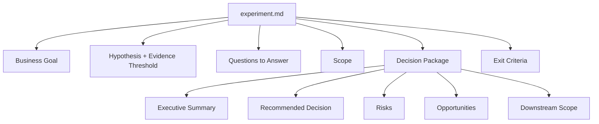
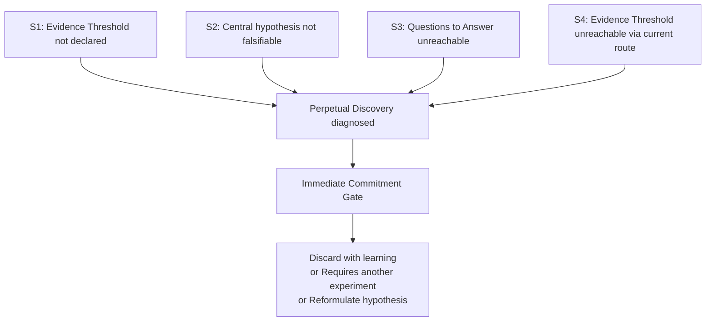
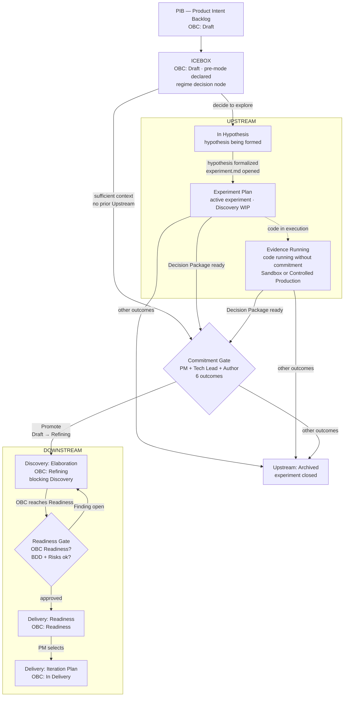

# Chapter 5: Upstream: the mode of explicit uncertainty

---

## The discipline of what is not a promise

*Figure 5. Upstream experiment lifecycle: from Hypothesis Formed to Commitment Gate with its 6 outcomes*

Upstream is not the mode where rigor is discarded. It is the mode where rigor takes a distinct form: oriented toward the quality of evidence, not toward verifying a delivery commitment.

What defines Upstream is not the absence of commitment, but the type of commitment that is in effect. There are three layers in this distinction that must be kept separate.

Work in progress carries a real commitment. The investigation has a hypothesis, responsible parties, and some stopping criterion, even if implicit. Conducting an experiment without rigor, without a formulated hypothesis, without verifiable progression, is not Upstream well executed; it is Upstream poorly conducted.

There is, however, no formal commitment to a specific Product Capability: no OBC Readiness, no Release Trail, no promise that that behavior will be in production for those users, with those acceptance criteria.

And there is no blocking commitment: changing direction, closing the experiment, or rejecting the hypothesis does not violate a contract that needs to be renegotiated. The cost of reversal remains controllable because the prevailing regime does not transform a change of course into a broken promise.

Software produced in Upstream can have production quality: tested, documented, and deployable code. What distinguishes this work from Downstream is not the technical quality of the artifact, but the commitment regime under which it was produced.

The discipline of Upstream is the discipline of keeping these three layers distinct. A team can work with all the technical rigor of a senior engineer in Upstream mode and the work still remains non-blocking, because the Product Capability commitment has not been made.

---

## When to open an experiment

When Upstream operates in the Discovery journey, the most structured working instrument is the experiment. An experiment is not just any informal investigation: it is a structured artifact with a defined purpose, a falsifiable hypothesis, and a stopping criterion.

The ProdOps framework guides four conditions to justify opening a formal experiment. All must be true: there is a falsifiable hypothesis; the hypothesis has not yet been answered by existing evidence; the answer has decision value, it affects what will be built or how; and the cost of assuming the hypothesis as true without testing it exceeds the cost of the experiment.

These conditions eliminate two frequent cases of inappropriate experiment use. The first: investigating what is already known. The hypothesis has already been answered by previous experiments or by the team's accumulated knowledge, and formalizing a new experiment is unnecessary work. The second: formalizing an untestable preference. The hypothesis is not falsifiable because it is a belief or a design orientation with no verification criterion.

> **Note:** The distinction between informal research and formal experiment is operational, not canonical. The framework does not require that every investigation be a formal experiment, only that formal experiments satisfy these conditions.

EXP-001 of the Magazine Siará Payments API is a concrete example. The central hypothesis: "the complete credit card lifecycle can be supported without crossing the PCI boundary, provided only the hosted flow is exposed in the first iteration." The hypothesis is falsifiable: if the PCI scope analysis shows that hosted and tokenized have equivalent exposure, or if the Checkout team cannot integrate the hosted flow without breaking changes to the existing contract, the hypothesis is refuted. The answer has decision value: it defines which of the three integration models (hosted, tokenized, transparent) enters Downstream first. And the cost of assuming the hypothesis without testing it would be to build with the wrong model and need a second Downstream delivery to correct it.

---

## The anatomy of the experiment

Every Upstream experiment has two mandatory artifacts: `experiment.md` and `upstream-trail.md`.

The `experiment.md` documents the permanent structure of the experiment: Business Goal, Questions to Answer, Hypothesis, Repository Scope Gate, Findings, and Decision Package.

It is not a bureaucracy template: it is the mechanism that keeps the experiment oriented toward its central hypothesis. The Decision Package section is what determines whether the experiment is mature enough for the Commitment Gate.

The `upstream-trail.md` is the chronological log of sessions: what was done, what was discovered, which artifacts were produced, which decisions were made and why. It serves two purposes. During the experiment, it is the mechanism that prevents context loss between sessions. At the Commitment Gate, it is the evidence that the experiment had real progression, not merely accumulated entries without advancing the hypothesis.

Beyond the mandatory artifacts, experiments work on artifacts that already exist or can be enriched during the investigation: the OBC Draft (which is born with the Business Intent, pre-exists the experiment, and must be present as a file before the Commitment Gate), the BDD Feature in draft, evidence files in `evidence/`, prototypes in `prototypes/`. The experiment does not create the OBC; it operates on it. The other optional artifacts are produced as the investigation needs them, not as an entry requirement.

---

## Evidence Threshold: the criterion that Upstream may or may not declare

The Evidence Threshold is the explicit criterion that defines when the evidence produced is sufficient to make a commitment decision.

In Upstream, the Evidence Threshold is *optional* (recommended, but not mandatory). If declared, revisions to the threshold must be recorded in the upstream-trail. If not declared, the stopping criterion is the author's judgment: the investigation questions have been answered, the Decision Package can be written with substance, and the residual uncertainty is declarable and acceptable.

What is not acceptable is the total absence of a stopping criterion, and it is precisely this absence that produces the main anti-pattern of Upstream.

Four concepts that operate in sequence in Upstream, but are not synonymous: the **Evidence Threshold** is the explicit criterion declared before or during the experiment; **evidence sufficiency** is the epistemological judgment about whether the knowledge produced allows a decision (it exists even when no threshold has been formally declared); the **stopping criterion** is the condition that indicates the experiment should end: it may be the threshold reached, the author's judgment, or one of signals S1–S4; the **Commitment Gate** is the collective mechanism that decides the Product Capability's fate based on the evidence produced. Using "Evidence Threshold" as a synonym for "evidence sufficiency" or for "Commitment Gate" is the error that feeds Perpetual Discovery.

---

## Perpetual Discovery: the central anti-pattern

Perpetual Discovery is the state of an experiment whose stop indicators are absent, ambiguous, or demonstrably unreachable. An experiment without a declared Evidence Threshold does not know when it has sufficient evidence: any amount seems insufficient. An experiment with a non-falsifiable hypothesis has no result that ends it: exploration continues because the question remains structurally open. An experiment with unreachable questions is blocked without an exit. In any of these cases, the experiment does not continue because more evidence is genuinely needed: it continues because the criterion that would end the exploration does not exist or cannot be satisfied.

Three structural conditions produce this ambiguity in stop indicators. The absence of a declared Evidence Threshold: without an explicit criterion, the implicit threshold is infinite and is never reached. The central hypothesis never formalized as falsifiable: without something to refute, any evidence seems partial and the experiment continues. The Commitment Gate seen as an approval event rather than a commitment decision: if the Gate is perceived as the moment when the ability to change course ends, there is a rational incentive not to declare stop criteria that would force the Gate to be convened.

The ProdOps framework identifies four diagnostic signals that make Perpetual Discovery recognizable. Each signal is individually sufficient to convene the Commitment Gate: it is not necessary for all to be active simultaneously.

**S1: Evidence Threshold not declared.** The experiment has not defined an explicit stopping criterion in `experiment.md`. When the threshold is absent, the implicit criterion is "when we have sufficient evidence" — which never satisfies itself. It is the most direct structural invitation to Perpetual Discovery.

**S2: Central hypothesis not falsifiable.** The hypothesis was formulated in such a way that no possible result refutes it, or was never formalized as a question with a verifiable answer. Without something to falsify, there is no result that ends the experiment: exploration continues because the question remains structurally open.

**S3: Questions to Answer demonstrably unreachable.** One or more questions were marked as "not answerable with available evidence" and the experiment has not identified a new evidence route or reformulated the central hypothesis. The experiment is blocked: it cannot satisfy its own stop indicators.

**S4: Evidence Threshold declared but unreachable via current route.** The stopping criterion exists but the accumulated evidence does not satisfy it and no new sources have been identified. Continuing to collect evidence of the same type will not change the result: the current route is a structural dead end.

Any active signal justifies convening the Commitment Gate immediately — not to approve, but to decide: reformulate the hypothesis, close with recorded learning, or declare that the experiment requires new formulation before proceeding.

---

## The three acts of deployment

A point that deserves explicit attention: Upstream does not prohibit code in production. The mode describes the type of commitment, not where code can be deployed.

There are two distinct acts of deployment in Upstream, with different authorizations and consequences:

**Sandbox Deploy**: code deployed in an ephemeral and isolated stack, without real client traffic. The engineer decides. The stack is destroyed at the end of the experiment. No Release Trail, no OBC Readiness.

**Controlled Production**: Upstream code deployed to real production, without Commitment Gate. Explicit authorization from the team and leadership. Immediate rollback available. No Release Trail required (which does not mean without evidence): what was observed in Controlled Production must be recorded in the experiment's upstream-trail. This is not a violation of Upstream mode: it is an authorized act. What distinguishes it from promotion is that the *Product Capability commitment* (OBC Readiness, Downstream Gates) has not been made. The code reaches production; the Product Capability remains under exploration.

The third act is the exit from Upstream, not a deployment within it:

**Product Capability Promotion**: Commitment Gate with Promote outcome. The OBC transitions from Draft to Refining; the BDD Feature exists as a draft in the Downstream paths. The item enters Discovery: Elaboration, where Downstream Discovery elaborates the scope, completes the BDD, and satisfies the Readiness Gate conditions. After the Readiness Gate, the OBC reaches Readiness state; the Iteration Plan is created and Delivery begins with Bootstrap.

The distinction between Controlled Production and Product Capability Promotion is precisely the distinction the modal model resolves: in the first case, the code is in production but the Product Capability is not committed; in the second, the commitment has been formally made with all its Gates.

---

## Upstream in operation: Magazine Siará as exemplar

The first three experiments of the Magazine Siará Payments API (EXP-001, EXP-002, and EXP-003) illustrate Upstream as an operational mode in its most complete form, with the Commitment Gate executed at the end of the sequence.

EXP-001 opened with a high-risk question: how to support the complete credit card lifecycle without crossing the PCI boundary or coupling Checkout to the Asaas contract? Before writing a single line of production code, the experiment specified the mandatory BDD scenarios, the Observable Events expected for each flow (authorization, confirmation, risk analysis, refusal, cancellation, chargeback), and the dimensions that could never appear in logs (card number, CVV, provider token). EXP-002 mapped the Asaas sandbox Product Capabilities and limitations for reproducing the credit card cycle, and confirmed the Validation Workbench as the simulation environment for scenarios the sandbox cannot reproduce deterministically; full provider scenario validation remains open, pending external evidence from Asaas. EXP-003 systematically compared the three possible integration models (hosted, tokenized, transparent) and produced the recommendation with justification: only hosted entry advances to Downstream, because it is the only option that does not require decisions external to the Payments team.

The EXP-003 Decision Package recommends Promote with restriction (outcome ②): the hosted slice advances; the remaining options remain in Upstream awaiting third-party decisions (PCI scope, token model, Checkout UX). The Commitment Gate was executed with this Decision Package: the trio recorded the outcome, and Downstream began exclusively for hosted entry.

Three sequential experiments. No production code during any of them. A recommendation verifiable by third parties. A Commitment Gate that decided the Product Capability's fate with sufficient evidence, and with an explicit restriction on what the evidence did not support. This is Upstream mode operated with full engineering rigor: not a low-discipline phase before the "real" engineering. A non-blocking commitment regime that produced verifiable knowledge, and a Decision Package that made the Commitment Gate possible.

---

## Coordinating Upstream: the Experiment Plan

When a team runs multiple Upstream experiments in parallel, a coordination artifact becomes necessary. That is the **Experiment Plan**: a VIEW over the Icebox items that have an active experiment: a formulated hypothesis, an open `experiment.md`, an investigation in progress.

The Experiment Plan is not a sprint. It has no deadline or mandatory sequence. It is a visibility instrument: it answers the question *"which hypotheses are we investigating right now?"* and makes **Discovery WIP** visible: the number of simultaneously active Upstream experiments.

The Experiment Plan is the Upstream equivalent of the Iteration Plan. The Iteration Plan governs the Downstream in execution (committed Product Capabilities, in Delivery). The Experiment Plan governs the Upstream in exploration (active hypotheses, no commitment). The two are symmetrical: one does not replace the other; they coexist when the team operates in both modes simultaneously.

*Figure 5a. PIB structure: the Icebox as the pre-mode triage node, Upstream VIEWs, the Commitment Gate as the modal boundary, and Downstream VIEWs through to Delivery.*

An item stays in the Icebox while there is no regime decision: it can go directly to the Commitment Gate (sufficient business context, no exploration needed), or activate the Upstream path by opening a hypothesis. The Experiment Plan lists only the experiments that are active at this moment; an item in the Icebox that has not yet opened an experiment does not appear in the Experiment Plan.

The three Magazine Siará experiments (EXP-001, EXP-002, EXP-003) would be represented in the Experiment Plan during their respective investigation windows, and removed when the Commitment Gate recorded the *Promote with restriction* outcome and the item entered Discovery: Elaboration as Downstream Declared.

---

## What Upstream is not responsible for doing

The definition of Upstream includes an explicit list of what is outside its scope. Implementing the committed Product Capability with blocking Gates: that is the Delivery journey in Downstream mode. The distinction is one of commitment, not physical activity: Upstream can produce functional code, proof of concept, implementation in sandbox or in controlled production, without that constituting the delivery of a formally promised Product Capability. Committing and technically implementing the observability of the Product Capability (SLOs, Observable Events, production instrumentation): that is the responsibility of Downstream. In Upstream, ODD means documenting what needs to be observable to test the hypothesis, without that constituting a commitment of implementation. Producing OBC Readiness: that is Discovery in Downstream. Producing complete BDD in `prodops/artifacts/bdd/`: that happens before the Readiness Gate. Guaranteeing the absence of uncertainty: acceptable residual uncertainty is a valid Commitment Gate criterion.

This last statement is counterintuitive enough to deserve emphasis: Upstream does not need to eliminate all uncertainty. It needs to reduce uncertainty to the point where the residual risk is acceptable for taking on the Downstream commitment. What is "acceptable" is the collective judgment of the trio at the Commitment Gate, not a zero-uncertainty criterion that no finite experiment can satisfy.

Special attention is due to the item "Producing Readiness OBC: that is Discovery in Downstream." It resolves a frequent misunderstanding: a Business Signal that enters directly into Downstream without prior Upstream does not skip discovery. The discovery happens in the Discovery journey executed in Downstream mode, with blocking rigor. The OBC transitions from Draft to Refining. The BDD Feature is written and refined. The Business Intent questions are resolved with dated decisions and identified responsible parties. The Readiness Gate blocks entry into the Delivery journey until these conditions are met. Only then (with the Iteration Plan generated in Planning) does Bootstrap, the first phase of Delivery, begin. What "without Upstream" describes is the absence of pre-Commitment Gate exploration. What happens after the Commitment Gate, in the Discovery journey in Downstream mode, is real discovery: with blocking Gates that do not allow advancing until the conditions are satisfied.

---

*Chapter 5 of 11 | Part II: The Modes*

---

[← Chapter 4 — Assessment: the journey that accompanies all others](chapter-04.md)
[→ Chapter 6 — Downstream: the mode of commitment](chapter-06.md)
