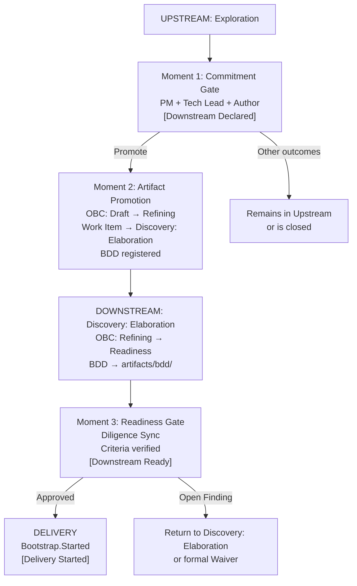

# Chapter 6: Downstream: the commitment mode

---

## Where Downstream begins

There is a common misconception about the starting point of Downstream. It does not begin when the team "finishes discovery." It does not begin when "the team feels ready." It does not begin when the Product Manager decides to prioritize an item.

Downstream begins when the Commitment Gate is executed with the Promote outcome, and not before. That is the moment when the mode is declared: the rigor regime shifts from non-blocking to blocking, and the item begins to carry a formal commitment.

This precision is not merely procedural. It is the direct consequence of what Downstream represents: a shift in the commitment regime. And commitment regimes must have a verifiable moment of inception. "The team felt ready" is not verifiable. A Commitment Gate recorded in the upstream-trail, with a date, participants, and documented outcome, is.

What the Commitment Gate does not initiate is Delivery. The ProdOps framework distinguishes three states within Downstream mode: **Downstream Declared**: the commitment has been made, the item enters Discovery: Elaboration; **Downstream Ready**: the pre-Delivery requirements have been satisfied and verified; **Delivery Started**: Bootstrap has been initiated. The Commitment Gate corresponds to Downstream Declared. Between it and Bootstrap.Started there is a readiness protocol that is part of Downstream, not an antechamber outside of it.

---

## The three transition moments

The detailed operationalization protocol for this transition (the steps between Downstream Declared and Delivery Started) is a proposal from the ProdOps framework canonization effort, robustly supported by the experiment artifacts, but still awaiting incorporation into the main framework.



**Moment 1: Commitment Gate** (Downstream Declared). The trio (PM + Tech Lead + Author) evaluates whether the evidence produced justifies the commitment. The criteria include: hypothesis answered with the Evidence Threshold satisfied (if declared), Decision Package with real substance, OBC Draft existing as a file, and BDD drafted and legible. The most consequential result is Promote, which triggers Moment 2. The Commitment Gate does not create the commitment: it makes the trio's decision about the Product Capability's fate verifiable and traceable.

> **Note:** The Commitment Gate does not presuppose prior Upstream exploration. When a Business Signal arrives at the PIB with sufficiently clear business context (without needing experimental exploration) the Commitment Gate can be executed immediately at PIB entry. In that case, the trio evaluates the available substrate (Business Signal, OBC Draft, initial BDD) and, if the outcome is Promote, the item enters Discovery: Elaboration directly as Downstream Declared. What Upstream mode represents is *optional prior exploration*, not a mandatory antechamber.

**Moment 2: Artifact Promotion**. Immediately after the Commitment Gate with the Promote outcome, the experiment artifacts transition into the Downstream space. The OBC changes from Draft to Refining. A Work Item enters Discovery: Elaboration referencing the experiment and the OBC. The upstream-trail is updated with the outcome and the reference to the Work Item. The experiment is not closed: it remains as a record of evidence and learnings. Only the status changes. Downstream is active, but Delivery has not started.

**Moment 3: Readiness Gate** (Downstream Ready). The item leaves Discovery: Elaboration and enters Delivery: Readiness when a set of requirements is satisfied. The OBC must have reached the Readiness state. The BDD Feature must be in `prodops/artifacts/bdd/`. Risks must be documented. For items with financial movement, external integration, SLO changes, or high/critical risk: a Reliability Plan is required. The Readiness Gate is not optional: it is the point where Diligence verifies, in a blocking manner, that Downstream has the necessary substrate to be executed with integrity.

The distinction between the three moments resolves frequent conflicts: "should BDD be in `artifacts/bdd/` at the Commitment Gate?" No: a legible draft is sufficient at Moment 1; it moves to the committed path during Moment 2 and before Moment 3. "Should the OBC be Readiness at the Commitment Gate?" No: merely existing as a Draft is sufficient at Moment 1; Readiness is mandatory at Moment 3.

---

## The Discovery journey in Downstream: from Discovery: Elaboration to the Iteration Plan

There is a period in Downstream that frequently goes unnamed: the interval between the Commitment Gate (Moment 1) and the Readiness Gate (Moment 3). The item is in Discovery: Elaboration. The commitment has been made. Delivery has not yet started. What is happening in this interval has a name: it is the **Discovery journey in Downstream mode**.

Chapter 3 established that the same five journeys exist in both modes. Discovery in Downstream is not the same thing as Discovery in Upstream. The objective is different, the regime is different, and the output is different.

In Upstream, Discovery reduces uncertainty: it produces evidence to answer hypotheses, builds the Decision Package, determines whether a commitment can be made. The output is an open set of learnings that informs the Commitment Gate.

In Downstream, Discovery satisfies conditions: it transforms the artifacts from Moment 2 (OBC in Refining, BDD in draft) into the artifacts the Readiness Gate requires to release Delivery. The output is not an open set of learnings; it is a set of satisfied conditions. It is refinement work with a verifiable completion criterion.

What Downstream Discovery does concretely, in Discovery: Elaboration:

- Completes the BDD Feature: the BDD drafted at Moment 1 is elaborated, validated, and moved to `prodops/artifacts/bdd/`
- Defines the Observable Events in the OBC: the events that will make behavior verifiable at runtime are specified with their mandatory dimensions
- Resolves open questions from the Decision Package: questions marked as open at the Commitment Gate are answered with dated, recorded decisions
- Produces the Reliability Plan (when required): the reliability conditions are defined before any production code is written
- Transitions the OBC from Refining to Readiness: all contract fields become measurable and verifiable by third parties without additional verbal context

The Readiness Gate (Moment 3) is the completion Gate of Downstream Discovery: it verifies whether this journey produced the artifacts the commitment requires. Without complete Downstream Discovery, the Readiness Gate does not open. With it complete, the item leaves Discovery: Elaboration, enters the Iteration Plan, and the Delivery journey begins.

This has a direct implication: every Business Intent that enters Discovery: Elaboration (whether coming from an Upstream with Discovery and Commitment Gate, or directly from a Business Signal with sufficient context) goes through Downstream Discovery before reaching Delivery. There is no path from the Commitment Gate to Bootstrap that does not pass through Discovery in Downstream mode. What varies is the duration and density of that work, depending on how much of the Decision Package was already ready at Moment 1.

### UX/UI work in Downstream Discovery

Downstream Discovery does not belong only to the Product Manager, Tech Lead, and engineering team. When the scope includes user interfaces, UX and UI designers are active participants in this journey. The work they do in Discovery: Elaboration is not open exploration: it is refinement with a verifiable completion criterion.

The distinction matters because, in Discovery in Upstream mode, design can explore multiple approaches, test alternative directions, and produce evidence to decide which path to follow. The Commitment Gate can include low-fidelity prototypes, interview results, and hypotheses about the solution. In Downstream Discovery, that decision has been made. The UX direction is set; what remains is transforming it into a verifiable specification that the Delivery team can implement with confidence.

What UX/UI work produces concretely during Downstream Discovery:

- **Detailed user flow**: complete navigation mapping, with intermediate states, confirmations, errors, and system messages
- **Wireframes or high-fidelity prototypes**: visual representation precise enough that the Delivery team does not need to guess behavior, nor that the user needs to imagine the result
- **UI state specification**: loading, empty, error, success, disabled: each state with defined behavior and textual copy
- **Component inventory**: which design system components will be used, which need to be created or adapted
- **Accessibility criteria**: contrast, keyboard navigation, screen readers: verifiable conditions, not vague intentions
- **Usability test results** (when applicable): validation with real users that the defined flow can be executed without relevant friction

These artifacts have a direct relationship with the Readiness Gate criteria.

The **BDD Feature** includes scenarios that describe interface behavior: "Given that the user selected Pix + Boleto as the payment method, When they confirm the order, Then the system must display two independent status elements." Without the detailed flow and wireframe, these scenarios remain vague or incorrect, and the Readiness Gate cannot verify them.

The **Observable Events** in the OBC record user interactions as behavior events observable at runtime. Which interactions to instrument depends on the finalized UX flow. If the flow defines that the user can change the payment method until the moment of confirmation, the `payment_method_changed` event needs to exist with the correct dimensions before any Hack line.

The **acceptance_criteria** in the OBC can include measurable usability criteria as acceptance conditions for the Product Capability: flow completion rate above a threshold, absence of validation errors in a specific state, or maximum response time for a critical action.

In the context of Magazine Siará's Split Payment, the UX/UI Downstream Discovery produced:

- The payment method selection flow at checkout: the user can combine Pix with Boleto, with immediate visual feedback for each valid combination
- Confirmation states for each payment portion: Pix with QR Code displayed and deadline, Boleto with barcode and expiration date
- The critical error state: what the user sees when the Boleto expired but Pix was already paid. This is not a generic error state: it is a specific state with copy, next-step instruction, and support contact interface, because the operation requires manual resolution by the operations team
- The specification of the dual payment status component: a new design system component that displays the status of each payment portion independently, with its own states for each method

This last point connects directly to the Observable Event `split_payment.boleto.expired` with the `pixStatus` dimension: the error state design established that the interface would need to know the Pix status at the moment the Boleto expires. This information need translated into the event dimension before any Hack session. The UX design did not follow the event; the event followed the design. This is the correct sequence in Downstream mode: ODD precedes implementation.

---

## Planning: from OBC Readiness to Iteration Plan

The Readiness Gate verifies that the OBC is ready for Delivery. But verifying that the OBC is ready is not the same as assembling the work that will execute it. That is the role of Planning: turning the Readiness OBC into an executable Iteration Plan.

The input to Planning is the OBC in the Readiness state: all fields complete and verifiable by third parties, the BDD Feature finalized, Observable Events defined with mandatory dimensions, Initial SLIs with numeric targets, and the active Reliability Plan. The output is the Iteration Plan: the set of tasks or spikes the Delivery team will execute in the Bootstrap → Promote sequence.

Planning does not create new commitment. The commitment was made at the Commitment Gate and verified at the Readiness Gate. What Planning does is make that commitment executable: it decomposes the OBC into concrete work units, distributes responsibilities, estimates effort per phase of the Delivery sequence, and records the dependencies that must be resolved before each phase begins.

What Planning produces concretely:

- **Tasks per phase of the Delivery sequence**: for each phase (Bootstrap, Hack, Sync, Finish, Ship, Validate, Promote), what actions are needed, who executes them, and what the Definition of Done is
- **Decomposition of BDD scenarios into implementable behaviors**: each BDD Feature scenario becomes a set of behaviors with a declared verification criterion; no behavior enters the Hack phase without a declared acceptance criterion
- **Risk spike identification**: if residual technical uncertainty exists in the OBC (as permitted by the Commitment Gate), Planning names the corresponding spike and positions it in the sequence before the main implementation
- **External dependency mapping**: integrations, third-party services, data access: everything that blocks Bootstrap must have a planned resolution before the phase begins

Planning is conducted by the trio (PM, Tech Lead, Author) with participation from the implementation team. The PM validates that the tasks cover the OBC's acceptance criteria. The Tech Lead validates that the technical decomposition is executable in the proposed sequence. The team estimates and flags impediments not visible in the artifacts. The result is recorded as a Work Item associated with the OBC in the PIB, with status Downstream: Delivery: Iteration Plan.

An important distinction: ProdOps Planning is not generic backlog refinement. It operates on an OBC already verified by the Readiness Gate, with measurable acceptance criteria and defined Observable Events. There is no "defining what done means" in Planning: that is already in the OBC. Planning exists to answer "how do we execute what is already defined," not "what needs to be done."

The duration of Planning is proportional to the complexity of the decomposition, not the size of the team. An OBC with five Initial SLIs, six Observable Events, and a BDD Feature with four scenarios may have a two-hour Planning with the full trio. The closure criterion for Planning is simple: the Iteration Plan covers all OBC acceptance criteria traceably, and all known impediments have a planned resolution.

---

## The Delivery sequence in Downstream mode


*Figure 6. Bootstrap → Promote sequence: materialization of blocking rigor in the Delivery journey, with Release Trail as append-only evidence*

Once the item passes through the Readiness Gate and enters the Iteration Plan, the Delivery journey in Downstream mode executes a formal sequence:

```
Bootstrap → Hack → Sync → Finish → Ship → Validate → Promote
```

This sequence is the materialization of blocking rigor within the Delivery journey, not the definition of Downstream as such. What makes it mandatory is not the mode itself, but the combination of Downstream mode with the Delivery journey: any item in Delivery that carries a formal commitment requires verifiable conditions for advancement at each stage, and this sequence provides them.

The sequence is organized into two cycles. **CI Sync** (Bootstrap, Hack, Sync, Finish) is local and synchronous work: preparing the environment, implementing, synchronizing the branch, and passing the code quality Gates. **CI Async** (Ship, Validate, Promote) is platform-driven work: building and publishing the artifact, deploying it, validating it at runtime, and promoting it with recorded evidence.

Each phase has a specific purpose and a Definition of Done that, if not satisfied, blocks advancement. Bootstrap verifies that the local environment is operational and that the implementation preconditions are satisfied. Hack implements via ProdOps TDD: observable behavior defined before any production line is written. Sync ensures the branch is up to date and that ProdOps artifacts reflect what was implemented. Finish executes the code quality Gates and produces the Pull Request with a complete narrative. Ship, Validate, and Promote transition the code to production with full traceability.

What blocking rigor means operationally: if Bootstrap fails the smoke Gate, Hack does not begin. If Finish detects failing tests, Ship does not begin. If Validate identifies an SLO violation, Promote does not happen. There is no "we'll fix it later": each Gate exists because the commitment must be honored with evidence, not with intention.

---

## The five Downstream anti-patterns

Downstream has its own set of anti-patterns: behaviors that reproduce the form of rigor without its substance. They emerged from the development and review work of the ProdOps framework; they are not universal concepts from the literature, although analogous phenomena exist in other methodologies. What distinguishes them is their specific relationship with the modal model: each one represents the collapse of the blocking rigor function while maintaining its appearance.

**AP-D1: Gate Theater:** executing Gates formally without the submitted artifacts satisfying the criteria. Cause: deadline pressure or social convenience that makes it easier to declare the Gate satisfied than to defend the interdiction. Examples: OBC marked as Readiness without verifiable `acceptance_criteria`; Readiness Gate approved with open Diligence Findings and no formal waiver; Commitment Gate conducted in a meeting where the Decision Package was not read. Consequence: Gates pass without the verification function having been exercised. Diagnostic criterion: audit whether the documented entry criteria were individually verified for each Gate. If there is no record of item-by-item verification, the Gate was theater. The counter-example in the Magazine Siará corpus: risk RISK-SP-001 (policy for expired Boleto with Pix already paid) was closed by PM Eugenio with a named, dated decision on the same day as the Commitment Gate: "maintains pending state, manual investigation by operations, no automatic cancellation or Pix reversal." Recorded. Verifiable. Not theater.

**AP-D2: Proxy Commitment:** OBC marked as Readiness without the success criteria being measurable. Cause: pressure to formalize the commitment before the OBC has verifiable substance. Examples: `expected_outcome` vague ("improve user experience"); `acceptance_criteria` describing what the system does, not when it is acceptable; `success_metrics` with relative targets without a baseline. Diagnostic criterion: "how will I know this item was successfully delivered 30 days after the Promote?" If the answer requires subjective interpretation, the OBC is not truly Readiness. The Magazine Siará `split-payment-pix-boleto` OBC is the counter-example: five Initial SLIs with explicit numeric targets (three at 100%, two at 99%), six Observable Events with mandatory dimensions, and the rule "the order is never released with only one portion confirmed" as an acceptance criterion verifiable without any additional verbal context.

**AP-D3: Forced Readiness:** Readiness Gate approved with known gaps (incomplete artifacts, open Findings, missing prerequisites) due to deadline or stakeholder pressure. Cause: the perceived cost of delaying Delivery exceeds the perceived cost of carrying the gaps. The distinction from Gate Theater is one of scope and specificity: Gate Theater covers any Gate executed without substance; Forced Readiness is specifically the Readiness Gate approved with pre-Delivery artifact gaps that should have blocked it. Consequence: Downstream carries an invisible readiness debt that manifests as problems during implementation. Magazine Siará demonstrates the distinction: PI-001 for the Split Payment lists open questions (minimum amount per payment method, limit of payment methods per purchase), but PI-001 explicitly classifies them as "refinement questions: they do not block the start." This is a declaration of acceptable residual uncertainty, not Forced Readiness: the gap is named, justified, and recorded, not concealed.

**AP-D4: Phantom BDD:** BDD Feature written after the code, describing what was implemented instead of the expected behavior before implementation. Cause: BDD treated as compliance documentation rather than behavioral specification. The BDD exists as a formal artifact, but has lost its function: specifying the agreed behavior *before* any line of code is written. Diagnostic criterion: verify the creation timestamp of the feature file versus the start of the Hack phase. If the feature file was created after the first implementation commit, the BDD is phantom. In PI-001 for the Split Payment, the instruction is explicit: "OBC and BDD must be written immediately" (on the same day as the Business Signal, before any Hack session).

**AP-D5: Empty Release Trail:** Promote executed without a filled Release Trail: no record of the decisions made, artifacts produced, tests executed, and the state in which the system was left after the release. Cause: Release Trail treated as an optional formality rather than a commitment record. Consequence: the traceability that Downstream promises (from the Commitment Gate to evidence in production) is destroyed. The Release Trail is not optional documentation; it is the record that allows the commitment to be audited after the Promote has happened. EXP-014 of the Payments API demonstrated empirically (53/53 PASS) that the ProdOps Runtime automatically tracks the Delivery state of each Feature via CloudEvents, making an empty Release Trail detectable by Diligence the moment it occurs, not only retrospectively.


The underlying pattern is the same: the framework exists in form but not in function. The rituals are executed, the artifacts exist, the meetings happen, but without the substance that would make each one a real verification mechanism. Downstream with Gate Theater, Proxy Commitment, and Forced Readiness offers illusory safety, worse than having no Gates at all, because it obscures the real problems.

---

## What happens when Downstream needs to go back

There is a scenario that the transition protocol must accommodate: an item in Delivery reveals that the original hypothesis has been invalidated, the scope has materially changed, or a blocking dependency has made delivery infeasible in the committed form.

In that case, there is a Downstream → Upstream regression protocol.

Regression is the formal suspension of the commitment, not the return to a previous step in the work. It is convened by the trio, not an individual decision. The typical trigger is a central hypothesis invalidated during Delivery: a technical spike fails, a user rejects the approach, a business premise disappears, or a blocking dependency that did not exist at the Commitment Gate.

When regression is decided, two records are made: in the Release Trail of the item in Delivery (with context, what was discovered, and the decision to suspend the commitment), and in a new Upstream experiment referencing the original experiment. The OBC transitions from Readiness to Refining: the formal commitment is suspended, not abandoned. The item awaits a new Upstream investigation cycle before any new commitment can be assumed.

Regression is not a failure of the Commitment Gate. It is the recognition that the context changed in a relevant way after the commitment, or that the residual uncertainty the Gate considered acceptable proved unacceptable during implementation. The protocol exists so that this situation is managed with honesty, not concealed until the problem becomes too serious.

What is *not* regression: adjusting an OBC parameter within the declared residual uncertainty range; a Diligence Finding resolved by formal waiver; an item reprioritized without a discovery that invalidates the hypothesis. These cases are ordinary Downstream management; they do not require the regression protocol and do not suspend the commitment.

---

## Downstream as structure, not as pressure

The last point in this chapter is about what Downstream is not.

Downstream is not the high-pressure mode. It is not where rigor increases because the team is being held accountable. It is not where delivery speed is the primary objective.

Downstream is the mode where the commitment has been made and must be honored with evidence. The Bootstrap → Promote sequence exists to ensure that honoring the commitment does not turn into a rush without structure. The Gates exist to protect the team from the cost of avoidable errors, not to create bureaucracy.

The distinction between Downstream as structure and Downstream as pressure is operationally verifiable: when the anti-patterns are present (Gate Theater, Forced Readiness, Proxy Commitment), Downstream is being used as an instrument of pressure, not as a commitment structure. The form is there, but the function is inverted.

---

*Chapter 6 of 11 | Part II: The Modes*

---

[← Chapter 5 — Upstream: the mode of explicit uncertainty](chapter-05.md)
[→ Chapter 7 — The Commitment Gate: the boundary with a name](chapter-07.md)
