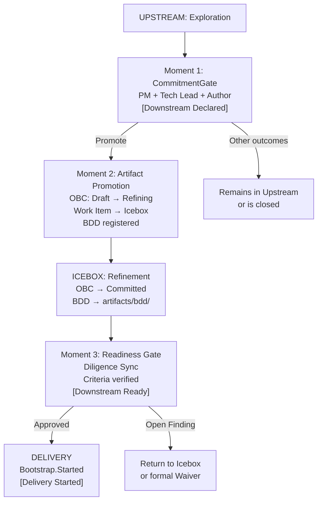
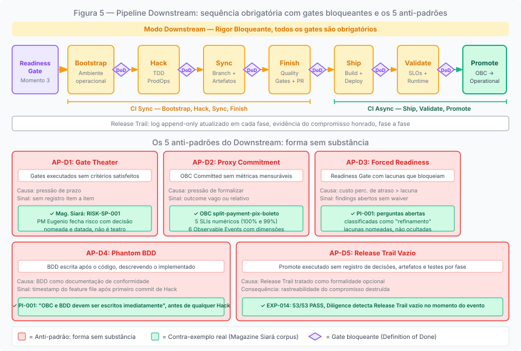
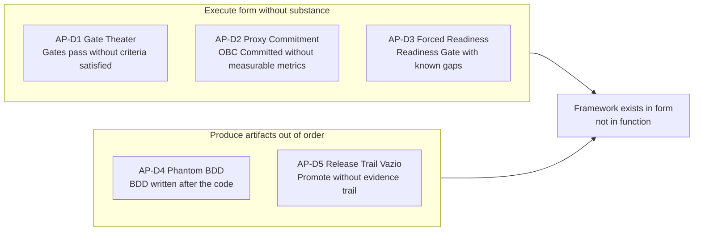

# Chapter 6: Downstream: the commitment mode

---

## Where Downstream begins

There is a common misconception about the starting point of Downstream. It does not begin when the team "finishes discovery." It does not begin when "the team feels ready." It does not begin when the Product Owner decides to prioritize an item.

Downstream begins when the CommitmentGate is executed with the Promote outcome, and not before. That is the moment when the mode is declared: the rigor regime shifts from non-blocking to blocking, and the item begins to carry a formal commitment.

This precision is not merely procedural. It is the direct consequence of what Downstream represents: a shift in the commitment regime. And commitment regimes must have a verifiable moment of inception. "The team felt ready" is not verifiable. A CommitmentGate recorded in the upstream-trail, with a date, participants, and documented outcome, is.

What the CommitmentGate does not initiate is Delivery. The ProdOps framework distinguishes three states within Downstream mode: **Downstream Declared**: the commitment has been made, the item enters the Icebox for refinement; **Downstream Ready**: the pre-Delivery requirements have been satisfied and verified; **Delivery Started**: Bootstrap has been initiated. The CommitmentGate corresponds to Downstream Declared. Between it and Bootstrap.Started there is a readiness protocol that is part of Downstream, not an antechamber outside of it.

---

## The three transition moments

The detailed operationalization protocol for this transition (the steps between Downstream Declared and Delivery Started) is a proposal from the ProdOps framework canonization effort, robustly supported by the experiment artifacts, but still awaiting incorporation into the main framework.



**Moment 1: CommitmentGate** (Downstream Declared). The trio (PM + Tech Lead + Author) evaluates whether the evidence produced justifies the commitment. The criteria include: hypothesis answered with the Evidence Threshold satisfied (if declared), Decision Package with real substance, OBC Draft existing as a file, and BDD drafted and legible. The most consequential result is Promote, which triggers Moment 2. The CommitmentGate does not create the commitment: it makes verifiable the collective decision to assume a commitment that the trio has already formed.

**Moment 2: Artifact Promotion + Icebox Entry**. Immediately after the CommitmentGate with the Promote outcome, the experiment artifacts transition into the Downstream space. The OBC changes from Draft to Refining. A Work Item is created in the Icebox referencing the experiment and the OBC. The upstream-trail is updated with the outcome and the reference to the Work Item. The experiment is not closed: it remains as a record of evidence and learnings. Only the status changes. Downstream is active, but Delivery has not started.

**Moment 3: Readiness Gate** (Downstream Ready). The item leaves the Icebox and enters the Iteration Backlog when a set of requirements is satisfied. The OBC must have reached the Committed state. The BDD Feature must be in `prodops/artifacts/bdd/`. Risks must be documented. For items with financial movement, external integration, SLO changes, or high/critical risk: a Reliability Plan is required. The Readiness Gate is not optional: it is the point where Diligence verifies, in a blocking manner, that Downstream has the necessary substrate to be executed with integrity.

The distinction between the three moments resolves frequent conflicts: "should BDD be in `artifacts/bdd/` at the CommitmentGate?" No: a legible draft is sufficient at Moment 1; it moves to the committed path during Moment 2 and before Moment 3. "Should the OBC be Committed at the CommitmentGate?" No: merely existing as a Draft is sufficient at Moment 1; Committed is mandatory at Moment 3.

---

## The Delivery sequence in Downstream mode


*Figure 6. Bootstrap → Promote sequence: materialization of blocking rigor in the Delivery journey, with Release Trail as append-only evidence*

Once the item passes through the Readiness Gate and enters the Iteration Plan, the Delivery journey in Downstream mode executes a formal sequence:

```
Bootstrap → Hack → Sync → Finish → Ship → Validate → Promote
```

This sequence is the materialization of blocking rigor within the Delivery journey, not the definition of Downstream as such. What makes it mandatory is not the mode itself, but the combination of Downstream mode with the Delivery journey: any item in Delivery that carries a formal commitment requires verifiable conditions for advancement at each stage, and this sequence provides them.

The sequence is organized into two cycles. **CI Sync** (Bootstrap, Hack, Sync, Finish) is local and synchronous work: preparing the environment, implementing, synchronizing the branch, and passing the code quality gates. **CI Async** (Ship, Validate, Promote) is platform-driven work: building and publishing the artifact, deploying it, validating it at runtime, and promoting it with recorded evidence.

Each phase has a specific purpose and a Definition of Done that, if not satisfied, blocks advancement. Bootstrap verifies that the local environment is operational and that the implementation preconditions are satisfied. Hack implements via ProdOps TDD: observable behavior defined before any production line is written. Sync ensures the branch is up to date and that ProdOps artifacts reflect what was implemented. Finish executes the code quality gates and produces the Pull Request with a complete narrative. Ship, Validate, and Promote transition the code to production with full traceability.

What blocking rigor means operationally: if Bootstrap fails the smoke gate, Hack does not begin. If Finish detects failing tests, Ship does not begin. If Validate identifies an SLO violation, Promote does not happen. There is no "we'll fix it later": each gate exists because the commitment must be honored with evidence, not with intention.

---

## The five Downstream anti-patterns

Downstream has its own set of anti-patterns: behaviors that reproduce the form of rigor without its substance. They emerged from the development and review work of the ProdOps framework; they are not universal concepts from the literature, although analogous phenomena exist in other methodologies. What distinguishes them is their specific relationship with the modal model: each one represents the collapse of the blocking rigor function while maintaining its appearance.

**AP-D1: Gate Theater:** executing gates formally without the submitted artifacts satisfying the criteria. Cause: deadline pressure or social convenience that makes it easier to declare the gate satisfied than to defend the interdiction. Examples: OBC marked as Committed without verifiable `acceptance_criteria`; Readiness Gate approved with open Diligence Findings and no formal waiver; CommitmentGate conducted in a meeting where the Decision Package was not read. Consequence: gates pass without the verification function having been exercised. Diagnostic criterion: audit whether the documented entry criteria were individually verified for each gate. If there is no record of item-by-item verification, the gate was theater. The counter-example in the Magazine Siará corpus: risk RISK-SP-001 (policy for expired Boleto with Pix already paid) was closed by PM Eugenio with a named, dated decision on the same day as the CommitmentGate — "maintains pending state, manual investigation by operations, no automatic cancellation or Pix reversal." Recorded. Verifiable. Not theater.

**AP-D2: Proxy Commitment:** OBC marked as Committed without the success criteria being measurable. Cause: pressure to formalize the commitment before the OBC has verifiable substance. Examples: `expected_outcome` vague ("improve user experience"); `acceptance_criteria` describing what the system does, not when it is acceptable; `success_metrics` with relative targets without a baseline. Diagnostic criterion: "how will I know this item was successfully delivered 30 days after the Promote?" If the answer requires subjective interpretation, the OBC is not truly Committed. The Magazine Siará `split-payment-pix-boleto` OBC is the counter-example: five Initial SLIs with explicit numeric targets (three at 100%, two at 99%), six Observable Events with mandatory dimensions, and the rule "the order is never released with only one portion confirmed" as an acceptance criterion verifiable without any additional verbal context.

**AP-D3: Forced Readiness:** Readiness Gate approved with known gaps (incomplete artifacts, open Findings, missing prerequisites) due to deadline or stakeholder pressure. Cause: the perceived cost of delaying Delivery exceeds the perceived cost of carrying the gaps. The distinction from Gate Theater is one of scope and specificity: Gate Theater covers any gate executed without substance; Forced Readiness is specifically the Readiness Gate approved with pre-Delivery artifact gaps that should have blocked it. Consequence: Downstream carries an invisible readiness debt that manifests as problems during implementation. Magazine Siará demonstrates the distinction: PI-001 for the Split Payment lists open questions (minimum amount per payment method, limit of payment methods per purchase), but PI-001 explicitly classifies them as "refinement questions — they do not block the start." This is a declaration of acceptable residual uncertainty, not Forced Readiness: the gap is named, justified, and recorded — not concealed.

**AP-D4: Phantom BDD:** BDD Feature written after the code, describing what was implemented instead of the expected behavior before implementation. Cause: BDD treated as compliance documentation rather than behavioral specification. The BDD exists as a formal artifact, but has lost its function: specifying the agreed behavior *before* any line of code is written. Diagnostic criterion: verify the creation timestamp of the feature file versus the start of the Hack phase. If the feature file was created after the first implementation commit, the BDD is phantom. In PI-001 for the Split Payment, the instruction is explicit: "OBC and BDD must be written immediately" — on the same day as the Business Signal, before any Hack session.

**AP-D5: Release Trail Vazio:** Promote executed without a filled Release Trail: no record of the decisions made, artifacts produced, tests executed, and the state in which the system was left after the release. Cause: Release Trail treated as an optional formality rather than a commitment record. Consequence: the traceability that Downstream promises — from the CommitmentGate to evidence in production — is destroyed. The Release Trail is not optional documentation; it is the record that allows the commitment to be audited after the Promote has happened. EXP-014 of the Payments API demonstrated empirically (53/53 PASS) that the ProdOps Runtime automatically tracks the Delivery state of each Feature via CloudEvents, making an empty Release Trail detectable by Diligence the moment it occurs — not only retrospectively.



The underlying pattern is the same: the framework exists in form but not in function. The rituals are executed, the artifacts exist, the meetings happen, but without the substance that would make each one a real verification mechanism. Downstream with Gate Theater, Proxy Commitment, and Forced Readiness offers illusory safety — worse than having no gates at all, because it obscures the real problems.

---

## What happens when Downstream needs to go back

There is a scenario that the transition protocol must accommodate: an item in Delivery reveals that the original hypothesis has been invalidated, the scope has materially changed, or a blocking dependency has made delivery infeasible in the committed form.

In that case, there is a Downstream → Upstream regression protocol.

Regression is the formal suspension of the commitment, not the return to a previous step in the work. It is convened by the trio, not an individual decision. The typical trigger is a central hypothesis invalidated during Delivery: a technical spike fails, a user rejects the approach, a business premise disappears, or a blocking dependency that did not exist at the CommitmentGate.

When regression is decided, two records are made: in the Release Trail of the item in Delivery (with context, what was discovered, and the decision to suspend the commitment), and in a new Upstream experiment referencing the original experiment. The OBC transitions from Committed to Refining: the formal commitment is suspended, not abandoned. The item awaits a new Upstream investigation cycle before any new commitment can be assumed.

Regression is not a failure of the CommitmentGate. It is the recognition that the context changed in a relevant way after the commitment, or that the residual uncertainty the gate considered acceptable proved unacceptable during implementation. The protocol exists so that this situation is managed with honesty, not concealed until the problem becomes too serious.

What is *not* regression: adjusting an OBC parameter within the declared residual uncertainty range; a Diligence Finding resolved by formal waiver; an item reprioritized without a discovery that invalidates the hypothesis. These cases are ordinary Downstream management; they do not require the regression protocol and do not suspend the commitment.

---

## Downstream as structure, not as pressure

The last point in this chapter is about what Downstream is not.

Downstream is not the high-pressure mode. It is not where rigor increases because the team is being held accountable. It is not where delivery speed is the primary objective.

Downstream is the mode where the commitment has been made and must be honored with evidence. The Bootstrap → Promote sequence exists to ensure that honoring the commitment does not turn into a rush without structure. The gates exist to protect the team from the cost of avoidable errors, not to create bureaucracy.

The distinction between Downstream as structure and Downstream as pressure is operationally verifiable: when the anti-patterns are present (Gate Theater, Forced Readiness, Proxy Commitment), Downstream is being used as an instrument of pressure, not as a commitment structure. The form is there, but the function is inverted.

---

*Chapter 6 of 11 | Part II: The Modes*
