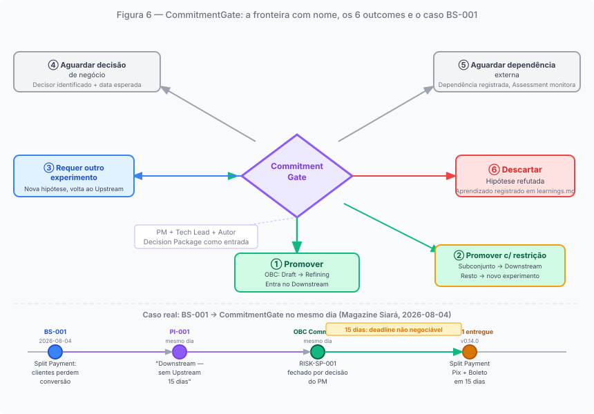
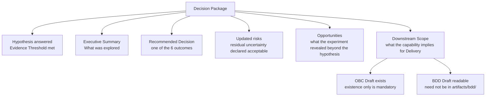

# Chapter 6: The CommitmentGate: the boundary with a name

---

## The problem of implicit boundaries

*Figure 6. The 6 canonical outcomes of the CommitmentGate: it is not an approval meeting — it is a collective decision with verifiable criteria*

In the absence of an explicit boundary, the transition from exploration to delivery happens regardless. An item "passes" when someone decides it is ready — usually the Product Owner, in a sprint planning session, based on an assessment that no one has formalized with verifiable criteria. An item "passes" because the team wants to start building, or because a deadline is approaching, or because the item has been in the queue long enough to seem mature.

This kind of transition has two problems with a common origin. The first: what was evaluated is not recorded in an auditable way. If the item goes wrong — if the feature does not match what users needed, if the technical premise that underpinned the implementation proves incorrect — there is no way to verify what was considered at the transition, by whom, and with what criteria. Without a record, there is no way to distinguish a well-informed decision from a decision made out of convenience. The second: the absence of formality creates an incentive to keep the item in exploration indefinitely, because the transition has no explicit cost. Nobody calls for the decision because nobody is responsible for calling it. Perpetual Discovery, addressed in the previous chapter, is the direct consequence of a boundary without consequences.

Both effects share the same cause: an implicit boundary produces either premature promotion (the decision happens before the evidence is sufficient) or exploration without decision (evidence accumulates, but the decision is never made). The CommitmentGate resolves both with a single mechanism: it makes the boundary explicit, verifiable, and consequential.

---

## What the CommitmentGate is

The CommitmentGate is the gate that mediates the Upstream → Downstream transition. It is called by the trio (PM + Tech Lead + Author) when the experiment's Decision Package is ready. Any member of the trio may call it.

Three characteristics distinguish it from an ordinary planning meeting.

The first: the CommitmentGate decides the *destiny of the capability* — whether it advances to Downstream, under what conditions, whether it returns for further exploration, or whether it is closed. It does not decide when to start building. An item may have production-quality code already written and still need to pass through the CommitmentGate before its capability commitment is formalized. The gate is not deciding whether the code exists; it is deciding what the organization will do with it.

The second: the Decision Package is an entry contract, not retroactive documentation. It must exist and have substance before the meeting — not be produced during it. A Decision Package with generically filled fields ("will be validated in Downstream") is Gate Theater (AP-D1): the form without the function.

The third: the 6 canonical outcomes cover the full possible phenomenology of the decision, not merely approval. The cultural expectation that a CommitmentGate results in "yes" or "no" underestimates what the gate resolves.

---

## The six canonical outcomes

Each outcome is an operationally distinct decision with specific mandatory actions.

**Promote**: the evidence justifies commitment. The capability enters Downstream: the BDD Feature and OBC are moved to the committed paths, the item enters the Iteration Plan with status `Entered`, and Downstream begins with Moment 2 of the transition protocol.

**Promote with restriction**: part of the capability is ready for commitment; another part needs to continue in exploration. The approved subset transitions to Downstream. The restricted parts remain in Upstream for a new experiment with a more specific hypothesis. The restriction is recorded explicitly in the upstream-trail: it is not a silent gap.

**Requires another experiment**: the evidence produced is not sufficient for commitment, but the hypothesis is still valid. A new experiment is created with a more specific hypothesis or a different evidence-collection route. The current experiment is marked with the Decision Package indicating this outcome. This is not failure: it is the recognition that exploration needs one more iteration.

The three outcomes above resolve the capability's destiny at the moment of the gate. The next two suspend the decision while an external condition is not satisfied: they are the only case in which the gate does not decide the capability's destiny, but records what prevents that decision.

**Awaiting business decision**: the trio cannot commit because there is a pending business decision (on budget, strategy, or from a stakeholder) that is outside the team's scope to resolve. The item is blocked in the Product Tracking List with the decision-maker identified and an expected resolution date. No new experiment is opened until the decision arrives. The gate was executed: the inability to decide the destiny is recorded with its cause.

**Awaiting external dependency**: commitment is not viable due to a technical or third-party dependency outside the team's control. The dependency is recorded in the Reliability Plan and in the Product Tracking List. Continuous Assessment monitors its status. When the dependency is resolved, the trio is reconvened.

**Discard**: the hypothesis was refuted or the context changed in a way that makes the investment unjustifiable. The learning is recorded in `prodops/framework/journeys/discovery/learnings.md`. The experiment is formally closed with justification in the upstream-trail. Discarding is not team failure: it is the most efficient possible result when exploration produces evidence that a direction is not worth the commitment.

The existence of six outcomes is what makes the CommitmentGate different from an approval meeting. An approval meeting has two possible results: approved or not approved. The CommitmentGate has six, and four of them are neither approval nor rejection, but structured responses to situations that the approved/rejected dichotomy does not resolve.

---

## The Decision Package: entry contract

The Decision Package is the set of artifacts the Author prepares to make the CommitmentGate possible. It is not documentation: it is an entry contract to the gate.

The canonical components:

**Hypothesis answered with evidence**: the experiment's central hypothesis has an answer supported by verifiable evidence, with the Evidence Threshold satisfied when declared. "Verifiable" means that a trio member who did not participate in the experiment can read the artifacts and reach the same conclusion without additional verbal context. If that is not possible, the evidence is not sufficient.

**Executive Summary**: a synthesis of what was discovered, in language that PMs, Tech Leads, and stakeholders can read in 5 minutes. It is not the complete upstream-trail: it is the distillation of what matters for the decision.

**Recommendation**: the Author's suggestion for the CommitmentGate outcome. The trio is not obligated to follow the recommendation, but the Author must hold a grounded position.

**Risks and declared residual uncertainty**: what remains unknown, what level of residual risk the Downstream will take on, and the explicit declaration that this uncertainty is acceptable to proceed. Risks not declared at the CommitmentGate are risks managed without visibility — the worst-case scenario.

**Opportunities**: what the experiment revealed beyond the central hypothesis that may inform future decisions. When present, it must not be omitted from the Decision Package: it is knowledge that Upstream produced and that belongs in the record.

**Downstream Scope**: what the capability implies in terms of Delivery. Two artifacts must exist as preconditions for entry to the gate: the OBC Draft (even if incomplete) and a readable BDD sketch. Completeness is not required at the CommitmentGate; existence is. The Downstream Scope section of the Decision Package references these artifacts and describes what will need to be built.

The substantive criterion that runs through all components is the same: verifiability by someone who did not participate in the experiment. If the trio member who was not in the experiment can read the Decision Package and reach the same conclusions, the package has substance. If additional verbal context is needed, it does not.

---

## Comparison with analogous mechanisms in the literature

The CommitmentGate has superficial similarities with mechanisms from other frameworks, but resolves a different problem.

The *betting table* from Shape Up (Singer) is the moment in which the organization decides to commit a project to a six-week cycle. In the author's reading, that decision is about *when* to commit an already-shaped project: the betting table does not verify whether the shaping was sufficient to warrant commitment; the shaping process fulfills that role before the project reaches the table. The CommitmentGate, by contrast, explicitly verifies whether the evidence justifies commitment, regardless of the preparation process that preceded it.

The Design Sprint results review — the synthesis moment in which the team evaluates whether user tests justify moving forward — is closer to the CommitmentGate in its orientation toward evidence. What distinguishes it is the absence of a formal record of the outcome: who participated, with what criteria, what the decision was, and what happens as a consequence. The traceability that the CommitmentGate requires is not present as a structural requirement in the Design Sprint.

The IPDS Milestone Review (Integrated Product Development System) from the aerospace industry is formally more rigorous than the CommitmentGate in documentation and hierarchical approval. But it operates in contexts where uncertainty is lower and rework costs are existentially higher, which justifies a level of formality that would be counterproductive in the context of digital products with shorter feedback cycles.

The CommitmentGate is calibrated to a specific balance: formal enough to be verifiable and auditable, agile enough not to make the transition more costly than the exploration that preceded it. What it resolves in a particular way is a combination that these analogous mechanisms address separately or do not address at all: a decision with a name, verifiable criteria, identified participants, and an outcome with a recorded consequence.

---

## The CommitmentGate as an observability mechanism

The CommitmentGate is designed specifically to make two opposite problems observable and treatable.

Perpetual Discovery: without a formal gate with a stopping criterion and defined participants, an experiment can continue indefinitely because nobody calls the decision. The CommitmentGate not only creates pressure to decide: it names the problem. When an experiment displays the diagnostic signs of Perpetual Discovery (addressed in the previous chapter), calling the CommitmentGate is the specific operational response — not to approve, but to decide what to do. The gate makes the state "in exploration without a stopping criterion" visible and treatable with a known set of outcomes.

Premature Promotion: committing a capability before having sufficient evidence, whether due to deadline pressure or unverified optimism. The Decision Package as an entry contract — with the rule that the trio member who did not participate in the experiment must be able to read the artifacts and reach the same conclusions — is the protective mechanism. But what the gate adds beyond the Decision Package is the record: the outcome is documented, the participants are identified, the conditions under which the decision was made remain in the upstream-trail. No process prevents intentional adversarial behavior, but that behavior ceases to be invisible, and recorded behaviors are treatable in ways that invisible behaviors are not.

The two problems are symmetric: Perpetual Discovery is exploration without pressure to decide; Premature Promotion is a decision without sufficient evidence. The CommitmentGate is the boundary that, by having a name, criteria, participants, and outcomes, transforms both from implicit states into recorded — and therefore treatable — states.

---

## A CommitmentGate without Upstream: the BS-001 case

The Magazine Siará corpus records a case that seems to contradict the protocol but in fact confirms it. Business Signal BS-001 (Split Payment, 2026-08-04) led to PI-001 with a CommitmentGate and Committed OBC on the same day — without any prior Upstream experiment.

This is not Premature Promotion. It is the demonstration that the CommitmentGate decides the *destiny of the capability*, not the conclusion of an exploration phase. When demand is confirmed through two independent channels, the scope is bounded (Pix + Boleto for a partner launch), the deadline is non-negotiable (15 days), and the open questions are of the refinement type — not the central hypothesis — the Decision Package can be assembled without prior exploration: the evidence is in the business signal and the clarity of the scope.

PI-001 documents the justification for the Downstream outcome: "there is sufficient clarity about what to build; the 15-day deadline does not allow for Upstream exploration." This statement is the Decision Package in its most compressed form. The trio assessed that the residual uncertainty is acceptable to move forward, recorded the open questions as refinement, and made the commitment. This is not theater: it is the correct calibration of rigor to the context.

What "without Upstream" describes precisely is the absence of pre-CommitmentGate experiments — not the absence of discovery. After the CommitmentGate, the Split Payment traversed the Discovery journey in Downstream mode: the OBC transitioned to Refining, the six Observable Events with mandatory dimensions were defined, the BDD Feature was written, the open questions from PI-001 were resolved with dated decisions (including RISK-SP-001, closed by PM Eugenio with an explicit decision on the expired Boleto with Pix already paid policy). The Readiness Gate verified that these conditions were met before authorizing entry into Delivery. Planning generated the Iteration Plan. Only then did Bootstrap, the first phase of Delivery, begin. The difference from the EXP-001/002/003 trajectory is not the presence or absence of discovery: it is the regime under which discovery occurred — in Upstream mode (advisory rigor, pre-CommitmentGate) or in the Discovery journey in Downstream mode (blocking rigor, post-CommitmentGate, with Readiness Gate before Delivery).

---

*Chapter 6 of 10 | Part III: The Boundary*
