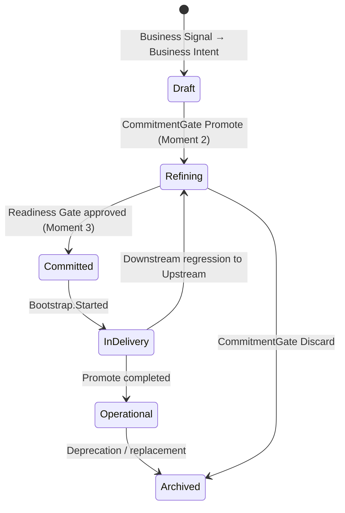
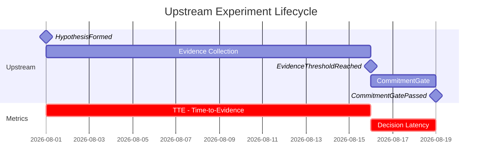

# Chapter 8: Observability as Epistemology, Not Infrastructure

---

## What observability does in each mode

*Figure 8. In Upstream, observability makes uncertainty explicit. In Downstream, it verifies commitment. Without observable evidence, governance and decision-making become dependent on perception, not verification.*

There is a distinction that ProdOps introduces that is not about observability technology: logs, metrics, traces, dashboards. It is about the epistemic role that observability plays in each execution mode.

In Downstream, observability verifies commitment. SLOs, DORA metrics, Release Trail: all exist to answer one question: is the commitment made being honored? Was the capability delivered with the promised behavior? Are the reliability metrics within the agreed limits? The OBC in the Operational state represents precisely this: the business contract has transitioned to a state where its fulfillment can be verified at runtime.

In Upstream, observability makes uncertainty explicit. The experiment evidence artifacts (referred to in this chapter as Evidence Package), the Upstream Trail, the Decision Package exist to answer a different question: what do we know, what do we not know, and with what degree of confidence can we assert each thing? In Upstream, observability is not verifying a commitment: it is documenting the state of knowledge about a hypothesis.

This asymmetry is not accidental. It derives directly from what each mode requires. Downstream requires that commitment be verifiable at runtime: therefore, observability is the verification mechanism. Upstream requires that uncertainty be explicit and manageable: therefore, observability is the explicitness mechanism.

---

## ODD: the principle before implementation

ODD (Observability Driven Design) is the ProdOps principle that states observability must be designed before implementation, not added afterward.

Principle 3 of the framework is explicit: "Observability, deployment strategy, and tests are defined before writing production code, in that order of priority." And Principle 7 complements: "Logs, errors, metrics, and traceability are part of the implementation, not complements added afterward. A feature is not done if its behavior cannot be observed in production."

ODD is not a technical prescription of instrumentation before code. It is a design principle: what needs to be observable must be decided before any production line is written. This distinction matters because without the prior decision about what to observe, instrumentation that comes afterward tends to record what is easy to measure, not what is necessary to verify commitment or make uncertainty explicit.

The epistemological motivation of ODD is that without observable evidence there is no reliable verification: without verification, governance and decision-making become dependent on perception or verbal context. This is especially critical in the framework context because what cannot be observed cannot be audited by Diligence, cannot underpin a Decision Package, and cannot satisfy the criteria of a blocking gate.

ODD applies to both modes, in different forms. In Upstream, ODD means documenting what will be observed to verify the hypothesis, before collecting evidence. A well-conducted experiment defines its falsification criteria before executing, not afterward. In Downstream, ODD means defining the Observable Events and OBC success metrics before writing code: the contract of what will be observable in production must exist before the implementation that will make it observable.

The `split-payment-pix-boleto` OBC from Magazine Siará demonstrates ODD in operation: six Observable Events with mandatory dimensions were defined before any production code was written. Among them, `split_payment.boleto.expired` with a `pixStatus` dimension — a failure event with enough context for operations to immediately identify that the Pix payment was made but the Boleto expired, without querying the database. The event design was a product decision, not a consequence of the implementation.

In Upstream, EXP-001 demonstrates the same principle applied to exploratory mode: before any production line about credit card was written, the experiment specified the required BDD scenarios, the expected Observable Events for each flow (authorization, confirmation, risk analysis, refusal, cancellation, refund), and the observability dimensions that must never appear in logs (card number, CVV, provider token). ODD in Upstream defines what must be observable to validate the hypothesis; ODD in Downstream defines what must be observable to verify the commitment.

---

## The OBC as an observability contract

The Observable Business Contract is not a technical SLA: it is the declaration that the business contract has measurable dimensions that can be verified at runtime.

The ontological starting point is relevant: commitment is the causal variable. The OBC states do not determine the mode nor produce the commitment: they make the commitment observable. What causes an OBC to transition between states is the satisfaction of criteria that reflect the maturity degree of the current commitment, not a decision to change the mode of work. The mode is the cause; the states are the verifiable record of where the commitment is in its lifecycle.

The OBC progresses through six states over the lifecycle of a capability:

**Draft**: born at the transition from a Business Signal to a Business Intent. In Upstream, it is memory of learning: it can be updated continuously, it can remain incomplete, it does not block experiments. The absence of completed fields in Draft is expected, not a failure.

**Refining**: the state the OBC assumes at the start of Downstream (Moment 2 of the transition, after the CommitmentGate with outcome Promote). The fields begin to be refined with real substance: `expected_outcome` ceases to be vague, `success_metrics` gains baseline and target, `acceptance_criteria` becomes verifiable by third parties.

**Committed**: records that the formal commitment has been made and that the contract is complete enough for Delivery to begin. The Committed state does not create the commitment — it is the artifact that makes the commitment observable and auditable. Every acceptance criterion is verifiable without additional verbal context. Success metrics have baseline and target. Observable Events are defined. The Reliability Plan (when required by risk triggers) is present. An OBC that has not reached Committed does not pass through the Readiness Gate: this is the protection against Phantom BDD and Proxy Commitment.

**In Delivery**: the OBC is associated with an item in execution in the Iteration Plan. Parameter changes are permitted within the declared residual uncertainty range; structural changes require regression to Upstream.

**Operational**: the committed behavior in the OBC can be verified at runtime. The capability is in production with the Observable Events functioning and success metrics tracked. The OBC in Operational state records that the committed behavior is verifiable at runtime — not that the business outcome has necessarily been achieved, but that the capability is operating with its observable criteria active. It continues to be updated as new operational evidence (incidents, usage metrics, postmortems) refines the understanding of the capability.

**Archived**: the capability was discontinued or replaced. The OBC remains as a historical record; it is not deleted.

State progression is not linear by decree: it is verified. What causes an OBC to transition from Refining to Committed is not a subjective decision by the Product Owner; it is the satisfaction of verifiable criteria that Diligence can audit.

---

## Upstream flow metrics

The ProdOps operational model fully instruments the Delivery journey: Lead Time, Cycle Time, and the Operational Event Model events allow automatic calculation of when each item passed through each phase.

The Discovery journey, in Upstream, does not have equivalent instrumentation yet. The ProdOps event canonization work proposes a set of flow metrics specific to Upstream experiments. This specification is in the process of canonization, with no automatic collection implementation available yet:

**TTE (Time to Evidence)**: time between the start of an Upstream experiment (opening of `experiment.md`) and the production of the first executable evidence. Measures how quickly an experiment begins to produce real learning, not just documentation of intent.

**Decision Latency**: time between the Evidence Threshold declared as reached and the convening of the CommitmentGate. A high Decision Latency is a signal of Perpetual Discovery: the team knows it has sufficient evidence but is not convening the decision.

**Discovery WIP (Work in Progress)**: number of Upstream experiments active simultaneously. The name is by analogy with Kanban WIP and refers to experiments in progress, regardless of the journey (Discovery, Assessment, or other) in which they are enrolled; the criterion is the Upstream mode, not the journey. A high Discovery WIP indicates that the team is dispersing attention across multiple hypotheses, which tends to increase the TTE of all of them.

These three metrics, when implemented, would allow identifying Perpetual Discovery before signals S1-S4 become critical, transforming a reactive diagnosis into proactive monitoring.

---

## DORA Extended metrics

For the Delivery journey in Downstream, ProdOps adopts a model of metrics that builds on the four historical metrics of the DORA Research Program and complements them with product- and operation-oriented extensions. The DORA model has evolved over time: the 2024–2026 formulation introduced Deployment Rework Rate as a fifth delivery performance metric and adopted Failed Deployment Recovery Time as the updated name for what was originally MTTR.

The four metrics rooted in historical DORA, with the names used by ProdOps: Lead Time for Change (time from commit to production), Release Frequency (adaptation of the original Deployment Frequency, measured as the frequency of successful deployments to production), Change Fail Rate (percentage of changes that cause failure in production), and Mean Time to Recovery (average recovery time after failure; equivalent to Failed Deployment Recovery Time in the current DORA formulation).

The ProdOps extensions: Reaction Time (time between an external signal — incident, user complaint, or regulatory change — and the first action processed on it), Rate of Return (escaped defects and rework: retries, reversals, post-Promote corrections), and Availability (operational uptime of the service; a dimension that DORA also considered in iterations of its operational performance model, incorporated here explicitly).

Reaction Time is particularly relevant for understanding the health of Downstream: it measures whether the team is responding to external signals with adequate speed, which is distinct from measuring the speed of planned deliveries. A team that delivers with low Lead Time but has high Reaction Time is operating well internally and poorly in response to the environment.

The weights of these metrics vary by product stage, as per the model canonized in the framework. In early stages (PoC), Lead Time for Change and Reaction Time carry maximum weight: learning speed and responsiveness matter more than the reliability of a system that is still being discovered. In MVP, Lead Time maintains maximum weight while Reaction Time decreases, indicating that delivery speed still dominates but responsiveness begins to share attention with other dimensions. In advanced stages (MVT, MLP), Change Fail Rate, MTTR, and Availability dominate: reliability becomes the differentiating criterion.

---

## Evidence Package vs. Release Trail: the records of each mode

Upstream and Downstream have distinct record-keeping mechanisms that reflect their distinct purposes.

In Upstream, the primary record-keeping mechanism is the set of evidence produced by the experiment (referred to here as Evidence Package) that underpins the Decision Package presented at the CommitmentGate. The central characteristic of the Evidence Package is verifiability: each piece of evidence must be readable by a trio member who did not participate in the experiment, without additional verbal context. If the evidence depends on context that is not documented, it does not constitute verifiable evidence: it is undocumented memory. The Evidence Package answers the question "what did we discover?".

In Downstream, the primary record-keeping mechanism is the Release Trail: the append-only log of evidence from each phase of the Bootstrap → Promote sequence. The Release Trail answers a different question: not "what did we discover?" but "how did we honor the commitment, step by step, with what evidence?". Each phase of the Delivery cycle produces its records in the trail; nothing is replaced or rewritten, only appended. Promote without a filled Release Trail is the anti-pattern AP-D5: the traceability promised by Downstream is destroyed.

The distinction between the two record-keeping mechanisms is a direct consequence of the distinction between the modes. Upstream records what was learned. Downstream records how the commitment was executed. Mixing the functions — using the Release Trail to document learnings or the Evidence Package to verify execution — is a symptom of modal confusion, not pragmatism.

---

## Why observability is epistemology

The word epistemology (the study of knowledge and how we know it) may seem out of place in a chapter about engineering practices. But this is precisely what observability does in the ProdOps model: it is the mechanism by which the team knows what it knows, and can assert that in a verifiable way.

In Upstream, without observability of evidence (without verifiable artifacts, without documented falsification criteria, without a declared Evidence Threshold), the team does not know what it knows. It has convictions, it has intuitions, it has memory of conversations. But it does not have verifiable knowledge. The CommitmentGate, without an Evidence Package with substance, is Gate Theater: the form without the function.

In Downstream, without observability of behavior in production (without SLOs, without reliability metrics, without Observable Events in the OBC), the team does not know whether the commitment is being honored. It has the feeling that things are working. But it does not have verifiable evidence. Promote, without a filled Release Trail, is an Empty Release Trail.

In both cases, the absence of observability is not a technical instrumentation problem: it is an epistemological problem of not knowing what one knows, and consequently of being unable to distinguish perception from evidence. This is why the framework treats observability as a design priority, not as an implementation complement. What the system can assert about itself is precisely what was designed to be observable.

---

*Chapter 8 of 11 | Part IV: The Common Substrate*

---

[→ Chapter 9 — Diligence: guardian of consistency](chapter-09.md)
