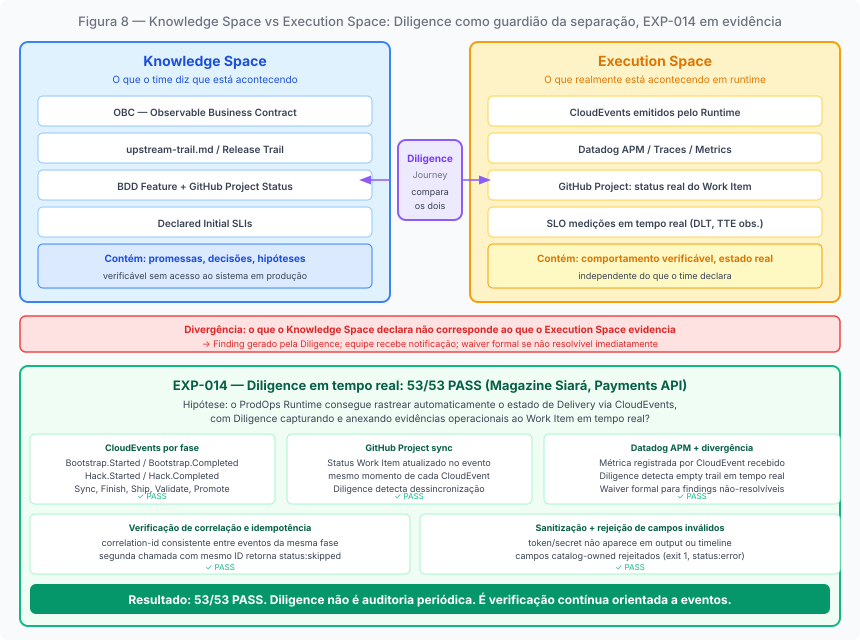
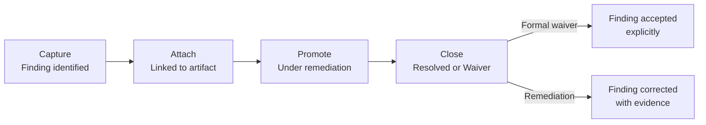

# Chapter 9: Diligence: Guardian of Consistency

---

## The problem Diligence solves

*Figure 8. Knowledge Space (Markdown artifacts) and Execution Space (Issues, Projects) naturally diverge. In Upstream, inconsistency is not blocking because the commitment has not been made; in Downstream it is operational risk because the commitment must be verifiable.*

In any work system that operates in two modes with different characteristics, there is a structural problem that is neither process nor technology: the divergence between what the system *knows* and what the system *does*.

ProdOps has two spaces that represent different realities about the same work.

The **Knowledge Space** is where knowledge lives: Markdown files, OBCs, BDD Features, experiments, trails, plans, evidence — all in the git repository. These artifacts have permanent identity and canonical state. An OBC survives dozens of releases. An experiment preserves the knowledge it produced even after it has concluded. When there is a divergence between what is recorded in a Markdown artifact and what appears in the execution tools, the divergence is resolved in favor of the artifact: the Knowledge Space is the authority on the content and state of artifacts.

The **Execution Space** is where work happens: GitHub Issues, Pull Requests, GitHub Projects, pipelines. These artifacts have an operational nature: they track work in progress, they do not accumulate the permanence of knowledge. The authority of the Execution Space is over the operational state of work in progress: who is doing what, at what stage, with what priority. A GitHub Issue can be closed, reopened, deleted. A GitHub Projects field can be edited without traceability.

The problem is that these two spaces naturally diverge. The Knowledge Space advances when the team produces artifacts. The Execution Space advances when the team executes operations. When the two progressions are not synchronized, the work system loses reliability: the artifacts say one thing and the Issues say another.

In Upstream, this inconsistency is not blocking. The work is exploratory: artifacts evolve in a non-linear fashion, the hypothesis can change between sessions, the OBC remains in Draft. The temporary inconsistency between Knowledge Space and Execution Space is the price of exploratory freedom; the cost of accepting it is controllable because the commitment has not been made. There is no contract that needs to be verifiable for work to advance.

In Downstream, the divergence is operational risk. The commitment has been made. An OBC that is Committed in the artifacts but still appears as Refining in the Execution Space creates confusion about what is ready for Delivery. An open Diligence Finding that has no representation in the Execution Space can go unnoticed until it causes a problem during implementation. Consistency is not organizational comfort: it is the condition for the commitment to be honored with confidence.

Diligence exists to manage this divergence.

---

## What Diligence does and does not do

Diligence is the transversal journey of ProdOps responsible for keeping the work system synchronized and consistent. It operates in both modes, with different consequences in each.

What Diligence **does**: verifies whether the state of Knowledge Space artifacts is correctly reflected in the Execution Space. Captures Findings when it detects divergences. Manages the lifecycle of those Findings until they are resolved or receive a formal waiver. Ensures that the prerequisites of each gate (CommitmentGate, Readiness Gate, quality gates) are satisfied before the gate is executed.

What Diligence **does not do**: implement software. Create implementation Pull Requests. Modify product code. Make product decisions: it informs and alerts, but does not decide. Prioritize the backlog: that is the Product Owner's responsibility.

This separation is necessary for Diligence to maintain its function: if Diligence were to implement or prioritize, it would cease to be the guardian of consistency and would become an actor in the delivery process, mixing the responsibilities of verification and execution.

---

## Two cycles, two purposes

Diligence operates in two cycles with distinct purposes.

The **diligence-sync** is the event-driven cycle: triggered by a specific event (new OBC created, item transitioning between states, CommitmentGate convened). Its purpose is to verify, at the moment of the event, whether the current state satisfies the criteria necessary to advance. In Downstream, if an OBC is in Refining when the Readiness Gate is called, diligence-sync generates a blocking Finding, and the item does not advance until the Finding is resolved or receives a formal waiver. In Upstream, the same cycle operates, but the Findings generated have an advisory character: they alert without blocking, because the commitment has not been made.

The **diligence-async** is the proactive cycle: executed periodically to sweep the state of the system and identify divergences before they cause problems. Its purpose is to detect drift: an OBC that should have transitioned state and has not, a BDD Feature in `prodops/artifacts/bdd/` without a corresponding Committed OBC, an active experiment without entries in the upstream-trail for more than two weeks (signal S1 of Perpetual Discovery). The diligence-async operates in both Upstream and Downstream: in Upstream with advisory rigor, alerting without blocking; in Downstream with blocking rigor, generating Findings that prevent advancement.

---

## The lifecycle of a Finding

The unit of work of Diligence is the Finding: a divergence identified between what the work system should be showing and what it is showing.

A Finding progresses through the four Phases of the diligence-sync cycle:

**Capture**: the Finding is identified, whether by diligence-sync, by diligence-async, or manually by a team member. The Finding is documented with: what was detected, where (which artifact, which backlog, which state), when, and what the expected impact is if not resolved.

**Attach**: the Finding is associated with the affected item or artifact. In the Execution Space, this translates into a Work Item that references the Finding. The affected item does not advance in its lifecycle while the Finding is open and without waiver; in Downstream, this is blocking.

**Promote**: the Finding is being addressed. The responsible team is taking the necessary action: completing the OBC, updating the BDD, documenting the risk. Findings that are not being addressed within an adequate timeframe can be escalated to the trio. When immediate resolution is not viable, the waiver process can be initiated during this phase; the formal decision is recorded at Close.

**Close**: the Finding has been resolved (the artifact satisfies the criterion, with evidence) or the waiver was approved by the trio with an expiration date. The Finding is closed with a record of what was done.

The waiver deserves special attention. A waiver is the explicit acknowledgment that a criterion is not satisfied, the justification for why the item advances anyway, and a commitment to resolve the problem within a defined timeframe. The waiver is not the approval of a gap without consequence: it is the commitment to manage the gap transparently. The difference between a waiver and Forced Readiness (AP-D3) is precisely this: the waiver is explicit and recorded; Forced Readiness is silent.

---

## Diligence in the two modes

In **Upstream**, Diligence operates in advisory mode. It can verify whether the experiment has the minimum mandatory artifacts (experiment.md and upstream-trail.md), whether the upstream-trail is being updated regularly, whether the Perpetual Discovery signals (S1-S4) are active. When it finds problems, it alerts, but does not block. In Upstream, the cost of blocking exploration due to artifact inconsistency would be greater than the cost of temporarily accepting the inconsistency: there is no formal commitment that requires consistency to be verifiable now.

In **Downstream**, Diligence is blocking. It verifies whether the OBC is Committed before the Readiness Gate. Whether the BDD Feature is in `prodops/artifacts/bdd/`. Whether open Findings have a formal waiver or have been resolved. Whether the Release Trail is being filled in at each phase of the Bootstrap → Promote sequence. When it finds problems, it does not merely alert: it generates Findings that prevent advancement until resolution.

This difference is not one of quantity of rigor applied: it is one of the nature of the consequence. In Upstream, inconsistency does not need to be resolved immediately because the commitment has not been made. In Downstream, consistency is necessary because the commitment must be verifiable, and verifiability requires that the state of artifacts and operational state coincide.

---

## Why Diligence is not bureaucratic governance

The word "governance" frequently evokes bureaucracy: layers of approval, documentation for documentation's sake, processes that consume more time than they protect.

ProdOps's Diligence is different for a structural reason: it operates in response to real divergences, not generic procedures. A Finding is created when a specific divergence exists: an OBC that should be Committed and is not, a BDD that should exist and does not. There is no checklist of forms that needs to be filled out as a matter of protocol.

The health measure of Diligence is not the volume of Findings created: it is the absence of divergences between Knowledge Space and Execution Space. A healthy Diligence in a healthy product tends to have few open Findings because the team keeps artifacts synchronized in real time, as a consequence of the work process. But this relationship is not invertible: few Findings can also be a signal of insufficient instrumentation, not a healthy product. Real health is verified in the absence of detectable divergences, not just in the absence of recorded Findings.

When Diligence repeatedly produces many Findings about the same type of problem, this is a process signal: the team is systematically producing a divergence that must be addressed at the root cause, not merely corrected each time it appears.

---

## The relationship between Diligence and Assessment

Diligence and Assessment are the two transversal journeys of ProdOps: both operate across all product journeys (Discovery, Delivery, Operation) without being one of them.

The difference in purpose is precise: Diligence maintains the consistency of the work system *now*: it operates in the present, verifying and correcting. Assessment analyzes the evolution of the work system *over time*: it operates in the past and projects recommendations for the future.

The relationship between them is bidirectional. Diligence produces Findings and execution evidence that Assessment consumes to evaluate operational maturity: if the number of Findings of a specific type is growing, this is a data point for Assessment. Assessment produces recommendations that can materialize as new verification criteria in the Diligence catalog. A recommendation to improve the OBC verification process can result in new checks that Diligence then executes.

This bidirectionality means that Diligence is not subordinate to Assessment, nor is Assessment subordinate to Diligence. They are journeys with distinct responsibilities that feed each other.

EXP-014 of the Payments API tested this property empirically: can the ProdOps Runtime automatically track the Delivery state of each Feature via CloudEvents, with Diligence capturing and attaching operational evidence to the same Work Item in real time? **53/53 PASS.** Synchronization between GitHub Project and Datadog was verified for every phase of the Bootstrap → Promote sequence. Diligence did not require human intervention to detect divergences: the event-driven cycle triggered verification at the moment of each phase transition. This result transforms Diligence from a periodic audit process into a continuous verification system — which is the only form of governance that does not create bureaucracy proportional to delivery volume.

---

*Chapter 9 of 11 | Part IV: The Common Substrate*
