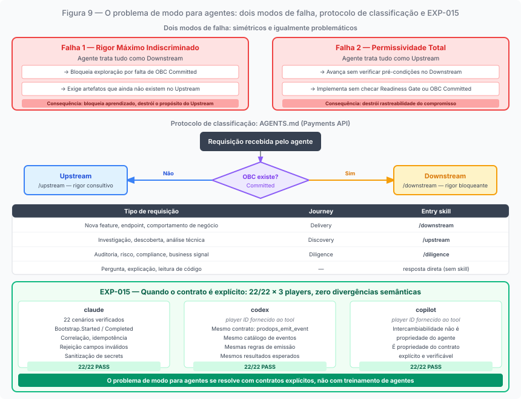
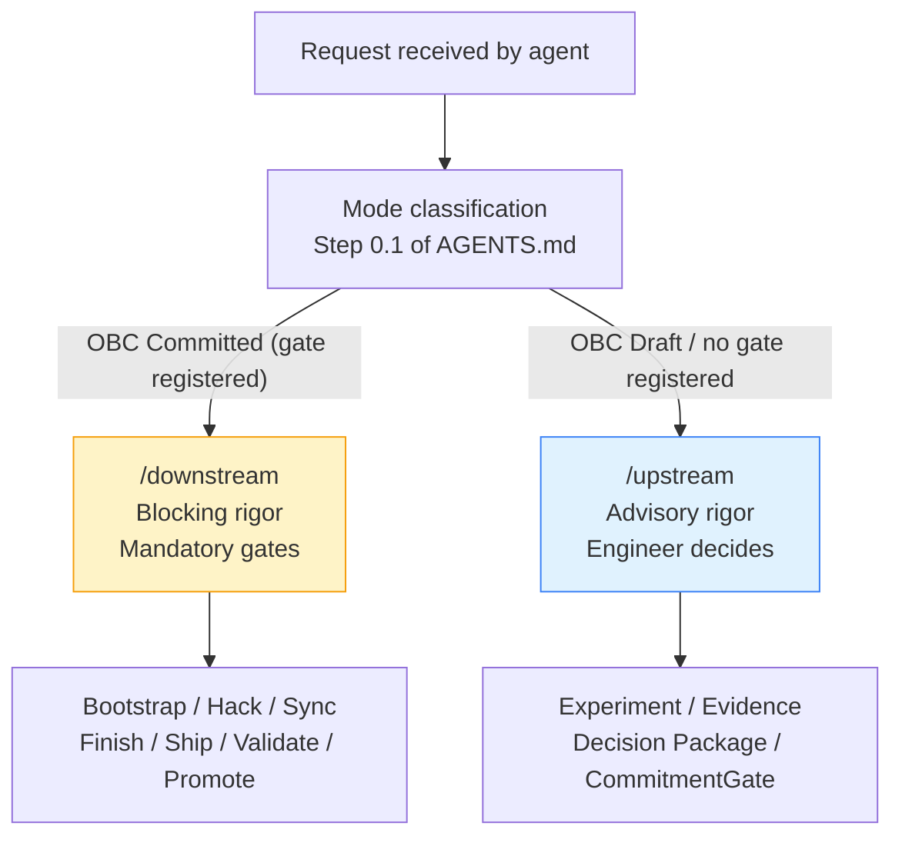

# Chapter 10: The Mode Problem for AI Agents

---

## Why agents don't have mode sensitivity by default

*Figure 10. Decision flow for mode classification: OBC state is the primary signal. OBC Committed (CommitmentGate registered) = Downstream; OBC in Draft or absent = Upstream.*

A human engineer who works with a product framework long enough develops something we might call mode sensitivity: the ability to perceive, from contextual signals (the conversation in the meeting, the state of the backlog, the tone of the PM's messages), in what kind of commitment the work is operating. They don't need to formally check whether the OBC is Committed; they perceive from the team's posture that something has been decided and the work is now about delivery.

This sensitivity is valuable. It allows rigor to be calibrated without every decision needing to be formally explicit. The problem is that it is acquired, not present from the start, and it does not exist in AI agents.

An AI agent does not accumulate mode sensitivity across sessions. Each session begins with the context it is provided (documentation, artifacts, instructions) and nothing more. The history of prior sessions does not exist unless explicitly loaded. The social pressure of a meeting, the tone of a Slack message, the implicit urgency of a deadline: none of these signals are available to an agent without specific instrumentation.

This does not mean agents are incapable of operating with mode sensitivity. It means mode sensitivity must be provided explicitly: through formalized protocols, declared mode interfaces, and instructions that make it verifiable in which mode work is operating.

---

## The two failure modes of an agent without explicit mode

In the absence of an explicit mode interface, AI agents tend to default to one of two extremes, and both produce real problems.

**Indiscriminate maximum rigor**: the agent treats all work as if it were Downstream — applying gates where they don't belong, requiring artifacts that don't yet exist, blocking exploration for lack of formal acceptance criteria. In Upstream mode, this is destructive: the discipline of Upstream is the freedom to explore with rigor in the evidence, not in artifact bureaucracy. An agent that stops to require a Committed OBC during hypothesis exploration is applying the wrong rigor at the wrong time.

**Total permissiveness**: the agent treats all work as if it were Upstream — executing without verifying preconditions, advancing without gates, implementing without checking whether the OBC is Committed or whether the BDD exists. In Downstream mode, this is risky: the commitment has been made and the gates exist to protect it. An agent that implements without verifying the Readiness Gate is executing without the structure the commitment requires.

The two failure modes are symmetric and equally problematic. Indiscriminate maximum rigor blocks learning. Total permissiveness destroys the traceability of commitment. In both cases, the agent is causing damage — not from technical incompetence, but from absence of mode context.

---

## The work reception protocol

The AGENTS.md of the Payments API repository defines a work reception protocol that functions as an explicit mode interface for agents.

The protocol begins with a classification of the request by type:

| Request type | Journey | Entry skill |
|---|---|---|
| New feature, endpoint, business behavior | Delivery | `/downstream` |
| Investigation, discovery, technical analysis | Discovery | `/upstream` |
| Audit, risk, compliance, business signal | Diligence | `/diligence` |
| Question, explanation, code reading | no journey | respond directly |

The AGENTS.md includes an explicit note that is itself evidence of the problem this chapter describes: "In this table, 'Discovery' is the journey. The `/upstream` skill is the entry point of the Discovery journey executed in Upstream mode. Modes are not journeys: they are the level of rigor with which any journey is executed. The complete distinction is in `prodops/framework/execution-model/README.md`."

This note exists because the AGENTS.md itself was committing the error of using "Journey: Upstream," treating Upstream as a journey instead of a mode. The contradiction was identified during the formal separation work of the execution modes as "conceptual contamination": the framework using its own terms inconsistently with the canonical definition.

---

## The contradiction that was identified and partially resolved

The formal separation work between execution modes identified three types of conceptual contamination in the repository:

**Structural contamination**: the AGENTS.md and `prodops/README.md` used "Journey: Upstream" and "Journey: Discovery / Upstream," mapping Upstream as a journey instead of a mode. An agent reading these documents without also reading `execution-model/README.md` learns an incorrect definition.

**Conceptual contamination**: the `upstream/SKILL.md` mentioned "committed OBCs" and "committed BDD Features" as Upstream targets — states exclusive to Downstream that Upstream is not authorized to require.

**Contamination by absence**: the phase skills (Bootstrap, Hack, Sync, Finish, Ship, Validate, Promote) described only Downstream behavior, without documenting how each phase behaves with advisory rigor in Upstream. An Upstream agent wanting to use the `/hack` skill in advisory mode has no guidance on how to do so.

The partial correction already made was the note in AGENTS.md that clarifies the distinction between mode and journey. The complete correction (documenting mode-specific behavior in each phase skill) is planned and not yet completed.

---

## Skills as a mode interface

The ProdOps skill architecture resolves part of the mode problem for agents in an elegant way: each entry skill implicitly carries a mode.

`/upstream` activates the Discovery journey with advisory rigor: no mandatory gates, no imposed sequence, with freedom for the agent to use whatever practices are useful to answer the hypothesis. The agent invoking `/upstream` is in exploration mode.

`/downstream` activates the Delivery journey with blocking rigor: preconditions verified, mandatory sequence, gates that prevent advancement when not satisfied. The agent invoking `/downstream` is in commitment mode.

What is still missing (and is the current boundary of the implementation) is the explicit documentation of how each individual phase (Bootstrap, Hack, Sync, etc.) behaves when invoked in Upstream mode. An Upstream agent may want to use `/hack tdd` with full rigor (identical Red/Green/Refactor cycle to Downstream), without that constituting an obligation to have a Committed OBC or Release Trail. The skill does not yet document this distinction.

---

## What happens when the contract is explicit: EXP-015

EXP-015 tested a hypothesis that this chapter formulates as theory: when the interface contract is explicit and verifiable, agents from different origins produce the same output.

The EXP-015 conformance suite ran 22 scenarios across 3 players (claude, codex, copilot). The result: **22/22 × 3 players — 100% conformance. Zero semantic divergences between players.**

The 22 checks covered: tool availability and skill discovery, correct emission of Bootstrap.Started (exit code, status JSON, event-type, presence in timeline, GitHub/Datadog synchronization), correct emission of Bootstrap.Completed, correlation between both events, idempotency (second call with same correlation-id returns status:skipped, exit 4), rejection of invalid inputs (catalog-owned fields → exit 1, status:error), and secret sanitization (token does not appear in output or timeline).

The contract in question is the `prodops_emit_event` tool with the ProdOps Framework event catalog. This tool is the interface between the agent and the framework's operational system. When the agent invokes the tool correctly (with the required fields, without trying to override catalog-owned fields), the output is identical regardless of which agent is executing. Interchangeability is not a property of agents; it is a property of the contract.

An honesty note recorded in the EXP-015 report itself: the Codex and Copilot agents were not directly invoked. Conformance was verified by running the tool with the corresponding player IDs. The suite validates the interface contract, not the direct behavior of the external agents. This transparency is itself an example of what a well-conducted Upstream produces: not just conclusions, but conclusions with a declared degree of confidence.

What EXP-015 demonstrates, in framework language: when the OBC defines Observable Events with mandatory dimensions (as in the `split-payment-pix-boleto` OBC), and when the tool canonicalizes the emission of these events (as `prodops_emit_event` does), an agent that follows the protocol produces verifiable evidence regardless of its origin. The mode problem for agents is not solved by training the agents: it is solved by explicit contracts that agents read and follow.

## The protocol as loaded context

There is a hypothesis underlying this book that the EXP-015 results address partially: whether a well-structured book about the distinction between modes can serve as context loading for agents, reducing mode classification errors.

The idea is that an agent with access to the content of this book as session context would have the mode sensitivity that is not acquired across sessions: it would know how to distinguish, from the description of the work, whether it is operating in Upstream or Downstream, and would calibrate its rigor accordingly.

EXP-015 answers a subset of this hypothesis: when the event emission contract is explicit and verifiable, agents converge. What has not yet been tested is whether the conceptual distinction between modes — not just the emission protocol, but the calibration of rigor in exploration versus delivery work — transfers to better judgment by agents who have access to the framework as context. The first step is demonstrated: explicit and verifiable work reception protocol, event emission contract with 22/22 × 3 player conformance. The second step (instrumenting phase skills with mode-specific behavior) is planned. The third step (verifying whether formal knowledge about modes transfers to rigor calibration outside the structured protocol) remains to be investigated.

---

## What this chapter demonstrates about the framework

The fact that the Payments API repository itself contained terminological contradictions about Upstream and Downstream is not embarrassing: it is evidence of the book's central thesis.

The problem of rigor configuration is not a problem that affects only human teams. It affects any agency system (human or artificial) that operates with artifact-provided guidance. When artifacts are inconsistent (using "journey" where "mode" should be), the agent learns the wrong distinction. When artifacts are consistent, the agent has the basis to calibrate rigor correctly.

ProdOps, by identifying and naming this contradiction, and by creating an explicit work classification protocol (AGENTS.md) and a verifiable event emission contract (EXP-015), is solving the mode problem for agents in the only way that works: making the distinction verifiable in the artifacts the agents read.

---

*Chapter 10 of 11 | Part V: Agents in Both Modes*

---

[← Chapter 9 — Diligence: guardian of consistency](chapter-09.md)
[→ Chapter 11 — Magazine Siará as evidence](chapter-11.md)
