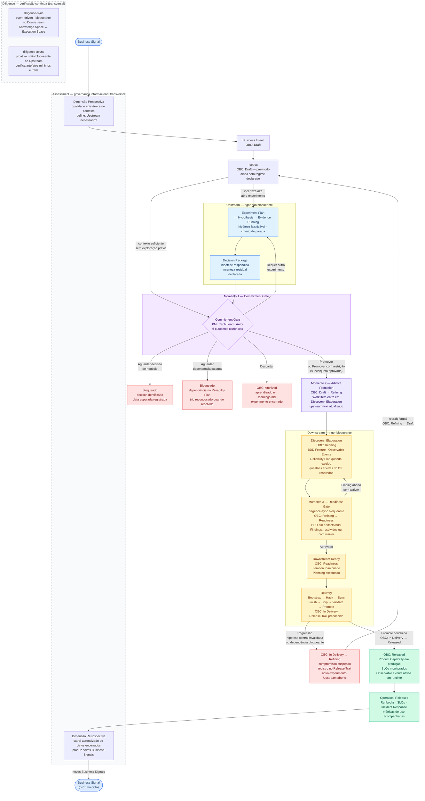
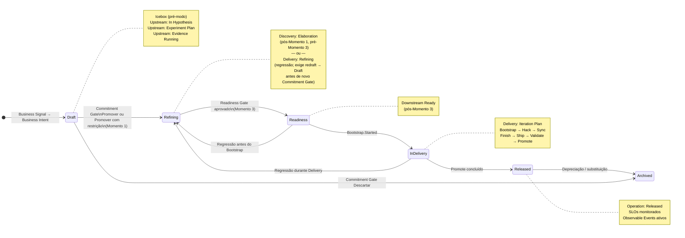
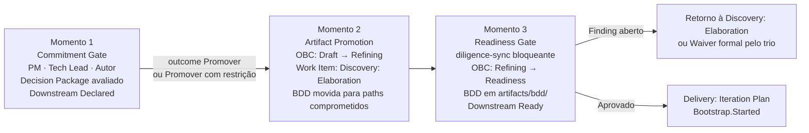
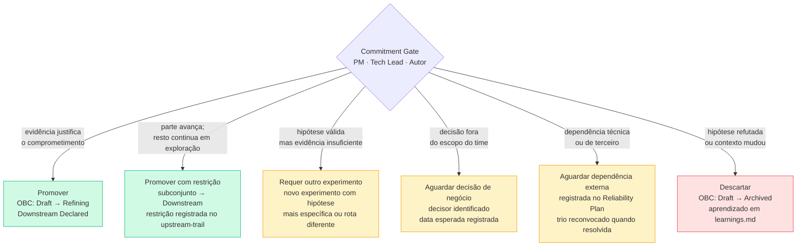
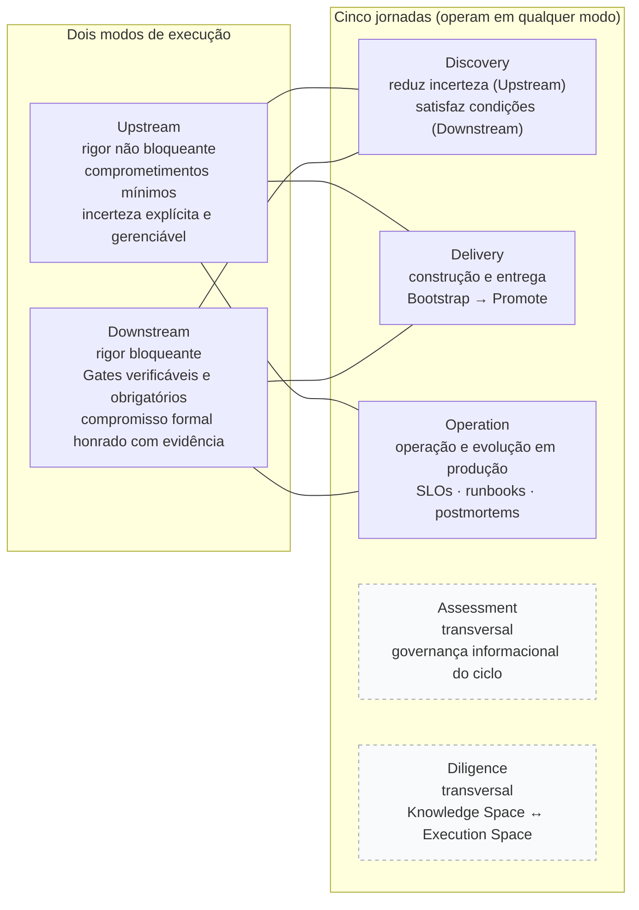

# ProdOps — Diagrama Completo do Framework

Documento de referência visual. Não faz parte do livro publicado.

---

## 1. Fluxo principal

Do Business Signal ao Released, com modos, Gates e jornadas transversais.

---

## 2. Ciclo de vida do OBC

Transições de estado do Observable Business Contract.

---

## 3. Os três momentos

---

## 4. Os seis outcomes do Commitment Gate

---

## 5. As cinco jornadas e os dois modos

---

## 6. Legenda

| Cor / estilo | Representa |
|---|---|
| Azul claro | Upstream (rigor não bloqueante) |
| Amarelo claro | Downstream (rigor bloqueante) |
| Roxo claro | Gates e Moments |
| Verde claro | Estados finais (Released, Operation) |
| Vermelho claro | Bloqueios, regressão, descarte |
| Tracejado cinza | Jornadas transversais (Assessment, Diligence) |
